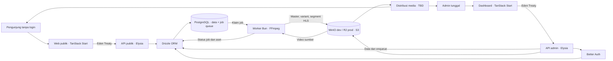

# Draft Architecture — Vertical Movie App

> Status: **Draft rincian integrasi** · Diperbarui 3 Oktober 2026 · Mengacu pada [PRD](PRD.md). Eden Treaty dipilih 1 Oktober 2026; MinIO development, Cloudflare R2 production melalui S3-compatible, selector env dan HLS dipilih pengguna 3 Oktober 2026. Media belum diimplementasikan.

## Keadaan repo saat ini

`apps/api` memakai factory Elysia tanpa listen, env tervalidasi, dan satu pool Bun SQL/Drizzle yang disuntikkan ke factory native Better Auth `@repo/auth/server`. Route aktif: root publik, `/api/auth/*`, 16 endpoint metadata `/admin/*`, Scalar `/openapi` dan `/openapi/json`. Schema canonical/admin plugin dimiliki `packages/auth`; role user/admin dan unique partial index membatasi satu admin. Seed memakai CLI resmi, recovery native hanya selama maintenance dengan seluruh penerima login berhenti. Macro `requireAdmin` memeriksa getSession authoritative, role/ban/expiry setiap request privat. Tidak ada writer/session endpoint/singleton custom aktif. TanStack Start memakai gateway same-origin fixed upstream dengan cookie/no-store/deadline, reader SDK isomorphic, satu snapshot Query per router/request, dan guard pathless sebelum loader anak. Cache UI/cookie 60 detik terpisah dari izin API; session tetap 24 jam. Browser acceptance lokal pada Vite dan hasil build Bun/Nitro termasuk native Better Auth/PostgreSQL sudah lolos; expand/contract DB development telah diterapkan dengan identitas/credential/sesi existing terjaga; rollout deployment masih terpisah. Eden khusus API bisnis type-only. Halaman publik masih starter dengan demo VerticalVideoPlayer 9:16; Video.js React/core 10.0.0-rc.4 sudah dipasang. HLS, storage/katalog, queue, worker dan FFmpeg belum diimplementasikan. Detail auth ada pada [Auth Operations](AUTH_OPERATIONS.md).

## Tech stack yang dipilih

| Lapisan               | Teknologi                                    | Peran yang direncanakan                                                                                                                                                         |
| --------------------- | -------------------------------------------- | ------------------------------------------------------------------------------------------------------------------------------------------------------------------------------- |
| Runtime dan workspace | Bun, Turborepo                               | Menjalankan kedua app dan task workspace; prioritaskan API native Bun bila cocok dengan kebutuhan dan stack terpilih.                                                           |
| Backend               | ElysiaJS (`apps/api`)                        | API publik video, API admin, validasi, otorisasi, dan aturan publikasi.                                                                                                         |
| Kontrak/client API    | Eden Treaty                                  | API mengekspor tipe kontrak Elysia; web memakai client bertipe untuk endpoint aplikasi di `/api`.                                                                               |
| Frontend              | TanStack Start (`apps/web`)                  | Halaman tonton publik dan dashboard admin yang responsif.                                                                                                                       |
| Database              | PostgreSQL                                   | Menyimpan metadata video, status, pengaturan sistem, dan data autentikasi.                                                                                                      |
| ORM dan migrasi       | Drizzle ORM, Drizzle Kit                     | Definisi skema, query, dan migrasi PostgreSQL di sisi API. Schema auth/admin awal tersedia; database development lokal telah dimigrasikan, deployment belum diverifikasi.       |
| Object storage        | MinIO development / Cloudflare R2 production | Menyimpan sumber/aset/hasil HLS melalui kontrak S3-compatible; selector `STORAGE_PROVIDER=minio\|r2` dan `S3_*` server. Prioritaskan `Bun.S3Client`, proof pada kedua provider. |
| Queue media           | PostgreSQL                                   | Tabel job yang persisten untuk transcode; tidak memerlukan broker queue terpisah. Mekanisme klaim, retry, dan pemulihan worker perlu dirancang.                                 |
| Transcode             | FFmpeg → HLS VOD                             | Worker Bun menghasilkan master/variant playlist dan segment lengkap. Codec/ladder/format dan durasi segment masih refinement.                                                   |
| Autentikasi           | Better Auth                                  | Email/password admin saja, session PostgreSQL, CLI provision/recovery, guard API, dan gateway web same-origin sudah diterapkan; pengunjung tanpa login.                         |
| UI                    | shadcn/ui, Tailwind CSS                      | Komponen dashboard dan antarmuka publik, dengan token desain lokal di `apps/web`.                                                                                               |
| Form                  | TanStack Form                                | State dan validasi interaksi formulir admin; API tetap memvalidasi input.                                                                                                       |
| Data fetching         | TanStack Query                               | Pengambilan, cache, dan pembaruan data API pada web.                                                                                                                            |
| Pemutar video         | Video.js React/core 10.0.0-rc.4              | Demo MP4 sudah tersedia; integrasi HLS memerlukan media component/adapter dari bundled docs dan proof browser pada task frontend.                                               |

Pilihan provider per lingkungan, format HLS dan resolusi sumber/keluaran 480p–1080p sudah disetujui. Sumber 1440p/4K ditolak; dimensi tampilan setelah rotasi/SAR memenuhi sisi pendek 480–1080 dan sisi panjang maksimal 1920. Semua video/sampul wajib portrait 9:16, rasio lain ditolak tanpa upscale/crop. Batas sumber terbaru mengikuti kind: movie/standalone maksimal 30 menit dan 1,5 GB (1.500.000.000 byte), episode maksimal 10 menit dan 512 MB. Limit berlaku juga untuk file yang lebih pendek. Acuan ekspor sumber H.264 SDR 1080p24–30 pada 4–6 Mbps (default 6 Mbps), audio AAC 128 kbps; default memberi estimasi sekitar 459,6 MB untuk 10 menit dan 1.378,8 MB untuk 30 menit sebelum overhead. Profil hls-v1 disetujui terpisah pada 4 Oktober 2026; proof teknis tetap pending. Limit sumber mencakup audio/container, tidak membatasi total storage keluaran HLS; acuan bitrate ekspor harus disesuaikan untuk memenuhinya. MP4/MOV/MKV H.264/H.265 dan WebM VP8/VP9 disetujui. Sampul memakai satu standar antarjenis konten: gambar diam JPG/JPEG/PNG/WebP maksimal 5 MB, sumber minimal 1080 × 1920 portrait 9:16, hasil WebP 1080 × 1920. Decode/konversi sumber lebih besar menjadi hasil standar dilakukan pada pipeline media sebelum siap; belum diimplementasikan. S3 multipart dipilih sebagai metode upload media dengan part kecil, termasuk sampul kecil satu part. hls-v1, part 2%/minimum 5 MiB, concurrency upload 3, session 24 jam/URL part 15 menit, distribusi privat/TTL 2× durasi, cache dan syarat publikasi sudah disetujui. Identity resume/freeze, detail encoder/HDR/VFR, header provider dan resource worker memerlukan proof; hosting nomor 8 tetap proposal. R2 menyimpan objek; transcoding tetap FFmpeg milik worker API, tanpa Cloudflare Stream. Detail kontrak env/roadmap ada pada [plan video](VIDEO_IMPLEMENTATION_PLAN.md) dan [backlog media](tasks/media.md). Tabel tidak berarti integrasi tersebut sudah berjalan.

## Batas sistem yang diusulkan

- **Web publik:** menampilkan katalog video terbit dan pengalaman tonton mobile first. Pada desktop, pemutar vertikal tetap berproporsi dan ruang tambahan dapat menampung metadata serta navigasi. Video.js digunakan pada komponen player.
- **Dashboard:** akses admin tunggal untuk video, status unggah/pemrosesan, publikasi, dan pengaturan yang disetujui. shadcn/ui menyediakan komponen, Tailwind CSS menyediakan styling, TanStack Form menangani interaksi formulir, dan TanStack Query mengelola data dari API.
- **API Elysia:** sumber kebenaran untuk daftar/detail publik, operasi admin, validasi input, syarat publikasi, serta pemeriksaan sesi dan otorisasi. Kode domain tidak diduplikasi di TanStack Start.
- **Eden Treaty:** web memakai tipe hasil komposisi Elysia melalui entry point type-only milik API. Client browser memakai origin web dengan base `/api`, `credentials: include`, dan tanpa konversi string tanggal menjadi `Date`; SSR memakai URL internal tetap dan cookie dari request aktif. Hasil sesi hanya membawa DTO whitelisted, sedangkan API tetap memvalidasi dan mengotorisasi setiap request. Eden berjalan dengan TanStack Query yang dibuat per router; Better Auth memakai client auth tersendiri. Aturan lifecycle, scope plugin, macro admin, dan SSR ada di [API Development](API_DEVELOPMENT.md).
- **Better Auth:** dimiliki `packages/auth`; API memakai `@repo/auth/server`, web `@repo/auth/client`, tipe bersama type-only `@repo/auth/types`. Native admin role, session/CLI/reset menggantikan singleton dan writer custom; database diinjeksi API, web hanya memanggil SDK. Proteksi/cookie/cache/maintenance dijelaskan pada [Auth Operations](AUTH_OPERATIONS.md).
- **PostgreSQL + Drizzle:** Bun SQL dan Drizzle adapter telah lulus proof terarah pada database test; factory runtime sudah tersedia. Schema auth native dan enam tabel metadata konten tersedia; migrasi metadata lulus proof dedicated dan sudah diterapkan pada development lokal. Queue/pengaturan/media masih task lanjutan. PostgreSQL menyimpan metadata, job, pengaturan, dan tabel auth; berkas video berada di object storage.
- **Object storage:** MinIO pada development, Cloudflare R2 pada production melalui kontrak S3-compatible. Selector `STORAGE_PROVIDER` dan endpoint/region/bucket/credential dari env server; akses native `Bun.S3Client` untuk operasi yang terbukti didukung. Persistenkan provider asal bersama key; perubahan env bukan copy objek. Perbedaan fitur antarprovider dan versi Bun dibuktikan lewat proof terpisah.
- **Unggah dan distribusi:** API admin membuat izin unggah terbatas, browser mengunggah langsung ke MinIO/R2 melalui signed URL part dalam S3 multipart yang disetujui. File dibagi menjadi bagian kecil dan digabung storage saat complete; sampul kecil dapat memakai satu part. Part target 2% ukuran aktual dengan minimum 5 MiB selain part terakhir disetujui; maksimal 3 part paralel per file, session 24 jam dan URL part 15 menit dibatasi sisa session disetujui. Detail identity resume/expiry/source freeze masih proof implementasi. Verifikasi objek dan bekukan identitas sumber sebelum enqueue. Bucket development existing adalah `vertical-movie-app`; port 9000 endpoint S3, port 9001 Console. Distribusi HLS harus mencakup master, variant, init dan segment, bukan presign master saja. Draft/source tetap privat; preview admin dan playback konten published mempunyai kebijakan akses/cache/archive yang disetujui pada nomor 4. R2 tidak memakai ACL S3 public-read dan presigned URL R2 tidak bisa dipindahkan ke custom domain.
- **Worker media:** jalankan sebagai proses Bun terpisah dari server HTTP, dengan kode tetap di `apps/api`. Worker mengambil job dari PostgreSQL, membaca sumber dari object storage, menjalankan FFmpeg melalui `Bun.spawn`, memeriksa exit code dan keluaran, mengunggah hasil ke storage, lalu menyimpan status. Proses FFmpeg tidak berjalan di dalam transaksi database.

Prioritaskan API native Bun untuk koneksi database, object storage, dan pemanggilan FFmpeg ketika kompatibel dengan library yang sudah dipilih. Gunakan library tambahan hanya jika operasi yang dibutuhkan tidak didukung, tidak kompatibel, atau hasil pengujian menunjukkan kebutuhan tersebut. Keputusan dan alasannya dicatat saat implementasi.

## Alur queue transcode yang diusulkan

Lifecycle video terbaru disetujui 4 Oktober 2026: **draft → published → archived**, tanpa status produk unpublished. Ini target lanjutan, bukan schema/runtime yang sudah berubah. VID-016 menyiapkan compatibility; Pengguna memilih satu bucket aplikasi per environment pada 4 Oktober 2026. Kontrak nomor 4 disepakati 4 Oktober 2026: seluruh bucket privat, sources/ untuk input dan outputs/ untuk hasil immutable, master/variant playlist melalui API dan init/segment/caption langsung dari storage melalui signed GET URL. TTL playback disetujui 4 Oktober 2026: 2× durasi video aktual terverifikasi sejak URL diterbitkan; cache bila diaktifkan wajib memiliki expiry/invalidation, dengan cache terkait signed URL tidak melewati expiry URL. Cache metadata TTL 60 detik, playlist no-store dan cache segment privat maksimal min(300 detik, sisa umur URL) disetujui 4 Oktober 2026; proof response headers/invalidation masih diperlukan; archive menghentikan URL baru sementara URL lama berlaku sampai expiry. Kontrak akses memakai expiry URL lama, bukan pencabutan instan; tidak menjanjikan revocation instan atau CDN/custom-domain presign. Playlist disajikan API; data video langsung dari storage. Gateway yang memproksi seluruh segment bukan kontrak yang dipilih. Detail pada [plan nomor 4](VIDEO_IMPLEMENTATION_PLAN.md#nomor-4--akses-video-distribusi-hls-dan-cache-disepakati-4-oktober-2026).

1. Setelah server memastikan objek sumber benar-benar ada, API mencatat status aset dan job `queued` di PostgreSQL secara atomik.
2. Worker mengklaim satu job secara aman untuk beberapa worker, misalnya melalui transaksi dan `FOR UPDATE SKIP LOCKED`, lalu mencatat lease serta jumlah percobaan. Transaksi klaim selesai sebelum FFmpeg dijalankan; lease perlu diperpanjang selama proses yang lama.
3. Worker mengambil sumber, menjalankan FFprobe/FFmpeg, memvalidasi master/variant playlist serta seluruh segment/init HLS VOD, dan mengunggah hasil ke prefix immutable per job/attempt. **hls-v1 disetujui 4 Oktober 2026**: H.264 SDR, AAC 128 kbps bila audio tersedia, target video 480p/720p/1080p 1,2/2,5/4,5 Mbps, output maksimal 30 fps, segment fMP4 dengan target 6 detik dan pemilihan kualitas adaptif; tanpa crop/upscale, hanya kualitas yang dapat dibuat dari sumber. Detail encoder/GOP/SAR/VFR/MIME serta kualitas visual dan compatibility tetap memerlukan proof HLS-PROFILE-001. rasio sumber portrait 9:16 dipertahankan; sumber rasio lain ditolak.
4. Setelah seluruh keluaran yang diwajibkan tersimpan, worker yang masih memegang lease menandai job `succeeded` dan aset `ready`. Kegagalan dicatat dengan alasan dan dijadwalkan ulang hingga batas percobaan; setelah itu job menjadi `failed` dan terlihat di dashboard.
5. Lease yang kedaluwarsa diklaim ulang setelah worker mati. Hasil setiap percobaan harus aman diproses ulang agar file atau status yang tertinggal tidak membuat video terbit secara keliru.

Tabel job adalah sumber kebenaran yang persisten. `LISTEN/NOTIFY` boleh dipakai untuk membangunkan worker lebih cepat, tetapi worker tetap memeriksa tabel saat mulai, setelah koneksi pulih, dan secara berkala. Jumlah worker, waktu lease, batas retry, dan kebijakan pembersihan file sementara masih keputusan implementasi.

## Model data dan status awal

Pada 3 Oktober 2026 pengguna meminta plan series dengan banyak video dan movie panjang. Rancangan detail konten kini ada pada [VIDEO_DATA_MODEL.md](VIDEO_DATA_MODEL.md), dengan [plan tahap metadata](VIDEO_IMPLEMENTATION_PLAN.md) dan [backlog](tasks/videos.md). Relasi metadata disetujui dan diimplementasikan: series → seasons → videos berjenis episode; movie/standalone memakai tabel videos tanpa season. Metadata editorial dipisahkan dari sumber media, generation transcode, dan rendition. Enam tabel tahap A dan 16 endpoint admin lulus proof lokal. Tabel media, queue, dan pengaturan pada ringkasan berikut tetap rancangan; migrasi konten development diterapkan pada VERIFY-001; production belum.

| Data             | Isi utama yang diusulkan                                     | Akses                                                                     |
| ---------------- | ------------------------------------------------------------ | ------------------------------------------------------------------------- |
| Akun/sesi admin  | Identitas dan sesi yang dikelola Better Auth                 | Admin dan layanan autentikasi                                             |
| Video            | ID, judul, deskripsi, sampul, status publikasi, waktu terbit | Tulis oleh admin; respons publik hanya saat terbit                        |
| Series/season    | Metadata serial, nomor season, relasi episode melalui season | Tulis oleh admin; episode publik mengikuti visibility parent series       |
| Aset video       | Kunci objek, status unggah/pemrosesan, metadata teknis       | Admin dan pekerja media; kunci objek privat tidak bocor ke respons publik |
| Job transcode    | ID aset, status, percobaan, jadwal ulang, lease, kesalahan   | API dan worker; status ringkas dapat dibaca admin                         |
| Pengaturan situs | Kunci dan nilai yang disetujui untuk diubah dari dashboard   | Tulis oleh admin; sebagian nilai dapat dibaca publik                      |

Pisahkan status aset `pending_upload` → `uploaded` → `processing` → `ready` atau `failed` dari status video `draft` → `published` → `unpublished`. Terbit mensyaratkan metadata lengkap dan aset `ready`. Detail skema dan migrasi masih perlu dirancang. Hanya satu identitas boleh memperoleh hak admin; pembatasan ini harus ditegakkan di provisioning dan API, bukan hanya disembunyikan dari UI.

## Kontrak API kandidat

Nama rute dan bentuk respons masih rancangan. Pemisahan aksesnya adalah keputusan penting:

| Operasi                                           | Tujuan                                      | Akses                                                |
| ------------------------------------------------- | ------------------------------------------- | ---------------------------------------------------- |
| `GET /videos`                                     | Katalog video terbit                        | Publik, tanpa login                                  |
| `GET /videos/:id`                                 | Detail dan informasi pemutaran video terbit | Publik, tanpa login                                  |
| `GET /admin/videos` dan `POST /admin/videos`      | Daftar semua video dan buat draf            | Admin                                                |
| `PATCH /admin/videos/:id`                         | Ubah metadata                               | Admin                                                |
| `POST /admin/videos/:id/upload-session`           | Mulai unggah berizin                        | Admin                                                |
| `POST /admin/videos/:id/publish`                  | Terbitkan video siap                        | Admin                                                |
| `POST /admin/videos/:id/unpublish`                | Tarik publikasi                             | Admin                                                |
| `GET /admin/settings` dan `PATCH /admin/settings` | Baca dan ubah konfigurasi yang diizinkan    | Admin                                                |
| Rute Better Auth                                  | Masuk, keluar, dan pengelolaan sesi admin   | Sesuai kontrak Better Auth; tanpa pendaftaran publik |

Semua operasi tulis memvalidasi input di API. Unggah, callback pemrosesan, dan publikasi harus aman terhadap pengulangan. API publik tidak mengembalikan draf, rahasia, atau kunci objek privat. URL unggah bertanda tangan hanya diberikan setelah otorisasi admin dan berlaku untuk objek serta operasi terbatas. Gateway auth dan origin/cookie sudah diimplementasikan; gateway bisnis web tetap task berikutnya sebelum UI metadata.

[Rekomendasi deployment nomor 8](VIDEO_IMPLEMENTATION_PLAN.md#nomor-8--rekomendasi-deployment-production-dan-r2-belum-disetujui) dicatat sebagai belum disetujui: satu server Linux dengan proses web/API/worker/PostgreSQL terpisah via Docker Compose, reverse proxy HTTPS, bucket R2 privat/token scoped/CORS, volume DB/workspace serta backup/restore proof. Target uji pengguna 4 core/RAM 4 GB; provider/domain/disk belum ditentukan. Kandidat worker 1,5 GiB/2 vCPU/thread 1 serta kapasitas keseluruhan menunggu benchmark; same-origin dan signed S3 delivery mengikuti keputusan yang sudah ada. Tidak ada Dockerfile/Compose/provisioning/deployment/migration baru.

## Keputusan teknis yang masih diperlukan

Provider MinIO/R2, selector env dan HLS sudah dipilih. S3 multipart dengan part kecil juga sudah dipilih. Yang masih diperlukan: parameter part/paralelisme/expiry/identity resume/source freeze/checksum dan proof operasi native Bun pada kedua provider; profil HLS codec/ladder/segment/resource; jumlah worker/lease/retry/cleanup; adapter HLS yang cocok Video.js existing; delivery seluruh objek HLS/CDN/cache/expiry serta bound URL lama setelah archive; implementasi D4 publication; hosting/observabilitas. Auth/metadata tetap mengikuti evidence lokalnya, bukan proof media. Rahasia hanya konfigurasi server, bukan dashboard atau bundle web.

## Referensi teknis

- [Elysia documentation index](https://elysiajs.com/llms.txt) dan [Better Auth–Elysia integration](https://better-auth.com/docs/integrations/elysia)
- [Eden installation](https://elysiajs.com/eden/installation), [Eden Treaty](https://elysiajs.com/eden/treaty/overview), [Elysia lifecycle](https://elysiajs.com/essential/life-cycle), dan [plugin scope](https://elysiajs.com/essential/plugin)
- [Drizzle PostgreSQL guide](https://orm.drizzle.team/docs/get-started/postgresql-new) dan [Better Auth Drizzle adapter](https://better-auth.com/docs/adapters/drizzle)
- [shadcn/ui for TanStack Start](https://ui.shadcn.com/docs/installation/tanstack)
- [TanStack Form](https://tanstack.com/form/latest) dan [TanStack Query](https://tanstack.com/query/latest/docs/framework/react)
- [Video.js documentation](https://videojs.com/guides/embeds)
- [Bun S3 API](https://bun.com/docs/runtime/s3), [Drizzle dengan Bun SQL](https://orm.drizzle.team/docs/connect-bun-sql), dan [kompatibilitas S3 Cloudflare R2](https://developers.cloudflare.com/r2/api/s3/api/)
- [Cloudflare R2 presigned URLs](https://developers.cloudflare.com/r2/api/s3/presigned-urls/)
- [FFmpeg CLI](https://ffmpeg.org/ffmpeg.html), [Bun.spawn](https://bun.com/docs/runtime/child-process), [PostgreSQL row locking](https://www.postgresql.org/docs/current/sql-select.html), dan [PostgreSQL NOTIFY](https://www.postgresql.org/docs/current/sql-notify.html)
