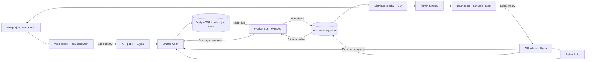

# Draft Architecture — Vertical Movie App

> Status: **Draft untuk ditinjau** · Diperbarui 1 Oktober 2026 · Mengacu pada [PRD](PRD.md). Pilihan stack di bawah berasal dari pemilik proyek, termasuk Eden Treaty yang ditetapkan pada 1 Oktober 2026; rincian integrasi dan infrastruktur media masih rancangan.

## Keadaan repo saat ini

`apps/api` memiliki factory Elysia terpisah dari bootstrap, validasi env, dan factory Bun SQL/Drizzle; route aktif masih `GET /`. Fondasi auth mengunci Better Auth/adapter `1.7.7`, Drizzle `0.45.3`, Drizzle Kit `0.31.11`, serta membuktikan adapter pada database test PostgreSQL terpisah. `@repo/auth/server` mengekspor factory auth dan helper server, tetapi instance auth, schema aplikasi, endpoint login, dan provisioning admin belum dipasang. Origin lokal direncanakan satu origin melalui gateway TanStack Start; route gateway belum dibuat. `apps/web` masih berisi halaman starter dan demo `VerticalVideoPlayer` 9:16. Video.js React/core `10.0.0-rc.4` telah dipasang; HLS, katalog, dashboard, dan media aplikasi belum diintegrasikan. Eden Treaty dipilih dan `api/types` tersedia; Eden SDK/client serta konsumsi kontrak web belum diimplementasikan. Worker, queue PostgreSQL, dan FFmpeg juga belum tersedia.

## Tech stack yang dipilih

| Lapisan               | Teknologi                                | Peran yang direncanakan                                                                                                                                           |
| --------------------- | ---------------------------------------- | ----------------------------------------------------------------------------------------------------------------------------------------------------------------- |
| Runtime dan workspace | Bun, Turborepo                           | Menjalankan kedua app dan task workspace; prioritaskan API native Bun bila cocok dengan kebutuhan dan stack terpilih.                                             |
| Backend               | ElysiaJS (`apps/api`)                    | API publik video, API admin, validasi, otorisasi, dan aturan publikasi.                                                                                           |
| Kontrak/client API    | Eden Treaty                              | API mengekspor tipe kontrak Elysia; web mengonsumsi endpoint aplikasi dengan client bertipe. SDK dipasang di web saat integrasi.                                  |
| Frontend              | TanStack Start (`apps/web`)              | Halaman tonton publik dan dashboard admin yang responsif.                                                                                                         |
| Database              | PostgreSQL                               | Menyimpan metadata video, status, pengaturan sistem, dan data autentikasi.                                                                                        |
| ORM dan migrasi       | Drizzle ORM, Drizzle Kit                 | Definisi skema, query, dan migrasi PostgreSQL di sisi API. Bun SQL + adapter Better Auth sudah lulus proof; schema aplikasi dan migrasi masuk AUTH-003.           |
| Object storage        | Cloudflare R2 atau layanan kompatibel S3 | Menyimpan video, hasil pemrosesan, dan aset media. Provider final belum dipilih. Prioritaskan `Bun.S3Client` untuk operasi server yang didukung.                  |
| Queue media           | PostgreSQL                               | Tabel job yang persisten untuk transcode; tidak memerlukan broker queue terpisah. Mekanisme klaim, retry, dan pemulihan worker perlu dirancang.                   |
| Transcode             | FFmpeg                                   | Memproses video sumber menjadi keluaran siap putar. Worker Bun memanggil proses FFmpeg; profil keluaran belum dipilih.                                            |
| Autentikasi           | Better Auth                              | Sesi masuk **hanya untuk admin**; pengunjung menonton tanpa login. Integrasi dengan Elysia dan PostgreSQL/Drizzle direncanakan.                                   |
| UI                    | shadcn/ui, Tailwind CSS                  | Komponen dashboard dan antarmuka publik, dengan token desain lokal di `apps/web`.                                                                                 |
| Form                  | TanStack Form                            | State dan validasi interaksi formulir admin; API tetap memvalidasi input.                                                                                         |
| Data fetching         | TanStack Query                           | Pengambilan, cache, dan pembaruan data API pada web.                                                                                                              |
| Pemutar video         | Video.js                                 | Pemutaran video vertikal, kontrol player, dan caption pada halaman publik serta pratinjau admin. Versi dan paket integrasi React perlu dipilih saat implementasi. |

Pilihan teknologi di tabel adalah keputusan pengguna; tabel ini tidak berarti seluruh dependensi sudah terpasang. Provider object storage final, profil transcode, format streaming, distribusi media, dan hosting belum dipilih. Prioritas API native Bun tidak mengganti Drizzle, Better Auth, Elysia, Video.js, atau FFmpeg yang juga sudah dipilih.

## Batas sistem yang diusulkan

- **Web publik:** menampilkan katalog video terbit dan pengalaman tonton mobile first. Pada desktop, pemutar vertikal tetap berproporsi dan ruang tambahan dapat menampung metadata serta navigasi. Video.js digunakan pada komponen player.
- **Dashboard:** akses admin tunggal untuk video, status unggah/pemrosesan, publikasi, dan pengaturan yang disetujui. shadcn/ui menyediakan komponen, Tailwind CSS menyediakan styling, TanStack Form menangani interaksi formulir, dan TanStack Query mengelola data dari API.
- **API Elysia:** sumber kebenaran untuk daftar/detail publik, operasi admin, validasi input, syarat publikasi, serta pemeriksaan sesi dan otorisasi. Kode domain tidak diduplikasi di TanStack Start.
- **Eden Treaty:** web memakai tipe hasil komposisi Elysia melalui entry point type-only milik API. Factory aplikasi tidak memanggil `listen`; startup berada di entry point server. Method chaining, response schema, dan helper `status(...)` mempertahankan inferensi kontrak. HTTP tetap divalidasi dan diotorisasi server. Eden dipakai bersama TanStack Query untuk endpoint aplikasi; Better Auth memakai client auth tersendiri. Aturan lifecycle, scope plugin, macro admin, dan SSR ada di [API Development](API_DEVELOPMENT.md).
- **Better Auth:** dependensi dimiliki `packages/auth`; `@repo/auth/server` menyediakan factory `createAuthServer` dan helper server, sementara client React dan tipe tetap di entry point terpisah. API telah menyiapkan env untuk secret/origin dan adapter, tetapi instance/runtime auth belum dikonfigurasi. Provisioning/pemulihan akun admin tetap direncanakan melalui CLI; pendaftaran mandiri publik dinonaktifkan saat endpoint dipasang. Periksa sesi dan identitas admin pada setiap operasi privat.
- **PostgreSQL + Drizzle:** Bun SQL dan Drizzle adapter telah lulus proof terarah pada database test; factory runtime sudah tersedia. Schema aplikasi/migrasi tetap akan dibuat oleh task auth berikutnya. PostgreSQL menyimpan metadata, job, pengaturan, dan tabel auth; berkas video berada di object storage.
- **Object storage:** gunakan Cloudflare R2 atau layanan kompatibel S3. Akses server melalui `Bun.S3Client` menjadi pilihan awal untuk operasi yang didukung. Simpan endpoint, bucket, dan kredensial di konfigurasi server. Perbedaan fitur antarprovider dan versi Bun harus diuji sebelum implementasi diandalkan.
- **Unggah dan distribusi:** rancangan awal adalah API admin membuat izin unggah terbatas untuk objek tertentu, lalu browser mengunggah langsung ke storage menggunakan URL `PUT` bertanda tangan. Periksa CORS, jenis/ukuran berkas, dan keberadaan objek sebelum memasukkan job transcode ke PostgreSQL. Distribusi untuk pemutaran masih memerlukan keputusan. Video yang belum terbit tidak boleh bisa diputar melalui URL publik; URL yang sudah dibagikan atau di-cache dapat bertahan setelah video ditarik, sehingga kebijakan pencabutan akses harus dirancang eksplisit.
- **Worker media:** jalankan sebagai proses Bun terpisah dari server HTTP, dengan kode tetap di `apps/api`. Worker mengambil job dari PostgreSQL, membaca sumber dari object storage, menjalankan FFmpeg melalui `Bun.spawn`, memeriksa exit code dan keluaran, mengunggah hasil ke storage, lalu menyimpan status. Proses FFmpeg tidak berjalan di dalam transaksi database.

Prioritaskan API native Bun untuk koneksi database, object storage, dan pemanggilan FFmpeg ketika kompatibel dengan library yang sudah dipilih. Gunakan library tambahan hanya jika operasi yang dibutuhkan tidak didukung, tidak kompatibel, atau hasil pengujian menunjukkan kebutuhan tersebut. Keputusan dan alasannya dicatat saat implementasi.

## Alur queue transcode yang diusulkan

1. Setelah server memastikan objek sumber benar-benar ada, API mencatat status aset dan job `queued` di PostgreSQL secara atomik.
2. Worker mengklaim satu job secara aman untuk beberapa worker, misalnya melalui transaksi dan `FOR UPDATE SKIP LOCKED`, lalu mencatat lease serta jumlah percobaan. Transaksi klaim selesai sebelum FFmpeg dijalankan; lease perlu diperpanjang selama proses yang lama.
3. Worker mengambil sumber, menjalankan FFmpeg, memvalidasi keluaran, dan mengunggah hasil ke object storage. Profil encoding, resolusi, dan format akhir masih perlu ditentukan.
4. Setelah seluruh keluaran yang diwajibkan tersimpan, worker yang masih memegang lease menandai job `succeeded` dan aset `ready`. Kegagalan dicatat dengan alasan dan dijadwalkan ulang hingga batas percobaan; setelah itu job menjadi `failed` dan terlihat di dashboard.
5. Lease yang kedaluwarsa diklaim ulang setelah worker mati. Hasil setiap percobaan harus aman diproses ulang agar file atau status yang tertinggal tidak membuat video terbit secara keliru.

Tabel job adalah sumber kebenaran yang persisten. `LISTEN/NOTIFY` boleh dipakai untuk membangunkan worker lebih cepat, tetapi worker tetap memeriksa tabel saat mulai, setelah koneksi pulih, dan secara berkala. Jumlah worker, waktu lease, batas retry, dan kebijakan pembersihan file sementara masih keputusan implementasi.

## Model data dan status awal

| Data             | Isi utama yang diusulkan                                     | Akses                                                                     |
| ---------------- | ------------------------------------------------------------ | ------------------------------------------------------------------------- |
| Akun/sesi admin  | Identitas dan sesi yang dikelola Better Auth                 | Admin dan layanan autentikasi                                             |
| Video            | ID, judul, deskripsi, sampul, status publikasi, waktu terbit | Tulis oleh admin; respons publik hanya saat terbit                        |
| Aset video       | Kunci objek, status unggah/pemrosesan, metadata teknis       | Admin dan pekerja media; kunci objek privat tidak bocor ke respons publik |
| Job transcode    | ID aset, status, percobaan, jadwal ulang, lease, kesalahan   | API dan worker; status ringkas dapat dibaca admin                         |
| Pengaturan situs | Kunci dan nilai yang disetujui untuk diubah dari dashboard   | Tulis oleh admin; sebagian nilai dapat dibaca publik                      |

Pisahkan status aset `pending_upload` → `uploaded` → `processing` → `ready` atau `failed` dari status video `draft` → `published` → `unpublished`. Terbit mensyaratkan metadata lengkap dan aset `ready`. Detail skema dan migrasi masih perlu dirancang. Hanya satu identitas boleh memperoleh hak admin; pembatasan ini harus ditegakkan di provisioning dan API, bukan hanya disembunyikan dari UI.

## Kontrak API kandidat

Nama rute dan bentuk respons masih rancangan. Pemisahan aksesnya adalah keputusan penting:

| Operasi                                           | Tujuan                                      | Akses                                                |
| ------------------------------------------------- | ------------------------------------------- | ---------------------------------------------------- |
| `GET /videos`                                     | Katalog video terbit                        | Publik, tanpa login                                  |
| `GET /videos/:id`                                 | Detail dan informasi pemutaran video terbit | Publik, tanpa login                                  |
| `GET /admin/videos` dan `POST /admin/videos`      | Daftar semua video dan buat draf            | Admin                                                |
| `PATCH /admin/videos/:id`                         | Ubah metadata                               | Admin                                                |
| `POST /admin/videos/:id/upload-session`           | Mulai unggah berizin                        | Admin                                                |
| `POST /admin/videos/:id/publish`                  | Terbitkan video siap                        | Admin                                                |
| `POST /admin/videos/:id/unpublish`                | Tarik publikasi                             | Admin                                                |
| `GET /admin/settings` dan `PATCH /admin/settings` | Baca dan ubah konfigurasi yang diizinkan    | Admin                                                |
| Rute Better Auth                                  | Masuk, keluar, dan pengelolaan sesi admin   | Sesuai kontrak Better Auth; tanpa pendaftaran publik |

Semua operasi tulis memvalidasi input di API. Unggah, callback pemrosesan, dan publikasi harus aman terhadap pengulangan. API publik tidak mengembalikan draf, rahasia, atau kunci objek privat. URL unggah bertanda tangan hanya diberikan setelah otorisasi admin dan berlaku untuk objek serta operasi terbatas. Cara web meneruskan sesi ke API dan pengaturan origin/cookie perlu diputuskan sebelum implementasi.

## Keputusan teknis yang masih diperlukan

Verifikasi `drizzle-orm/bun-sql` dan adapter Better Auth pada versi yang dipasang; strategi migrasi; provisioning/pemulihan admin; batas konfigurasi dashboard; format dan batas video; pilihan Cloudflare R2 atau provider kompatibel S3; operasi storage yang diperlukan dan dukungan `Bun.S3Client`; metode unggah final; profil keluaran FFmpeg; jumlah worker, lease, retry, dan pembersihan file; format putar dan versi Video.js; CDN/cache serta pencabutan akses setelah unpublish; hosting; serta observabilitas. Rahasia koneksi dan penyedia tetap berada di konfigurasi server, bukan pengaturan dashboard.

## Referensi teknis

- [Elysia documentation index](https://elysiajs.com/llms.txt) dan [Better Auth–Elysia integration](https://better-auth.com/docs/integrations/elysia)
- [Eden installation](https://elysiajs.com/eden/installation), [Eden Treaty](https://elysiajs.com/eden/treaty/overview), [Elysia lifecycle](https://elysiajs.com/essential/life-cycle), dan [plugin scope](https://elysiajs.com/essential/plugin)
- [Drizzle PostgreSQL guide](https://orm.drizzle.team/docs/get-started/postgresql-new) dan [Better Auth Drizzle adapter](https://better-auth.com/docs/adapters/drizzle)
- [shadcn/ui for TanStack Start](https://ui.shadcn.com/docs/installation/tanstack)
- [TanStack Form](https://tanstack.com/form/latest) dan [TanStack Query](https://tanstack.com/query/latest/docs/framework/react)
- [Video.js documentation](https://videojs.com/guides/embeds)
- [Bun S3 API](https://bun.com/docs/runtime/s3), [Drizzle dengan Bun SQL](https://orm.drizzle.team/docs/connect-bun-sql), dan [kompatibilitas S3 Cloudflare R2](https://developers.cloudflare.com/r2/api/s3/api/)
- [Cloudflare R2 presigned URLs](https://developers.cloudflare.com/r2/api/s3/presigned-urls/)
- [FFmpeg CLI](https://ffmpeg.org/ffmpeg.html), [Bun.spawn](https://bun.com/docs/runtime/child-process), [PostgreSQL row locking](https://www.postgresql.org/docs/current/sql-select.html), dan [PostgreSQL NOTIFY](https://www.postgresql.org/docs/current/sql-notify.html)
