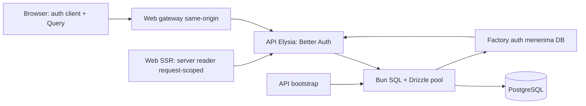

# Rencana refactor auth: package, isomorphic, dan TanStack Query

- Status: implementasi AUTH-REF-001–010 selesai pada 2 Oktober 2026; evidence/commit pada backlog. Migrasi database development selesai pada tindak lanjut 2 Oktober 2026; deployment masih terpisah.
- Tanggal: 2 Oktober 2026, Asia/Jakarta.
- Persetujuan: 2 Oktober 2026, melalui arahan pengguna untuk melanjutkan perincian rencana pada setiap task.
- Baseline: `feat/auth-admin-module`, commit `34f8ec59b125bbabaae87b3939de38874afb3a58`.
- Scope tetap: satu admin, email/password, tanpa signup publik/email service, seed/recovery CLI lokal, satu origin publik; penonton anonim.
- Dokumen ini menggantikan usulan cache `useSession` saja sebelumnya. AUTH-001–013 adalah riwayat; AUTH-REF-001–010 pada [backlog auth](tasks/auth.md) sudah selesai.

## 1. Temuan baseline dan keputusan

| Area                          | Kondisi sekarang                                                          | Target refactor                                                                       |
| ----------------------------- | ------------------------------------------------------------------------- | ------------------------------------------------------------------------------------- |
| `packages/auth/src/server.ts` | Wrapper `betterAuth(options)` dan re-export.                              | Factory dengan konfigurasi produk/plugin/schema, policy, serta reader session server. |
| `packages/auth/src/client.ts` | Re-export SDK React.                                                      | Factory SDK dengan plugin admin dan reader snapshot aman.                             |
| API module auth               | Konfigurasi/hook/admin singleton di API; provision/reset menulis SQL.     | Composition/framework adapter tipis; operasi auth native dari package.                |
| Web session                   | Eden `/admin/session`, SSR/browser melalui `typeof window`.               | Reader native SDK dengan `createIsomorphicFn`, DTO aman, Query bersama.               |
| Guard layout                  | `fetchQuery({ staleTime: 0 })` setiap `beforeLoad`.                       | Guard memakai Query fresh/stale dan menolak sebelum loader anak.                      |
| Database                      | API membuat Bun SQL + Drizzle sekali.                                     | Pertahankan pool API; injeksikan DB ke factory package.                               |
| Transport                     | Callback publik tidak diterima gateway; SSR belum punya deadline sendiri. | Fixed upstream, callback publik valid, cookie forwarding, cancellation/deadline.      |

Versi terpasang: Better Auth/CLI `auth` 1.7.7, Drizzle ORM 0.45.3, TanStack Start 1.168.59, Router 1.170.40, Query 5.104.0, SSR Query integration 1.167.3, Turbo 2.11.5. Refactor mengikuti versi tersebut, tanpa upgrade implisit. Query terpasang menyediakan `queryClient.query()`; `fetchQuery`/`ensureQueryData` ditandai deprecated.

Better Auth memiliki hashing/verifikasi password, pembuatan/validasi/pencabutan session, cookie, reset token, rate limit, dan role/admin plugin. Aplikasi melakukan komposisi dependency, proyeksi data aman, integrasi framework, serta invariant satu admin. TanStack Query menyimpan snapshot UI; ia tidak menjadi mesin autentikasi.

## 2. Ownership dan entry point

| Pemilik             | Tanggung jawab target                                                                                                                               |
| ------------------- | --------------------------------------------------------------------------------------------------------------------------------------------------- |
| `@repo/auth/server` | Factory Better Auth, Drizzle adapter/schema auth, plugin/role/policy, opsi keamanan/session, native operator API, dan reader HTTP native untuk SSR. |
| `@repo/auth/client` | Factory SDK client, `adminClient`, reader session melalui SDK, proyeksi aman. Tidak membawa DB/server config.                                       |
| `@repo/auth/types`  | Ekspor type-only: inferensi server/plugin, DTO aman dan dependency/error contracts.                                                                 |
| API                 | Validasi env, pool/shutdown, bootstrap, migrasi, pemasangan handler, dan macro guard Elysia pada rute privat.                                       |
| Web                 | Instance client dari package, adapter TanStack request-scoped, query options, guard rute, UI, invalidation, gateway.                                |

Semua impor runtime Better Auth/plugin/adapter/crypto berada di package. App memakai entry point, tanpa deep import `packages/auth/src/*`. `client.ts` dan `server.ts` adalah pintu masuk stabil; helper internal boleh dipisah agar file tetap terbaca. Query/Router tetap milik web dan Elysia tetap milik API.

```text
packages/auth/src/
  client.ts                   # factory SDK + reader DTO aman
  server.ts                   # factory auth + schema + reader SSR
  types.ts                    # kontrak type-only dan inferensi plugin
  internal/
    options.ts                # opsi produk/plugin; tanpa env/pool saat import
    schema.ts                 # schema Better Auth/admin
    projection.ts             # DTO tanpa akses database
    server-session.ts         # vanilla SDK untuk HTTP server-ke-API
apps/api/src/
  index.ts                    # env -> pool -> factory auth -> Elysia
  auth.ts                     # composition entry CLI; tidak membuka HTTP server
  db/schema/auth.ts           # re-export schema package bagi agregator/migrator
  modules/auth/               # handler adapter dan operator entry
  modules/auth/admin/guard.ts  # macro Elysia memakai session/role native
apps/web/src/lib/auth/
  client.ts                   # instance SDK dari factory package
  session.server.ts           # adapter TanStack server-only/request-scoped
  session.ts                  # createIsomorphicFn + queryOptions bersama
  session-cache.ts            # transisi/invalidation cache privat
```

Nama helper internal dapat disesuaikan saat implementasi. Ownership, public entry point, dan perilaku merupakan acceptance criteria; folder dibuat sesuai task yang memerlukannya.

Cutover bertahap: AUTH-REF-001 memperkenalkan factory terkonfigurasi/kontrak baru tanpa mengaktifkan schema plugin pada bootstrap DB lama. Wrapper legacy boleh dipertahankan sementara agar commit ini tetap dapat di-type-check/dijalankan. AUTH-REF-002 melakukan expand migration, AUTH-REF-004 mengaktifkan factory native pada API, dan AUTH-REF-009 menghapus compatibility export. Setiap commit mempertahankan jalur yang runnable dengan tahap migrasi yang didokumentasikan.

## 3. Mekanisme koneksi database

`packages/auth` adalah library yang dikompilasi konsumen, bukan proses/service baru. Import package tidak membuka koneksi. API menginisialisasi resource dan menyerahkannya ke factory:

```ts
// Sketsa arsitektur; implementasi konkret memakai createAdminAuthServer pada server.ts.
import { createAuthServer } from "@repo/auth/server";
import { createDatabase } from "./db/client";

const database = createDatabase(env.databaseUrl);
const auth = createAuthServer({
  database: database.db,
  origin: env.betterAuthUrl,
  secret: env.betterAuthSecret,
  secureCookies: env.betterAuthUrl.startsWith("https://"),
});
// Factory package memakai drizzleAdapter(database,
// { provider: "pg", schema: authSchema, transaction: true }).
```

1. `DATABASE_URL` tetap pada env API dan divalidasi `loadApiEnv()`.
2. `new SQL(...)` dan `drizzle(...)` dibuat sekali per proses API; pool yang sama dipakai auth dan modul lain. Factory auth juga dibuat sekali saat bootstrap.
3. Package memiliki definisi schema auth/plugin. API mengagregasi/re-export schema bersama schema domain; riwayat migrasi dan command eksekusi tetap di API.
4. Web SSR memakai reader HTTP native dari `@repo/auth/server`, mengirim cookie request saat ini ke API internal; reader tidak membuat auth engine/pool.
5. Proses CLI/migrasi memakai URL DB API dalam proses terpisah. Wrapper milik aplikasi menutup pool dalam `finally`; CLI resmi mengakhiri prosesnya sendiri.
6. Shutdown API tetap menutup pool melalui `onStop`.



API mempunyai satu pool; CLI mempunyai pool sementara; web/browser tidak mempunyai pool. Koneksi fisik mengikuti pooling Bun SQL. Tidak menambah `packages/database`, Redis, atau driver PostgreSQL lain. Jika schema dipindah, `drizzle-orm` menjadi dependency langsung package auth dengan versi kompatibel API. Tidak ada siklus runtime `auth -> api -> auth`, pembacaan env atau pembukaan pool saat import.

## 4. Native auth, role, dan migrasi

- Konfigurasi `admin()`/`adminClient()` di package; role default `user`. Admin dashboard membutuhkan role kanonis `admin`, tidak banned, dan session belum expired. Role library adalah sumber kebenaran; lookup SQL singleton dihapus setelah cutover.
- Produk memakai role `user`/`admin` saja. Constraint nilai kanonis dan partial unique index pada `role = 'admin'` mempertahankan satu admin termasuk operasi concurrent. Role gabungan library tidak dipakai pada MVP; `adminUserIds` bukan bypass invariant.
- Login/logout/get-session memakai handler/SDK native. Access control/plugin library dipakai pada guard; belum membuat permission media sebelum modulnya ada.
- Signup publik nonaktif. Endpoint create-user/set-role/ban/impersonate/set-password/reset tidak otomatis dibuka karena plugin aktif. Allowlist path/method dimiliki package dan digunakan API/OpenAPI.
- Password 12–128 karakter dan session tetap 24 jam tanpa sliding refresh; perubahan cache terpisah dari lifetime session.
- CSRF/origin native aktif; cookie HttpOnly, SameSite=Lax, host-only, Secure pada HTTPS. Rate limit database dipertahankan. Header proxy tidak dipercaya sebelum deployment menentukan trusted proxy.

### Migrasi akun yang sudah ada

Tambah migrasi baru untuk field plugin sesuai generator 1.7.7: `user.role/banned/banReason/banExpires`, `session.impersonatedBy`. Backfill admin dari `admin_identity.userId`; user lain menjadi `user`. Pertahankan ID, email, credential account, dan hash admin lama. Data invalid membuat migrasi gagal, tanpa memilih/menghapus akun diam-diam.

Gunakan expand -> pindahkan consumer -> contract. Tabel lama tetap tersedia selama cutover, lalu dihapus melalui migrasi AUTH-REF-009. Jangan mengubah migrasi yang sudah diterapkan atau reset DB development. Proof memakai DB test khusus; backup dan jeda deployment saat contract migration. Rollback aplikasi hanya memungkinkan selama schema lama masih tersedia.

### Snapshot aman dan error

Reader package memproyeksikan hasil SDK menjadi `user.id/name/email/role/banned` dan `session.expiresAt` UTC string. Token session, IP, user-agent, hash, account row, dan secret tidak disimpan dalam Query/router context/dehydrated HTML. Proyeksi bukan lifecycle/validasi token buatan aplikasi.

Jangan mengaktifkan `customSession` tanpa proof error semantics: source plugin 1.7.7 menangkap error pembacaan session menjadi `null`, yang dapat menyamarkan outage sebagai logout. Tahap awal menggunakan endpoint core native dan proyeksi hasil SDK sebelum caching/serialization; 5xx tetap dibedakan dari session kosong. Jika plugin digunakan kemudian untuk memproyeksikan respons HTTP, buktikan error semantics dan schema OpenAPI. Proyeksi tidak menambah query DB.

## 5. Isomorphic session dan SSR

`beforeLoad`/loader berjalan pada SSR dan browser. `createIsomorphicFn` memilih implementasi lingkungan; ia tidak otomatis membuat pembacaan secret aman.

```ts
// Sketsa pola, bukan implementasi yang sudah diverifikasi.
const readSession = createIsomorphicFn()
  .server((options) => readSessionOnServer(options))
  .client((options) => readSessionOnClient(authClient, options));

const sessionOptions = queryOptions({
  queryKey: ["auth", "session"],
  queryFn: ({ signal }) => readSession({ signal }),
  staleTime: 60_000,
  gcTime: 300_000,
  retry: false,
});

// beforeLoad pathless layout admin:
const session = await context.queryClient.query(sessionOptions);
// Periksa null/role/banned/expiry sebelum loader anak.
```

### Cabang server

1. `session.server.ts` memakai batas server-only TanStack. Bila RPC diperlukan, gunakan `createServerFn` dengan helper request-scoped pada handler; tidak mengekspor utility privileged sebagai fungsi browser biasa.
2. Ambil cookie lewat `getRequest()` ketika dipanggil dan baca internal URL hanya pada server. Input browser tidak boleh menentukan cookie/header/origin target.
3. Reader dari `@repo/auth/server` memakai vanilla SDK native menuju `<API_INTERNAL_URL>/api/auth/get-session`; SSR dokumen memakai `disableCookieCache: true` untuk pemeriksaan DB authoritative.
4. Gabungkan request/query cancellation dan deadline 10 detik. Abort navigasi tetap cancellation; deadline/network/5xx/config invalid menjadi unavailable. Redirect tidak boleh membocorkan cookie ke origin lain.
5. Teruskan semua `Set-Cookie` upstream ke respons web dengan API header TanStack. Cookie-cache dapat menghasilkan cookie walaupun lifetime session fixed.
6. Return DTO aman; response admin/auth termasuk redirect/error memakai `Cache-Control: private, no-store`.
7. Satu QueryClient per router/per request SSR. Browser menghydrate cache itu dan mempertahankannya selama navigasi; tidak ada singleton QueryClient/session/cookie user pada server.

### Cabang browser dan batas import

SDK dari `@repo/auth/client` memakai public origin tetap dan `credentials: include`. Query memanggil `getSession()` native lalu proyeksi aman. Eden `/admin/session` tidak menjadi sumber session. Halaman publik tidak memasang query auth global.

Tambahkan client import-deny rule untuk specifier `@repo/auth/server`; default import protection TanStack berfokus pada source app dan mengecualikan node_modules, sehingga nama entry package saja belum cukup. Buktikan cabang server/SQL/secret terhapus dari browser bundle. Type-only `@repo/auth/types` tetap aman.

`tanstackStartCookies()` berguna ketika instance auth berjalan dalam konteks server TanStack. Instance di sini berjalan pada proses Elysia: plugin tersebut tidak otomatis meneruskan cookie antar proses. Gateway/SSR menangani forwarding eksplisit.

## 6. Cache Query, revalidation, dan transisi

Gunakan satu query key/options untuk guard, layout, dan UI. Tidak memasang `authClient.useSession()` sebagai pembaca jaringan kedua. SDK memiliki auth; Query memiliki lifecycle snapshot yang ditampilkan.

| Lapisan             | Usulan                                                             | Tujuan/perilaku                                                                  |
| ------------------- | ------------------------------------------------------------------ | -------------------------------------------------------------------------------- |
| Query browser       | `staleTime: 60_000`, `gcTime: 300_000`, `retry: false`             | Fresh navigation/preload/hydration memakai cache; fetch bersamaan dideduplikasi. |
| Observer layout     | Focus/reconnect saat stale; interval 60 detik hanya visible/online | Revalidasi saat pengguna tetap di halaman; tidak polling tab background.         |
| Cookie cache native | `enabled: true`, `maxAge: 60`, `refreshCache: false`               | Mengurangi query DB saat read snapshot UI; tidak menghilangkan HTTP request.     |
| SSR dokumen         | `disableCookieCache: true`; deadline 10 detik                      | Satu pemeriksaan DB per refresh/direct link, lalu hydration.                     |
| API domain privat   | `disableCookieCache: true` setiap request                          | Identitas/role authoritative sebelum membaca/mengubah data.                      |
| HTTP/CDN            | `private, no-store`                                                | Tidak ada cache respons personal bersama.                                        |

`queryClient.query()` menggunakan snapshot fresh atau menunggu fetch ketika stale. Jangan memaksa `staleTime: 0` pada navigasi biasa, memakai Infinity/static pada auth, atau mengembalikan snapshot stale segera melalui `ensureQueryData`. Guard memeriksa expiry juga: freshUntil adalah minimum `dataUpdatedAt + TTL` dan `expiresAt`. Layout mengunci/revalidasi pada expiry termasuk halaman idle.

SDK mengembalikan `{ data, error }`; reader wajib memetakan `error` non-auth menjadi thrown error bertipe agar Query tidak menyimpan outage sebagai hasil sukses selama TTL. Respons native sukses `null` berarti anonymous. Retry otomatis auth dinonaktifkan pada observer maupun pemanggilan imperative; cancellation diteruskan sampai fetch upstream.

Layout mengamati query yang sama melalui `useQuery`, bukan hanya snapshot route context. Anonymous/non-admin/banned/outage pada revalidation menutup Outlet, membatalkan query privat, dan memperbarui router. Query dapat menyimpan data sukses lama setelah fetch error; data itu tidak boleh membuka dashboard setelah outage diketahui. Outage tidak otomatis menghapus cookie/dianggap password salah.

- Login sukses: native `signIn.email` -> cancel/hapus snapshot auth dan data privat lama -> satu native read dengan bypass cookie cache -> navigate hanya setelah admin valid -> router invalidate. Jangan cache payload login mentah.
- Logout sukses: native `signOut` -> cancel auth/private query -> hapus data privat/set anonymous -> router invalidate -> login. Fetch in-flight tidak boleh mengisi kembali snapshot lama.
- Logout gagal: tampilkan error; jangan menyatakan session server sudah dicabut. Tampilan privat dibersihkan bila pengguna meninggalkan dashboard.
- Perubahan role/session melalui operasi native: invalidate query/router dan tutup cache privat sebelum identitas lain ditampilkan.
- Lintas tab: satu bridge notifikasi auth-changed tanpa token/password/DTO personal menginvalidasi Query. Pakai surface SDK publik jika tersedia tanpa memicu reader kedua; bila hanya internal tersedia, gunakan event browser kecil untuk invalidation, tanpa impor internal library/store session baru.
- API privat 401: clear auth/private cache dan login; 403: kunci akses/revalidasi role; 5xx/network: unavailable tanpa loop login. Penanganan ini tidak diterapkan pada request publik.

Target network: SSR pertama satu request session; hydration fresh nol request tambahan; N navigasi admin dalam 60 detik tanpa event lain nol request tambahan; navigasi pertama setelah stale satu fetch. Focus/poll/expiry/transisi auth merupakan trigger terpisah.

TTL Query dan cookie adalah dua jendela: tampilan revocation/role bisa tertunda kira-kira gabungannya pada tab aktif, ditambah latency. Background/offline tidak mempunyai janji wall-clock; revalidasi saat aktif kembali. API privat selalu memeriksa DB. TTL awal sudah dipakai dan network counts diuji; belum merupakan hasil benchmark deployment.

## 7. Protected route dan authorization API

`/admin/login` berada di luar pathless `/admin/_authenticated`. Guard induk menentukan hasil sebelum loader anak:

| Hasil                       | Perilaku                                                         |
| --------------------------- | ---------------------------------------------------------------- |
| Session kosong/expired      | Redirect login dengan tujuan lokal tervalidasi.                  |
| Admin valid, tidak banned   | Return principal aman; lanjutkan loader/Outlet.                  |
| Role lain/banned            | Throw denial terkontrol; error akses tanpa loader anak/Outlet.   |
| Config/network/deadline/5xx | Throw unavailable; dashboard terkunci, retry, status SSR sesuai. |

Tidak cukup menyembunyikan Outlet setelah loader anak dimulai. `beforeLoad` melempar redirect/error terlebih dahulu. Halaman publik tetap dapat dibaca ketika auth down.

API memakai macro/plugin Elysia bernama dengan dependency eksplisit, register sebelum rute privat, method chaining dan inferred route types. Setiap private route memakai session native bypass cookie cache, role/banned, baru service. Missing/expired/revoked -> 401; role salah/banned -> 403; DB/dependency gagal -> 503. Guard web tidak memberi izin API. Server function/route web yang membaca data privat juga mengotorisasi sendiri atau meneruskan ke endpoint API yang mengotorisasi.

Setelah seluruh consumer berpindah, hapus `GET /admin/session`, gateway `/api/admin/session`, DTO/Eden auth-specific, dan hook singleton SQL. Eden/type-only `api/types` tetap untuk endpoint bisnis.

## 8. Seed, recovery, gateway, dan OpenAPI

### Seed admin

`apps/api/src/auth.ts` menyediakan composition entry CLI dari factory package tanpa membuka HTTP server. Script memakai CLI `auth` 1.7.7 yang sudah terpasang melalui Bun, bukan `@latest`; lokasi binary/config/env dibuktikan saat implementasi. Password melalui prompt tersembunyi, bukan flag `--password`/log/source/env sample. Unique constraint tetap menolak admin kedua saat dua CLI berjalan concurrent atau memakai `--force`.

### Recovery CLI tanpa email

Wrapper operator memakai mode CLI factory dengan callback `sendResetPassword` yang menangkap token di memori, kemudian `requestPasswordReset` -> `resetPassword` native dan `revokeSessionsOnPasswordReset: true`. Tidak menulis hash/credential atau menghapus session melalui SQL. Mode CLI tidak menerima HTTP; handler publik tetap menutup endpoint operator.

`admin.setUserPassword` memerlukan admin session dan tidak otomatis revoke session pada 1.7.7; ia tidak memulihkan satu-satunya admin yang lupa password.

Recovery MVP dijalankan dalam maintenance: hentikan semua proses API yang dapat menerima login, reset, verifikasi pencabutan native, kemudian restart. Native library tidak otomatis menutup race login lama yang menyisipkan session setelah reset. Reproduksi konkurensi dari review tetap membuktikan perilaku upstream; jangan menjanjikan reset online atomic jika proof gagal. Maintenance menghilangkan login concurrent. Catat failure parsial; jangan membuka API sebelum pencabutan session terverifikasi. Reset online tanpa jeda memerlukan keputusan/proof upstream terpisah.

### Transport dan dokumentasi API

Gateway hanya transport: fixed upstream, raw body/status, method/path allowlist, multiple Set-Cookie, no-store, deadline/cancellation, redirect manual. Jangan mengubah kontrak SDK dengan envelope auth baru. Terima callback origin publik yang sesuai configured public origin; internal URL bukan satu-satunya origin valid. Tolak origin asing dan jangan mengikuti redirect sambil membawa cookie.

Scalar `/openapi` dan spec `/openapi/json` tetap ada. Gabungkan schema native dan Elysia, filter path/method sesuai endpoint yang benar-benar aktif; operator yang ditutup tidak dicantumkan sebagai public API aktif. Schema tidak memberikan authorization.

## 9. Backlog, dependensi, dan commit

ID 001–005 dipertahankan dan diperinci; 006–010 memecah web/cleanup/acceptance. Detail AC dan evidence terdapat pada [tasks/auth.md](tasks/auth.md).

Setiap task kini mempunyai peta file, kontrak/input-output, checklist implementasi ber-ID, matriks skenario uji, perintah validasi, gerbang cutover dan pesan commit. Total 72 langkah implementasi dan 57 skenario proof; checklist belum dikerjakan. `Ready` menunjukkan kesiapan task pertama, bukan implementasi aktif atau selesai.

| Urutan | Task         | Hasil                                                   | Dependensi    | Commit usulan                                              |
| ------ | ------------ | ------------------------------------------------------- | ------------- | ---------------------------------------------------------- |
| 1      | AUTH-REF-001 | Factory/config/schema client/server dan kontrak package | —             | `refactor(auth): centralize native auth configuration`     |
| 2      | AUTH-REF-002 | Expand migration plugin/role + backfill/invariant       | 001           | `feat(auth): migrate native admin roles`                   |
| 3      | AUTH-REF-004 | Native handler/cookie cache/guard API authoritative     | 001, 002      | `refactor(api): authorize admins with native sessions`     |
| 4      | AUTH-REF-005 | Gateway/callback/cookie/deadline                        | 004           | `fix(auth): preserve native gateway cookies and callbacks` |
| 5      | AUTH-REF-006 | Reader isomorphic SSR/browser dan serialization aman    | 001, 004, 005 | `refactor(web): read native sessions isomorphically`       |
| 6      | AUTH-REF-007 | Query cache, hydration, revalidation                    | 006           | `feat(web): cache auth snapshots with tanstack query`      |
| 7      | AUTH-REF-008 | Route guard/observer/login/logout/transisi cache        | 007           | `refactor(web): enforce admin route access`                |
| 8      | AUTH-REF-003 | CLI seed resmi/recovery native maintenance              | 001, 002, 004 | `refactor(auth): provision and recover admins natively`    |
| 9      | AUTH-REF-009 | Hapus legacy/writer/singleton; contract migration       | 003, 008      | `refactor(auth): remove legacy auth ownership`             |
| 10     | AUTH-REF-010 | Regression/runbook/docs/bukti acceptance                | 005, 009      | `docs(auth): document and verify native auth refactor`     |

Commit setelah AC task terpenuhi dan evidence dicatat; pecah task lagi jika hasil belum cukup kecil/reviewable. Pertahankan branch fitur saat ini; branch baru hanya jika diminta. Push/PR/merge/deploy tidak termasuk rencana ini.

## 10. Validasi dan definition of done

| Proof                | Skenario wajib                                                                                                                                                              |
| -------------------- | --------------------------------------------------------------------------------------------------------------------------------------------------------------------------- |
| Package/bundle       | Client/types tidak membawa server/SQL/secret; illegal import gagal build; plugin inference/adapter kompatibel.                                                              |
| Database khusus test | Upgrade schema lama tanpa perubahan credential; login admin lama; admin kedua/multirole/concurrent ditolak; contract migration.                                             |
| API native/guard     | Login benar/salah, signup/operator tertutup, logout, 401/403/503; revoked/banned/role-changed ditolak walau cookie cache fresh; denied tidak memanggil service.             |
| Operator             | CLI prompt/config; reset tanpa email/admin session; expiry/replay, password/session lama ditolak; failure parsial, maintenance dan proof race.                              |
| Transport            | Callback public valid/foreign denied, multi-cookie, path/method, deadline/abort/redirect; Vite dan production Bun/Nitro.                                                    |
| SSR/hydration        | Direct link/refresh, anonymous/non-admin/banned/outage; no private HTML/loader saat denied; dua request/user terisolasi; Set-Cookie forwarding; no duplicate hydrate fetch. |
| Query/browser        | Request counts fresh/stale/preload, focus/reconnect/poll, expiry idle/background, outage locks layout, query in-flight saat logout, lintas tab.                             |
| OpenAPI/runbook      | Spec endpoint aktif; Eden bisnis type-only; command/env/pool/migration/recovery jelas; lokal terpisah dari production.                                                      |

API unit memakai `bun:test`, injected dependency dan `app.handle(new Request(...))` tanpa listen. Proof PostgreSQL memakai DB test khusus dan dijalankan serial karena suite lama dapat mereset schema. Test cache/transport menguji perilaku/network counts dan invalidation, bukan menyalin implementasi.

Root checks: `bun install --frozen-lockfile` sesudah dependency/script berubah; `bun run lint`, `bun run check-types`, `bun run build`, API unit/proof relevan, web transport/session/guard proof, `git diff --check`. Husky/Commitlint tetap aktif. Package auth tetap mengekspor TS source tanpa build task terpisah. Audit Turbo env/task/input sesuai bundled docs; buktikan perubahan source package menginvalidasi build consumer, jangan menganggap cache hit baseline sebagai bukti source baru.

Browser/network proof diperlukan untuk menutup AC cache/route; bila runner tidak tersedia, status tetap pending, HTTP smoke bukan bukti seluruh interaksi. Domain/TLS/trusted proxy dan production smoke menunggu deployment. Tidak menambah GitHub CI. Perubahan skill/`skills-lock.json` dan `docs/design/` yang sudah ada tidak termasuk task auth.

## Referensi dan batas kepastian

- [Better Auth index versi 1.7](https://better-auth.com/llms.txt), cocok dengan source/declaration 1.7.7 terpasang.
- [Admin plugin dan CLI](https://better-auth.com/docs/plugins/admin), [session/cookie cache](https://better-auth.com/docs/concepts/session-management), [password reset](https://better-auth.com/docs/authentication/email-password), [integrasi TanStack](https://better-auth.com/docs/integrations/tanstack).
- [TanStack execution/isomorphic](https://tanstack.com/start/latest/docs/framework/react/guide/execution-model), [protected routes](https://tanstack.com/router/latest/docs/guide/authenticated-routes), [authorization boundary](https://tanstack.com/start/latest/docs/framework/react/guide/authentication).
- [Query SSR integration](https://tanstack.com/start/latest/docs/framework/react/guide/tanstack-query), [QueryClient.query](https://tanstack.com/query/latest/docs/framework/react/reference/classes/QueryClient), [import protection](https://tanstack.com/start/latest/docs/framework/react/guide/import-protection).
- [Elysia Better Auth handler/macro](https://elysiajs.com/integrations/better-auth).
- Turbo 2.11.5 bundled docs: `node_modules/turbo/docs/README.md`, `core-concepts/internal-packages.mdx`, `crafting-your-repository/using-environment-variables.mdx`.

Saat perencanaan, hasil baseline tidak dianggap sebagai evidence refactor. Implementasi berikutnya membuktikan migrasi, cache counts, guard, native recovery, import boundary, SSR/gateway deadline, browser dan native end-to-end lokal; rincian aktual pada [backlog auth](tasks/auth.md) serta [Auth Operations](AUTH_OPERATIONS.md).

# Penerapan expand migration

AUTH-REF-002 menghasilkan `0001_native-admin-expand.sql` melalui Drizzle Kit 0.31.11; schema pembanding memakai CLI Better Auth 1.7.7. Role dibuat lebih ketat dari generator: default `user`, non-null, hanya `user`/`admin`, dengan unique partial index untuk satu admin.

Sebelum cutover API, backup database dan pastikan identitas singleton memiliki credential account. Migrasi menolak identitas tanpa password; tidak memilih admin berdasarkan email, membuat akun, atau mengubah hash. Jalankan `bun run --cwd apps/api db:migrate` sebagai langkah eksplisit pada database target sebelum menyalakan API native. Eksekusi refactor awal membuktikan upgrade pada database test lokal; migrasi tidak otomatis saat startup. Tindak lanjut 2 Oktober 2026 sudah menerapkan expand/contract pada database development, sehingga tabel `admin_identity` di sana telah dihapus. Sebelum contract pada target lain, tabel tersebut tetap tersedia untuk rollback aplikasi. Jangan mengembalikan schema dengan DROP atau mengubah `0000_auth-admin.sql`.
