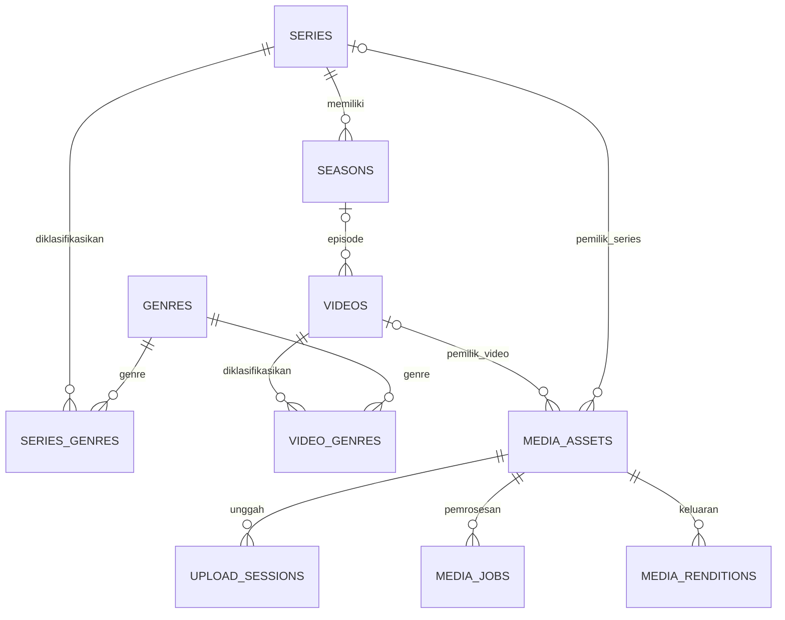

# Rancangan Data — Video, Series, dan Movie

> Status: **Disetujui untuk tahap metadata** · 3 Oktober 2026 · Base SHA `d1d3e0a36a4adf1c7198db7a1d36c49e9f1c93ed`. Pengguna meminta dukungan series dan movie dalam rancangan; rancangan metadata D1–D3 disetujui pada 3 Oktober 2026. Belum ada tabel atau migrasi konten yang dibuat/dijalankan.

Referensi: [context](VIDEO_REPOSITORY_CONTEXT.md), [plan](VIDEO_IMPLEMENTATION_PLAN.md), [backlog](tasks/videos.md), PRD-03–07/09 dan GR-03–07. Model mendukung video mandiri, movie panjang, serta episode. Durasi dan rasio aspek adalah metadata teknis file, bukan penentu jenis konten.

## 1. Relasi utama dan tahap implementasi



`media_assets` mempunyai tepat satu pemilik: video ATAU series. Relasi nullable pada diagram tidak berarti aset boleh tanpa pemilik. Movie/standalone tidak mempunyai season. Setiap episode mempunyai satu season; series sederhana menggunakan Season 1, yang dibuat dalam transaksi saat series dibuat. Ini menyiapkan multi-season tanpa migrasi relasi episode di kemudian hari.

| Tahap                         | Tabel/migrasi                                                            | Hasil                                                          |
| ----------------------------- | ------------------------------------------------------------------------ | -------------------------------------------------------------- |
| A — metadata, task berikutnya | `series`, `seasons`, `videos`, `genres`, `series_genres`, `video_genres` | CRUD admin untuk semua jenis konten; semua konten masih draft. |
| B — unggah                    | `media_assets`, `upload_sessions`; pointer sumber/poster pada konten     | Aset privat dan unggah terverifikasi.                          |
| C — pemrosesan                | `media_jobs`, `media_renditions`                                         | Queue persisten, hasil transcode versi tertentu, retry.        |
| D — publikasi                 | service publish/unpublish, query publik, delivery policy                 | Katalog dan playback hanya untuk konten efektif terbit.        |

Tahap A bukan perintah membuat seluruh tabel media. Tabel masa depan adalah kontrak rancangan yang divalidasi kembali saat modulnya dimulai. Seluruh tabel domain dimiliki `apps/api`; tidak mengubah schema auth.

## 2. Konvensi field

- PK entitas: PostgreSQL `uuid`, dihasilkan API menggunakan `Bun.randomUUIDv7()`; FK memakai tipe yang sama. UUID tidak menjadi bukti otorisasi.
- Timestamp kejadian: `timestamptz`, respons ISO 8601 UTC. `release_date` memakai `date` dengan respons `YYYY-MM-DD`; `release_year` terpisah untuk tahun tanpa tanggal pasti.
- `created_at` default `now()`; `updated_at` diubah service pada setiap write. `row_version integer NOT NULL DEFAULT 1 CHECK (> 0)` naik pada mutation; PATCH/aksi menerima `expectedVersion` untuk mencegah overwrite.
- Status menggunakan `text` + named `CHECK`; hindari pgEnum agar perluasan nilai melalui migrasi lebih sederhana. API menggunakan literal union dan validator Elysia.
- Nilai tidak diketahui memakai NULL, bukan string kosong, angka nol, atau tanggal palsu. Text optional trim dan empty→NULL; text wajib tidak kosong.
- Slug lowercase ASCII `[a-z0-9]+(-[a-z0-9]+)*`, maksimal 180 karakter. Slug unik per resource (`series` dan `videos` terpisah); ID tetap canonical. Slug dibuat dari judul atau input admin, konflik menjadi 409; tidak memakai `MAX()+1`. Slug tidak berubah otomatis saat judul diedit. Sementara perubahan slug setelah first publish ditolak; redirect history dapat dirancang kemudian.
- Batas awal usulan: judul 200, original title 200, synopsis 500, description 10.000 karakter. Pemeriksaan trim/nonempty/panjang wajib pada API dan CHECK database untuk batas yang relevan.
- Foreign key menggunakan `RESTRICT` untuk entitas utama. Soft archive memakai `archived_at`, bukan hard delete. Slug dan nomor tetap reserved setelah archive agar tautan/identitas tidak dialihkan diam-diam.
- `created_by`/`updated_by` adalah `text` FK ke ID native user auth (`ON DELETE RESTRICT`), berasal dari sesi admin; tidak menerima user ID klien. Auth package/schema tetap canonical. Worker tidak menjadi user admin: perubahan teknis tidak menulis actor editorial.

## 3. `series` — metadata tingkat serial

| Kolom                                  | Tipe / null / default          | Makna dan validasi                                          |
| -------------------------------------- | ------------------------------ | ----------------------------------------------------------- |
| `id`                                   | uuid PK                        | Identitas stabil.                                           |
| `slug`                                 | varchar(180), NOT NULL, UNIQUE | Tautan series.                                              |
| `title`                                | varchar(200), NOT NULL         | Nama series; trim nonempty.                                 |
| `original_title`                       | varchar(200), NULL             | Judul asli bila berbeda.                                    |
| `synopsis`                             | varchar(500), NULL             | Ringkasan kartu katalog.                                    |
| `description`                          | text, NULL                     | Deskripsi panjang plain text, maks. 10.000.                 |
| `original_language`                    | varchar(35), NULL              | Tag bahasa BCP 47 tervalidasi service, misalnya `id`, `en`. |
| `release_year`                         | smallint, NULL                 | Tahun 1800–9999; bukan tahun publish situs.                 |
| `release_date`                         | date, NULL                     | Tanggal rilis asli; bila year juga diisi harus cocok.       |
| `completion_status`                    | text, NOT NULL, `ongoing`      | CHECK `ongoing/completed`; independent dari publikasi.      |
| `publication_status`                   | text, NOT NULL, `draft`        | CHECK `draft/published/unpublished`.                        |
| `first_published_at`                   | timestamptz, NULL              | Pertama kali publish, tidak direset saat unpublish.         |
| `published_at`                         | timestamptz, NULL              | Publish aktif terakhir; NULL saat draft/unpublished.        |
| `archived_at`                          | timestamptz, NULL              | Tidak muncul pada listing default.                          |
| `row_version`                          | integer, NOT NULL, 1           | Konflik update editorial.                                   |
| `created_by`, `updated_by`             | text, NOT NULL, FK user        | Actor admin.                                                |
| `created_at`, `updated_at`             | timestamptz, NOT NULL          | Audit waktu.                                                |
| `poster_asset_id`, `backdrop_asset_id` | uuid, NULL, **tahap B**        | Gambar vertikal dan landscape; owned by series ini.         |

Tidak menyimpan `episode_count`, `season_count`, atau total durasi sebagai sumber kebenaran; dihitung dari query. DTO publik menghitung hanya episode efektif terlihat. Completion status tidak menentukan apakah semua episode sudah diunggah atau boleh dipublikasikan.

## 4. `seasons` — pengelompokan episode

| Kolom                          | Tipe / null / default              | Makna dan validasi                                     |
| ------------------------------ | ---------------------------------- | ------------------------------------------------------ |
| `id`                           | uuid PK                            | Identitas season.                                      |
| `series_id`                    | uuid, NOT NULL, FK series RESTRICT | Satu series pemilik.                                   |
| `season_number`                | integer, NOT NULL, CHECK > 0       | Nomor season; UNIQUE `(series_id, season_number)`.     |
| `title`                        | varchar(200), NULL                 | Nama season opsional; UI dapat menampilkan “Season 1”. |
| `description`                  | text, NULL                         | Deskripsi maks. 10.000.                                |
| `release_year`, `release_date` | smallint/date, NULL                | Aturan sama seperti series.                            |
| `archived_at`                  | timestamptz, NULL                  | Season tersembunyi.                                    |
| `row_version`                  | integer, NOT NULL, 1               | Konflik editorial.                                     |
| `created_by`, `updated_by`     | text, NOT NULL, FK user            | Actor admin.                                           |
| `created_at`, `updated_at`     | timestamptz, NOT NULL              | Audit waktu.                                           |

Tidak ada publication status season pada scope awal; visibility mengikuti series dan episode. Tidak ada nomor 0/special pada scope awal. Tambahan season boleh dibuat eksplisit; Season 1 bukan singleton, tetapi default awal. Season tidak boleh dipindahkan antarseries pada API awal.

## 5. `videos` — semua unit yang dapat diputar

| Kolom                                  | Tipe / null / default           | Makna dan validasi                                                           |
| -------------------------------------- | ------------------------------- | ---------------------------------------------------------------------------- |
| `id`                                   | uuid PK                         | Identitas video, tidak berubah saat file diganti.                            |
| `kind`                                 | text, NOT NULL                  | CHECK `standalone/movie/episode`; immutable setelah create pada API awal.    |
| `season_id`                            | uuid, NULL, FK seasons RESTRICT | Wajib hanya untuk episode.                                                   |
| `episode_number`                       | integer, NULL                   | Wajib > 0 untuk episode; UNIQUE `(season_id, episode_number)`.               |
| `slug`                                 | varchar(180), NOT NULL, UNIQUE  | Slug global semua video, termasuk episode.                                   |
| `title`                                | varchar(200), NOT NULL          | Judul video/movie/episode.                                                   |
| `original_title`                       | varchar(200), NULL              | Judul asli.                                                                  |
| `synopsis`                             | varchar(500), NULL              | Ringkasan singkat.                                                           |
| `description`                          | text, NULL                      | Plain text maks. 10.000.                                                     |
| `original_language`                    | varchar(35), NULL               | Bahasa editorial; bukan deteksi audio.                                       |
| `release_year`, `release_date`         | smallint/date, NULL             | Rilis asli, bukan waktu publish.                                             |
| `rights_confirmed_at`                  | timestamptz, NULL               | Waktu admin menyatakan hak konten; hanya server menulis dari aksi eksplisit. |
| `rights_confirmed_by`                  | text, NULL, FK user             | Harus NULL bersama timestamp atau keduanya terisi.                           |
| `publication_status`                   | text, NOT NULL, `draft`         | CHECK `draft/published/unpublished`.                                         |
| `first_published_at`, `published_at`   | timestamptz, NULL               | Pertama publish dan publish aktif terakhir.                                  |
| `archived_at`                          | timestamptz, NULL               | Soft archive.                                                                |
| `row_version`                          | integer, NOT NULL, 1            | Mutasi metadata/publikasi menaikkan versi.                                   |
| `created_by`, `updated_by`             | text, NOT NULL, FK user         | Actor admin.                                                                 |
| `created_at`, `updated_at`             | timestamptz, NOT NULL           | Audit waktu.                                                                 |
| `active_source_asset_id`               | uuid, NULL, **tahap B**         | Sumber aktif; aset lain tetap menjadi riwayat.                               |
| `poster_asset_id`, `backdrop_asset_id` | uuid, NULL, **tahap B**         | Gambar milik video ini.                                                      |
| `playback_job_id`                      | uuid, NULL, **tahap C**         | Generation hasil yang dipilih; bukan “hasil terbaru” implisit.               |

Tidak ada `series_id` duplikat pada video; diperoleh dari `season_id → seasons.series_id`. Ini menghindari pasangan series/season yang bertentangan. Movie dan standalone sama-sama dapat pendek/panjang; `movie` adalah pilihan editorial, tidak otomatis berdasarkan menit.

Tidak menyimpan URL file, signed URL, ukuran file, codec, atau durasi pada tabel `videos`. Durasi yang ditampilkan berasal dari source/job playback terpilih yang telah diprobe dan divalidasi. Rasio landscape/portrait/square diturunkan dari display dimensions/rotation, bukan diasumsikan 9:16 untuk semua konten.

### Constraint inti (bentuk SQL rancangan)

```sql
CHECK (
  (kind = 'episode' AND season_id IS NOT NULL
    AND episode_number IS NOT NULL AND episode_number > 0)
  OR
  (kind IN ('standalone', 'movie')
    AND season_id IS NULL AND episode_number IS NULL)
);
UNIQUE (season_id, episode_number);
CHECK ((rights_confirmed_at IS NULL) = (rights_confirmed_by IS NULL));
CHECK (
  (publication_status = 'published' AND published_at IS NOT NULL
    AND first_published_at IS NOT NULL AND archived_at IS NULL)
  OR
  (publication_status IN ('draft', 'unpublished') AND published_at IS NULL)
);
CHECK (release_year IS NULL OR release_year BETWEEN 1800 AND 9999);
CHECK (release_date IS NULL OR release_year IS NULL
  OR EXTRACT(YEAR FROM release_date) = release_year);
```

Publication timestamp/year CHECK juga diterapkan pada series; year/date CHECK juga pada seasons. Status CHECK dan NOT NULL tetap wajib. `episode_number IS NOT NULL` eksplisit penting karena CHECK PostgreSQL yang menghasilkan NULL tidak menolak row. Kondisi asset ready/parent live lintas tabel ditegakkan service dalam transaksi dengan row lock, bukan CHECK berisi query lintas tabel. Mekanisme mengikuti [PostgreSQL constraints](https://www.postgresql.org/docs/current/ddl-constraints.html).

## 6. Genre dan metadata yang ditunda

| Tabel           | Kolom                                                                            | Constraint / perilaku                                                                 |
| --------------- | -------------------------------------------------------------------------------- | ------------------------------------------------------------------------------------- |
| `genres`        | `id uuid PK`, `slug varchar(80)`, `name varchar(80)`, `created_at`, `updated_at` | Slug UNIQUE, name nonempty; taxonomy admin. Rename slug tidak tersedia pada API awal. |
| `series_genres` | `series_id uuid`, `genre_id uuid`                                                | Composite PK; FK series RESTRICT, genre RESTRICT.                                     |
| `video_genres`  | `video_id uuid`, `genre_id uuid`                                                 | Composite PK; FK video RESTRICT, genre RESTRICT.                                      |

PATCH `genreIds` berarti replace seluruh himpunan secara atomik dengan metadata/video version; duplicate ID atau unknown ID ditolak. Episode dapat memiliki genre sendiri; untuk DTO `effectiveGenres`, override bila video punya minimal satu genre, selain itu inherit series. `genreIds: []` mengembalikan inheritance pada episode. Filtering katalog mengikuti aturan inheritance yang sama. Actor/version untuk perubahan genre label dapat ditambahkan bila taxonomy kelak memerlukan alur editorial kompleks; scope awal hanya create/list, bukan rename/delete.

Cast/crew/credits, tag bebas, rating usia resmi, negara, translation metadata, audio dubbing, franchise/movie collection dan trailer tidak dimasukkan sebagai kolom JSON tanpa kontrak. Tambahkan tabel relasi terpisah ketika kebutuhannya disepakati. Movie bukan anggota series pada scope awal; franchise kelak merupakan relasi collection terpisah dari episode.

## 7. Media tahap B — `media_assets` dan `upload_sessions`

### `media_assets`

| Kolom                                                            | Tipe / aturan                                                                                                              |
| ---------------------------------------------------------------- | -------------------------------------------------------------------------------------------------------------------------- |
| `id`                                                             | uuid PK.                                                                                                                   |
| `video_id`, `series_id`                                          | uuid nullable FK RESTRICT; CHECK tepat satu non-NULL.                                                                      |
| `kind`                                                           | text CHECK `source_video/image/subtitle`; sumber/subtitle hanya boleh mempunyai video owner.                               |
| `status`                                                         | text `pending_upload/uploaded/processing/ready/failed`; default pending_upload.                                            |
| `provider`, `bucket`, `object_key`                               | text NOT NULL; UNIQUE `(provider,bucket,object_key)`; key ditentukan server di namespace sumber, bukan nama file pengguna. |
| `original_filename`                                              | varchar(255), NULL; display saja, bukan path/key.                                                                          |
| `declared_mime_type`, `declared_size_bytes`                      | text/bigint nullable; klaim klien, tidak authoritative.                                                                    |
| `detected_mime_type`, `size_bytes`, `checksum_sha256`            | text/bigint/text nullable; hasil verifikasi; size > 0, checksum format 64 hex jika tersedia.                               |
| `duration_ms`                                                    | bigint NULL, > 0 bila ada; probe sumber video.                                                                             |
| `display_width`, `display_height`, `rotation_degrees`            | integer NULL; dimensi setelah mempertimbangkan rotasi, > 0; rotation fakta probe.                                          |
| `video_codec`, `audio_codec`, `frame_rate_num`, `frame_rate_den` | text/integer NULL; rate rational denominator > 0; codec optional karena tanpa audio valid.                                 |
| `language`, `label`                                              | varchar(35)/varchar(100) NULL; bahasa/label subtitle.                                                                      |
| `verified_at`, `created_at`, `updated_at`                        | timestamptz, verified nullable.                                                                                            |
| `error_code`, `error_message`                                    | text NULL, pesan aman; tidak menyimpan stderr penuh/credential.                                                            |

Beri UNIQUE `(id,video_id)` dan `(id,series_id)` untuk ownership FK pointer. Misalnya `videos(active_source_asset_id,id) → media_assets(id,video_id)`; poster/backdrop video sama, dan pointer series → `(id,series_id)`. Pointer nullable dengan MATCH SIMPLE; `kind=image/source_video`, ready dan subtype dipastikan service. CHECK `(video_id IS NOT NULL) <> (series_id IS NOT NULL)` memastikan satu owner; CHECK `(kind = 'image' OR video_id IS NOT NULL)` membatasi source/subtitle ke video. Tabel dibuat dulu tanpa pointer konten, lalu ALTER menambahkan FK untuk mengatasi siklus DDL. Drizzle relations bukan pengganti FK database.

Sumber yang dipakai upload-complete diverifikasi memakai ukuran/checksum/metadata storage, lalu dibekukan: URL lama yang masih berlaku tidak boleh mengubah input yang diproses. Spike menentukan copy ke key final immutable atau versi objek yang didukung provider; worker memverifikasi identitas/checksum sumber. Presigned PUT sendiri bukan jaminan file tidak berubah. Tidak menyimpan signed URL pada database; URL dibuat saat dibutuhkan.

### `upload_sessions`

`id uuid PK`, `asset_id uuid FK RESTRICT`, `mode text CHECK single_put/multipart`, `provider_upload_id text NULL`, `idempotency_key uuid NOT NULL UNIQUE`, `request_hash text NOT NULL`, `status text CHECK pending/completed/aborted/expired DEFAULT pending`, `expected_size_bytes bigint NOT NULL > 0`, `expected_mime_type text NOT NULL`, `expires_at timestamptz NOT NULL`, `completed_at timestamptz NULL`, `created_by text FK user`, `created_at/updated_at timestamptz`.

Partial unique index pada `asset_id WHERE status='pending'` membatasi satu session aktif; sesi kedaluwarsa harus ditandai expired sebelum membuat pengganti. Request identik mengembalikan session yang sama, key sama dengan payload berbeda menjadi 409. Multipart membutuhkan provider upload ID; method/part list/checksum dan finalization kontraknya ditentukan pada spike movie upload. Jangan menganggap multipart server `S3Client` otomatis menyediakan resume browser. Size bigint dikirim DTO sebagai decimal string; hindari kehilangan presisi/JSON BigInt error. `durationMs` API number hanya setelah batas safe integer tervalidasi.

## 8. Media tahap C — `media_jobs` dan `media_renditions`

### `media_jobs`

`id uuid PK`, `asset_id uuid FK RESTRICT`, `profile_version text NOT NULL`, `generation integer NOT NULL > 0`, UNIQUE `(asset_id,profile_version,generation)`, `status text CHECK queued/running/succeeded/failed DEFAULT queued`, `attempts integer NOT NULL DEFAULT 0 >= 0`, `max_attempts integer NOT NULL > 0`, `available_at timestamptz NOT NULL`, `lease_token uuid NULL`, `lease_expires_at/heartbeat_at timestamptz NULL`, `started_at/finished_at timestamptz NULL`, `error_code/error_message text NULL`, `created_at/updated_at timestamptz NOT NULL`.

Partial unique index `asset_id WHERE status IN ('queued','running')` membatasi satu job aktif per sumber. Running mensyaratkan lease token/expiry terisi; non-running harus mengosongkannya. Retry otomatis mengulang job yang sama dengan attempts naik; reprocess manual setelah terminal membuat generation baru. Klaim memakai transaksi singkat `FOR UPDATE SKIP LOCKED`; FFmpeg di luar transaksi. Heartbeat/finish hanya berhasil bila token masih cocok dan lease belum kedaluwarsa. Hasil stale worker memakai namespace job/attempt sendiri dan tidak dapat menjadi playback aktif. Semua output wajib terverifikasi sebelum job succeeded; enqueue dan source status dibuat atomik setelah verifikasi storage selesai di luar transaksi.

### `media_renditions`

`id uuid PK`, `asset_id uuid NOT NULL`, `job_id uuid NOT NULL`, `name text NOT NULL`, `kind text CHECK hls_master/hls_variant/mp4/poster/thumbnail/subtitle`, `provider/bucket/object_key text NOT NULL`, `mime_type text NOT NULL`, `size_bytes bigint NULL`, `display_width/display_height integer NULL`, `bitrate_bps bigint NULL`, `duration_ms bigint NULL`, `language varchar(35) NULL`, `verified_at timestamptz NOT NULL`, `created_at timestamptz NOT NULL`.

UNIQUE `(job_id,name)`; UNIQUE `(provider,bucket,object_key)`. Composite FK `(job_id,asset_id) → media_jobs(id,asset_id)` dengan UNIQUE target memastikan output berasal dari sumber yang benar. Hasil disisipkan setelah upload/verify; output transient tidak terlihat sebagai rendition siap. HLS master/variant dapat merujuk banyak segment dalam prefix immutable milik job; tidak membuat row per segment. Master menunjuk playlist, varian menyimpan karakteristik kualitas. MIME/codec/resolusi/profil tepat ditentukan saat worker dikembangkan. Namespace keluaran `outputs/<asset>/<job>/<attempt>/...` berbeda dari sumber untuk menghindari overwrite lintas tabel.

Pointer `videos(playback_job_id,active_source_asset_id) → media_jobs(id,asset_id)` dibuat tahap C. CHECK `(playback_job_id IS NULL OR active_source_asset_id IS NOT NULL)` wajib; source boleh ada sebelum hasil siap. Job siap/sumber aktif/kind dan semua rendition wajib dicek service. Subtitle upload manual tetap berupa asset kind subtitle; derivative caption hasil worker dapat berupa rendition.

## 9. Publikasi, archive, dan concurrency

1. Tahap A hanya expose create draft, read, edit, archive. `publicationStatus`, actor/timestamp, asset pointers, kind conversion, serta field teknis tidak dapat ditulis melalui PATCH metadata. Payload unknown field ditolak.
2. Tahap D publish video memerlukan metadata wajib lengkap, source terverifikasi, playback job succeeded yang sesuai sumber, semua hasil wajib siap, poster terverifikasi, dan rights confirmation. Subtitle wajib atau optional ditentukan sebelum task publish Ready.
3. Episode boleh diberi status published ketika series masih draft; episode baru efektif publik ketika series juga published dan seluruh parent tidak archived. Publish series mensyaratkan metadata/poster serta minimal satu episode lokal published dan siap. Ini memungkinkan menyiapkan episode sebelum membuka katalog series.
4. Predicate tunggal `isPubliclyPlayable`: video published + tidak archived + sumber/job siap; episode juga membutuhkan season dan series tidak archived serta series published. Dipakai daftar/detail/playback/next-episode, bukan hanya listing. Parent unpublished tidak mengubah status child; republish series mengembalikan episode published. Admin mendapat penjelasan efektif visibility ini.
5. Query publik mengembalikan 404 yang sama untuk draft/hidden/absent, dan hanya DTO whitelisted. Jumlah episode/genre/next-episode tidak boleh membocorkan child tersembunyi. Series otomatis hilang dari katalog publik bila tidak mempunyai episode efektif playable; status editorialnya tidak diubah otomatis.
6. Kind tetap immutable. Pindah season/nomor episode setelah first publish ditolak pada scope awal; nomor season juga terkunci bila mempunyai episode yang pernah terbit. Perubahan grouping membutuhkan task migration terpisah. Penggantian source pada konten draft/unpublished diperbolehkan dan mengosongkan playback pointer sampai generation baru siap; source/playback selection pada konten published ditolak sampai unpublish. File portrait/landscape diterima sesuai policy, tanpa crop otomatis.
7. Publish mengunci parent series → season → video → source → job dalam urutan tetap; mutation/worker yang menyentuh row sama mengikuti urutan kompatibel. Parent unpublish memegang lock series, sehingga race parent-child konsisten. Filter baca tetap authoritative, tidak mengandalkan cache UI.
8. Archive konten published ditolak 409; series/season yang masih punya child published atau job queued/running ditolak sampai child ditangani. Soft archive draft tidak menghapus file/child. Hard delete, restore dan garbage collection mempunyai task terpisah dan belum menjadi endpoint.
9. `expectedVersion` salah menghasilkan 409 `CONTENT_VERSION_CONFLICT`; PATCH menulis `WHERE row_version=expectedVersion`, bukan read-then-write tanpa proteksi. Genre set dan metadata berubah dalam satu transaksi. Episode reassign hanya sebelum first publish dan pada draft/unpublished, dengan parent lock dan UNIQUE nomor tujuan.
10. Publish/upload/reprocess memerlukan dedup persisten. Upload memakai upload_sessions; job memakai identity asset/profile/generation. Sebelum tahap D, tambahkan tabel `content_operations(id uuid PK, video_id uuid FK, operation text, idempotency_key uuid, request_hash text, result_version integer, created_at timestamptz, UNIQUE(video_id,operation,idempotency_key))` dalam transaksi perubahan publish/unpublish; key sama payload berbeda 409, replay tidak mengganti timestamp. Series publication memakai tabel `series_operations` setara dengan FK series, bukan owner polymorphic tanpa FK. Retensi key dan batas request wajib disepakati saat task publikasi.

Policy CDN/signed URL menentukan kapan akses file berhenti setelah unpublish. Query DB saja tidak mencabut URL/cache yang telah beredar. Source dan hasil preview tidak diletakkan pada bucket publik. Tahap D harus menetapkan batas pencabutan akses yang teruji untuk movie MP4 maupun seluruh playlist/segment HLS.

## 10. Index dan query yang direncanakan

| Table            | Index tambahan selain PK/UNIQUE                                                                                                                                                                                                                    | Query sasaran                                    |
| ---------------- | -------------------------------------------------------------------------------------------------------------------------------------------------------------------------------------------------------------------------------------------------- | ------------------------------------------------ |
| series           | `(created_at DESC,id DESC) WHERE archived_at IS NULL`; `(published_at DESC,id DESC) WHERE publication_status='published' AND archived_at IS NULL`                                                                                                  | Admin list; series katalog setelah join episode. |
| seasons          | UNIQUE `(series_id,season_number)`; index FK sudah tercakup prefix tersebut                                                                                                                                                                        | Season suatu series.                             |
| genres           | `(created_at DESC,id DESC)`                                                                                                                                                                                                                        | Listing taxonomy bounded.                        |
| videos           | `(created_at DESC,id DESC) WHERE archived_at IS NULL`; `(kind,created_at DESC,id DESC) WHERE archived_at IS NULL`; `(published_at DESC,id DESC) WHERE publication_status='published' AND archived_at IS NULL`; UNIQUE `(season_id,episode_number)` | Admin all/kind, katalog publik, urutan episode.  |
| *_genres         | Composite PK owner/genre; index `(genre_id,owner_id)`                                                                                                                                                                                              | Filter genre dan FK genre.                       |
| media_assets     | `(video_id,created_at DESC)`, `(series_id,created_at DESC)`                                                                                                                                                                                        | Aset pemilik.                                    |
| upload_sessions  | UNIQUE pending asset; `(status,expires_at)`                                                                                                                                                                                                        | Session dan expiry sweep.                        |
| media_jobs       | Partial `(available_at,id) WHERE status='queued'`; partial `(lease_expires_at,id) WHERE status='running'`; `(asset_id,generation)`                                                                                                                 | Claim, recovery, riwayat generation.             |
| media_renditions | UNIQUE `(job_id,name)`; `(asset_id,job_id)`                                                                                                                                                                                                        | Output playback generation.                      |

Index tambahan dibuat ketika query terkait diimplementasikan dan diperiksa EXPLAIN pada fixture realistis. Search tahap A adalah `ILIKE` judul dengan binding parameter; belum menambah trigram/FTS/index tanpa kebutuhan. Admin list cursor `(created_at,id)` descending; episode order `(season_number,episode_number,id)`, tidak menyimpan urutan acak. Default limit 20, maksimal 100; opaque cursor memiliki sort/filter/version tervalidasi dan bound panjang; filter berbeda tidak dapat memakai cursor lama.

## 11. Contoh konten

| Konten              | kind       | Hubungan                      | Media                                       |
| ------------------- | ---------- | ----------------------------- | ------------------------------------------- |
| “Kisah Kota”        | series     | Season 1 dan Season 2         | Poster/backdrop series.                     |
| “Pertemuan Pertama” | episode    | Season 1, episode 1           | Sumber portrait, hasil HLS, poster episode. |
| “Babak Baru”        | episode    | Season 2, episode 1           | Nomor sama sah pada season berbeda.         |
| “Perjalanan Pulang” | movie      | season_id/episode_number NULL | Sumber landscape 120 menit; job terpisah.   |
| “Cerita Singkat”    | standalone | season_id/episode_number NULL | Video mandiri portrait 3 menit.             |

Contoh durasi bukan batas produk. Movie 120 menit tidak dipotong menjadi episode dan tidak membutuhkan schema khusus movie.

## 12. Keputusan untuk ditinjau

- D1: jenis `standalone/movie/episode`, season wajib bagi episode dan default Season 1.
- D2: enam tabel metadata tahap A, field opsional/year-date/language/genre, plain text, batas input dan UUIDv7.
- D3: immutable kind, slug locked setelah first publish, nomor unik per season, soft archive/nomor reserved, optimistic concurrency dan genre inheritance.
- D4: parent series publication gate, episode boleh disiapkan published sebelum series live, requirement poster/hak/subtitle saat publish.
- D5: movie dapat landscape; batas ukuran/durasi/provider/upload-resume/profil HLS/distribution ditentukan sebelum tahap media.

D1–D3 disetujui pengguna pada 3 Oktober 2026. D4–D5 boleh diselesaikan saat refinement media/publikasi; tidak menghalangi metadata draft bila field/status future tetap read-only.
