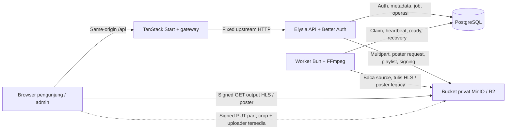

# Architecture — Vertical Movie App

> Status: **Baseline implementasi repository; batas UI dan verifikasi production dicatat terpisah** · Review 5 Oktober 2026, pembaruan uploader/crop sampul 6 Oktober 2026 · Snapshot `1f45728d5a0aeeecae48149ae538997c04f122f2` tetap historis. Pilihan auth/metadata/media disetujui pengguna pada 1–4 Oktober 2026. Pembaruan ini merujuk ACOV-009 tanpa keputusan produk baru atau klaim kesiapan production.

Update implementasi 5 Oktober 2026, disetujui pengguna: dashboard metadata tahap pertama tersedia pada `feat/admin-content-dashboard`; scope/evidence pada [backlog admin content](../tasks/admin-content.md). Snapshot review awal di atas dipertahankan sebagai sejarah; tidak ada rollout production.

## Keadaan repo saat ini

Workspace Bun mempunyai dua aplikasi dan satu package auth bersama. `apps/api` menyediakan Elysia HTTP API, PostgreSQL/Drizzle, storage/upload, publikasi/katalog/playback dan kode worker. `apps/web` menyediakan TanStack Start, gateway same-origin, login/dashboard metadata admin (Eden/TanStack Query) dan player watch/preview minimal. `packages/auth` memiliki Better Auth server/client/types; credential server tidak masuk entry client.

Media backend sudah diimplementasikan: multipart/freeze/enqueue, worker FFmpeg HLS, native poster request processing, claim/lease/retry/recovery, readiness/publish/archive, katalog API dan signed delivery. Homepage masih starter MP4 demo. Dashboard metadata Film/Standalone/Series tersedia: list/search/pagination, create/detail/edit, theme, conflict dan dirty-navigation. Uploader source/cover Film/Standalone dan cover Series tersedia, dengan crop, hash/pause/resume, readiness dan auth cleanup; bukti ADUP ada pada [backlog uploader](../tasks/admin-media-upload.md), dan bukti sampul worker-independent pada [ACOV-009](../tasks/admin-cover-processing.md). Publication UI, editor season/episode, katalog web lengkap, konfigurasi situs dan subtitle masih lanjutan. Spesifikasi/mockup desain tidak dianggap layar runtime untuk fitur lain.

Ketentuan produk dan angka policy media dimiliki [PRD](../product/prd.md), aturan lintas fitur oleh [Global Rules](../product/global-rules.md). Overview ini memiliki batas komponen dan dataflow. Instruksi proses/command dimiliki [AGENTS.md](../../AGENTS.md), [API development](../guides/api-development.md), [environment](../guides/environment.md) dan runbook, sehingga tidak diduplikasi sebagai workflow baru.

## Tech stack yang dipilih

| Lapisan           | Teknologi                                       | Kondisi/peran saat ini                                                                                                                                                                                                                                       |
| ----------------- | ----------------------------------------------- | ------------------------------------------------------------------------------------------------------------------------------------------------------------------------------------------------------------------------------------------------------------ |
| Runtime/workspace | Bun, Turborepo                                  | Runtime API/web/worker dan orchestration task workspace; versi/dependensi mengikuti manifests/lockfile.                                                                                                                                                      |
| Backend           | Elysia                                          | Factory bertipe tanpa listen pada `app.ts`; bootstrap dependency/listen di `index.ts`.                                                                                                                                                                       |
| API client        | Eden Treaty                                     | Type-only `api/types`, `parseDate: false`; browser memakai public origin `/api`, auth memakai SDK Better Auth tersendiri.                                                                                                                                    |
| Web               | TanStack Start, React, Bun/Nitro                | Gateway, auth, dashboard metadata responsif/light-dark dan watch/preview tersedia; uploader source/cover tersedia; readiness/Publish/Archive Film/Standalone terverifikasi lokal 7 Oktober 2026; publication Series/episode serta katalog UI masih lanjutan. |
| Database          | PostgreSQL, Drizzle, Bun SQL                    | Auth, metadata, aset, session upload, durable job/attempt/rendition dan operation tersedia. API/worker memakai pool per proses pada DB yang sama.                                                                                                            |
| Auth              | Better Auth pada `@repo/auth`                   | Email/password, single-admin provisioning/recovery, sesi PostgreSQL dan private guard tersedia; signup publik nonaktif.                                                                                                                                      |
| Object storage    | MinIO development / Cloudflare R2 production    | Satu bucket privat per env, selector server `STORAGE_PROVIDER`; profil provider/bucket/key persisten. R2 staging belum dibuktikan.                                                                                                                           |
| Storage clients   | Native `Bun.S3Client` dan SDK S3                | Native read/stat/presign; SDK explicit multipart/copy/control dan penulisan output worker menutup kebutuhan yang belum dipenuhi native pada proof Bun 1.4.2.                                                                                                 |
| Queue/worker      | PostgreSQL, proses Bun terpisah, FFmpeg/FFprobe | Polling, SKIP LOCKED, heartbeat/recovery/retry, deadline/shutdown dan cleanup tersedia; tidak ada broker atau LISTEN/NOTIFY runtime.                                                                                                                         |
| UI/form/data      | shadcn Base UI, Tailwind, TanStack Form/Query   | Primitive/login, dashboard metadata dan uploader menggunakan Query/Eden/Form sesuai kebutuhan; File/transport berada pada manager privat.                                                                                                                    |
| Player            | Video.js React/core/hlsjs-video 10.0.0-rc.4     | Adapter HLS dan renewal URL tersedia; compatibility Safari/native HLS/perangkat sasaran masih gerbang verifikasi.                                                                                                                                            |

Manifests API/web/auth menjadi acuan dependency. AWS SDK tidak mengubah keputusan provider atau metode upload; batas proof native dan alternatif tercatat pada [kontrak upload](media-upload-contract.md) dan [runbook media](../operations/media.md).

## Batas sistem dan dataflow

- **Web/gateway:** bisnis browser `/api/*` diteruskan ke upstream API yang ditetapkan dengan satu prefix `/api` dihapus; auth `/api/auth/*` mempertahankan path native. Allowlist path/header, origin, batas body, timeout/cancellation dan forwarding cookie berlaku sesuai tipe route. Cookie/authorization hanya diteruskan untuk auth/admin, bukan endpoint katalog publik.
- **API:** menyusun module series/videos/genres/media/catalog/publication/playback, menerapkan schema input dan guard authoritative untuk operasi privat. Pembacaan katalog/playback publik tidak membutuhkan login, tetapi tetap memeriksa effective visibility. Bootstrap menginjeksi DB, auth, storage dan service; konfigurasi storage yang tidak diaktifkan membuat service media/playback unavailable, bukan fallback provider tersembunyi.
- **Auth:** `packages/auth` memiliki entry server/client/types. API menginjeksi database ke server auth; web menggunakan client/reader per request, guard layout dan state sesi. Hak admin ditegakkan server dan unique partial index, bukan hanya UI. Pengaturan recovery/maintenance dimiliki [runbook auth](../operations/auth.md).
- **Database:** menyimpan state durable dan constraints; body video/sampul/HLS berada di object storage. Transaksi claim/completion/publish/activation pendek; storage network dan subprocess tidak berada di dalamnya. API dan worker mempunyai pool sendiri, bukan singleton pool bersama lintas proses.
- **Storage:** source, staging upload dan output attempt memakai namespace berbeda dalam satu bucket privat. Publikasi tidak mengubah prefix menjadi publik atau memindahkan segment. Browser harus dapat menjangkau endpoint signed URL dan CORS yang sesuai; mengganti env tidak memindahkan data/provider asal.
- **Worker:** kode tetap di `apps/api`, tetapi entry process terpisah dari HTTP. Parameter resource/concurrency/retry/lease/deadline dimiliki env worker; default concurrency 1 merupakan keputusan yang sudah disetujui, kapasitas target tetap menunggu benchmark.

HLS master/variant berjalan melalui API/gateway; segment/init dan poster menggunakan signed GET output langsung dari storage. Gateway bukan proxy seluruh body video. Browser multipart, uploader/resume dan crop sampul sudah tersedia; proof browser built MinIO ada di backlog ADUP/ACOV. R2 staging serta Safari/perangkat fisik belum dibuktikan.

## Alur upload dan pemrosesan

1. Admin membuat metadata draft dan memulai session source/poster melalui API. Owner/kind/parent, ukuran/format awal, idempotency dan profile diperiksa; API menetapkan staging key, geometry dan expiry. Browser mengunggah part langsung memakai URL yang diotorisasi; part sukses direkonsiliasi dari storage saat resume.
2. Complete mengklaim session, memeriksa daftar part/ukuran dan membekukan objek source atau original crop lewat copy/stat di luar transaksi. Claim yang masih sah menyelesaikan session, memasang pointer dan membuat satu job generation durable. Poster request-mode kemudian diproses browser melalui private API command; source dan poster legacy worker-mode menunggu worker. Completed belum berarti Ready atau Published.
3. Worker polling hanya mengklaim `execution_mode='worker'` dengan `FOR UPDATE SKIP LOCKED`, membuat lease token/attempt dan prefix output immutable. Transaksi selesai sebelum download/probe/FFmpeg. Heartbeat memperpanjang lease; job generation dan claim diperiksa lagi sebelum hasil menjadi aktif. Request poster memakai lease/attempt durable yang sama tetapi menunggu native terminal dalam HTTP request.
4. Untuk source, FFprobe/decode memverifikasi container/codec, rotasi/SAR, durasi/resolusi/9:16 dan sumber; FFmpeg menghasilkan HLS `hls-v1`. Untuk poster request, API memakai Bun.Image awaited dan memverifikasi original fingerprint, private output WebP, HEAD/hash, ukuran serta dimensi. Worker tetap memproses poster legacy yang sudah bermode `worker`.
5. Transaksi activation mensyaratkan lease belum expired, token/generation masih sama dan asset tidak sedang/selesai dihapus. Job menjadi succeeded, daftar objek/rendition dicatat, asset ready dan readyJobId/provenance dipasang. Tidak ada autopublish.
6. Failure transient dijadwalkan retry; lease expired direcover atau menjadi failure terminal sesuai batas. Attempt yang kehilangan claim tidak mengaktifkan output. Admin uploader menyediakan status dan recovery upload/crop; monitoring worker global tetap lanjutan.
7. Maintenance worker menjalankan expiry/cleanup upload dan source/failed attempt, dengan claim/namespace tercatat. Shutdown menghentikan claim baru dan membatasi subprocess; source/HLS/metadata tidak dihapus oleh sweep bucket tanpa seleksi.

Profil/limit media, geometry multipart dan timeout policy yang telah disetujui mengikuti [PRD](../product/prd.md#keputusan-inti-yang-disetujui) serta [environment](../guides/environment.md). Polling/recovery/cleanup saat ini sudah mempunyai implementasi; LISTEN/NOTIFY tetap bukan kebutuhan atau fitur runtime yang diklaim tersedia.

## Model data dan status aktif

| Data / owner                                           | Peran implementasi                                                                                                                                                                 |
| ------------------------------------------------------ | ---------------------------------------------------------------------------------------------------------------------------------------------------------------------------------- |
| Native auth                                            | Identitas, account/session/rate-limit dan enforcement satu admin, dimiliki package auth.                                                                                           |
| `series`, `seasons`, `videos`                          | Hierarchy konten; video kind movie/standalone tanpa season, episode melalui season; metadata/audit/versioning dan pointer asset.                                                   |
| `genres`, `series_genres`, `video_genres`              | Taxonomy dan inheritance/override metadata genre.                                                                                                                                  |
| `media_assets`, `upload_sessions`                      | Ownership, provider/bucket/key, generation/facts/provenance, multipart/claim/expiry and source/poster readiness; session executor defaults to `worker`, new posters use `request`. |
| `media_jobs`, `media_job_attempts`, `media_renditions` | Durable queue, lease/retry, output attempt and HLS renditions; `request` is poster-only, implemented and verified locally. Worker claim/recovery excludes request-mode jobs.       |
| `content_operations`                                   | Rekam idempotency/hasil operasi publikasi; bukan tabel body media.                                                                                                                 |
| Pengaturan situs / subtitle                            | Belum mempunyai fitur schema/API/UI lengkap; tetap pekerjaan lanjutan.                                                                                                             |

| Subject        | Status yang ada pada source                                                                                                                                   |
| -------------- | ------------------------------------------------------------------------------------------------------------------------------------------------------------- |
| Video          | `draft`, `published`, `archived`; archive menyimpan audit/version dan menutup visibility baru.                                                                |
| Series         | `publicationStatus` masih `draft/published/unpublished` dari kontrak parent sebelumnya, dengan `archivedAt` terpisah. Jangan memakai enum video untuk parent. |
| Season         | `archivedAt`/audit; tidak mempunyai publicationStatus sendiri.                                                                                                |
| Asset          | `uploading`, `uploaded`, `processing`, `ready`, `failed`; berbeda dari publicationStatus.                                                                     |
| Upload session | `initializing`, `pending`, `completing`, `completed`, `aborting`, `aborted`, `expired`, `failed`.                                                             |
| Job            | `queued`, `running`, `retry`, `succeeded`, `failed`, `cancelled`; attempt/lease dan output aktif terpisah.                                                    |

Source canonical berada pada `apps/api/src/db/schema/`. Model data menyimpan detail tahap A serta [schema media aktif](video-data-model.md#schema-media-aktif--6-oktober-2026); ketika bagian historis berbeda, periksa schema/migration saat ini. Migration source `0006_media-upload`, `0007_media-jobs`, `0008_media-publication`, dan `0010_poster-execution-mode` tersedia; migration development/preservation dibuktikan pada runbook dan backlog task. Tidak ada migration production yang dijalankan.

## Kontrak API aktif

Path berikut adalah path upstream Elysia. Browser bisnis menambahkan `/api` melalui gateway; auth upstream tetap memakai `/api/auth`. DTO/schema/OpenAPI dan module source menjadi acuan rinci, bukan kontrak kandidat baru.

| Operasi/family route                                                                                           | Peran                                                             | Akses                                         |
| -------------------------------------------------------------------------------------------------------------- | ----------------------------------------------------------------- | --------------------------------------------- |
| `GET /videos`, `/videos/:slug`, `/videos/:slug/next`                                                           | Katalog/detail dan next episode efektif playable                  | Publik                                        |
| `GET /series`, `/series/:slug`                                                                                 | Series publik dengan child playable                               | Publik                                        |
| `GET /videos/:slug/playback`                                                                                   | DTO playback/poster dan expiry                                    | Publik setelah pemeriksaan visibility         |
| `GET /playback/videos/:slug/master.m3u8`, `/playback/videos/:slug/variants/:index`                             | Playlist terverifikasi/rewrite output                             | Publik setelah pemeriksaan visibility         |
| `GET /admin/content`                                                                                           | Pagination metadata Film/Standalone/Series; total/page/pageSize   | Admin                                         |
| `GET/POST /admin/videos`, `GET/PATCH /admin/videos/:id`                                                        | Draft/read/edit metadata                                          | Admin                                         |
| `GET/POST /admin/series`, `GET/PATCH /admin/series/:id`                                                        | Metadata series                                                   | Admin                                         |
| `GET/POST /admin/series/:id/seasons`, `GET/PATCH /admin/seasons/:id`                                           | Metadata season                                                   | Admin                                         |
| `GET/POST /admin/genres`                                                                                       | Taxonomy genre                                                    | Admin                                         |
| `POST /admin/media/uploads`, `GET /admin/media/uploads/:id`                                                    | Initiate dan status multipart/processing                          | Admin                                         |
| `POST /admin/media/uploads/:id/parts`, `/admin/media/uploads/:id/complete`, `/admin/media/uploads/:id/abort`   | Izin part, freeze/enqueue atau abort                              | Admin                                         |
| `POST /admin/videos/:id/publish`, `/admin/series/:id/publish`                                                  | Publish manual/idempotency/readiness                              | Admin                                         |
| `POST /admin/videos/:id/archive`, `/admin/series/:id/archive`, `/admin/seasons/:id/archive`                    | Archive/versioning dan parent visibility                          | Admin                                         |
| `GET /admin/videos/:id/playback`, `/admin/videos/:id/hls/master.m3u8`, `/admin/videos/:id/hls/variants/:index` | Preview output ready                                              | Admin                                         |
| `/api/auth/*`                                                                                                  | Kontrak native auth dengan path yang dinonaktifkan tetap tertutup | Sesuai Better Auth/guard, tanpa signup publik |
| `GET /`, `/openapi`, `/openapi/json`                                                                           | Health dan kontrak Scalar/OpenAPI                                 | Publik                                        |

Tidak ada endpoint aktif `/admin/videos/:id/upload-session`, `/admin/videos/:id/unpublish`, `/admin/settings`, restore atau manual reprocess. Status operation/schema tidak berarti route kandidat tersebut tersedia. Rincian input/idempotency/conflict dan respons dimiliki [kontrak upload](media-upload-contract.md), [runbook metadata](../operations/video-metadata.md) dan [runbook media](../operations/media.md).

## Publikasi, delivery dan retensi

API publish memerlukan metadata/hak/source/HLS/poster siap; source tombstone setelah retensi tidak membuat HLS siap kehilangan provenance. Episode published hanya publik ketika parent dan readiness memenuhi effective visibility. Series tanpa child playable tidak ditampilkan. Metadata katalog DTO whitelisted; playback sengaja mengirim kapabilitas signed output temporer, tanpa credential server atau source asli.

Playback memeriksa provider/bucket persisten, job/output namespace aktif dan durasi verified; master/variant di-rewrite agar hanya objek terverifikasi dapat diminta. Player watch `/watch/:slug` dan admin preview `/admin/videos/:id/preview` menggunakan loader playback dan renewal saat expiry/play/seek/pergantian kualitas dengan posisi/pause dipertahankan. Tidak ada UI next episode/katalog lengkap hanya karena endpoint tersedia.

TTL signed 2× durasi aktual dan kebijakan cache/invalidation mengikuti [PRD](../product/prd.md#publikasi-akses-dan-cache). DTO/playlist no-store; payload MinIO menggunakan fallback private/no-store. Archive menghentikan akses/URL baru; signed URL lama/buffer/cache mengikuti batas expiry yang disetujui, bukan revocation instan.

Retensi source non-archived dimulai tujuh hari sejak HLS verified-ready tanpa job aktif. Archived mempertahankan file valid yang masih ada, termasuk source; source deleted tidak dipulihkan dan deletion claim mempunyai batas race. Tombstone/metadata tetap tersedia. Kebijakan failure/upload/attempt/temp cleanup dan reprocess mengikuti [PRD](../product/prd.md#retensi-dan-pemulihan) dan runbook, bukan lifecycle bucket unconditional.

## Pekerjaan lanjutan dan gerbang verifikasi

- **UI produk:** publication Series/episode, upload/editor season/episode, katalog/navigasi publik lengkap dan konfigurasi situs. Field pengaturan, UX katalog dan kebijakan konten masih pertanyaan PRD yang dilewati; tidak diputuskan oleh review arsitektur.
- **Fitur opsional/lanjutan:** subtitle, restore/republish, revisi source published dan cascade parent yang belum dirancang/diimplementasikan. Tidak mengklaim caption delivery karena kontrol caption player tersedia.
- **Provider/platform:** R2 staging/end-to-end serta Safari/native HLS/perangkat sasaran. Proof MinIO/Chromium historis tidak menggantikannya.
- **Resource/recovery:** benchmark target 4 core/RAM 4 GB, kualitas visual, supervisor/stress/fault dan full restore yang belum lengkap. Concurrency/config defaults bukan bukti kapasitas.
- **Deployment:** server/domain/disk, TLS/provisioning, migrasi/backup/rollout production masih terpisah. [Proposal deployment](../plans/video/implementation-plan.md#nomor-8--rekomendasi-deployment-production-dan-r2-belum-disetujui) belum dijalankan; review docs tidak menambah Dockerfile/Compose atau membeli/provision server.

Bukti lokal auth/metadata/media, command/tanggal/fixture dan batas test dimiliki [auth runbook](../operations/auth.md), [media runbook](../operations/media.md), [backlog media](../tasks/media.md), [worker](../tasks/media-worker.md) dan [publication](../tasks/media-publication.md). Review statis source dan pemetaan klaim ada pada [context DOCS-006](../plans/documentation/repository-context.md#review-architecture--5-oktober-2026); tidak menjalankan ulang proof runtime/production atau menaikkan seluruh backlog menjadi Done.

## Riwayat baseline

Overview sebelumnya merupakan draft integrasi pada 3–4 Oktober 2026. Metadata enam tabel/endpoint tahap A dan keputusan kandidat saat itu tetap menjadi sejarah di plan/backlog. Review 5 Oktober 2026 mengganti klaim media/gateway belum tersedia, delivery TBD, enum video lama dan rute kandidat dengan baseline source pada snapshot di atas. Referensi teknis berikut dipertahankan sebagai navigasi pendukung; bukti kondisi implementasi berasal dari source dan runbook pada SHA/tanggal yang dicatat.

## Referensi teknis

- [Elysia documentation index](https://elysiajs.com/llms.txt) dan [Better Auth–Elysia integration](https://better-auth.com/docs/integrations/elysia)
- [Eden installation](https://elysiajs.com/eden/installation), [Eden Treaty](https://elysiajs.com/eden/treaty/overview), [Elysia lifecycle](https://elysiajs.com/essential/life-cycle), dan [plugin scope](https://elysiajs.com/essential/plugin)
- [Drizzle PostgreSQL guide](https://orm.drizzle.team/docs/get-started/postgresql-new) dan [Better Auth Drizzle adapter](https://better-auth.com/docs/adapters/drizzle)
- [shadcn/ui for TanStack Start](https://ui.shadcn.com/docs/installation/tanstack)
- [TanStack Form](https://tanstack.com/form/latest) dan [TanStack Query](https://tanstack.com/query/latest/docs/framework/react)
- [Video.js documentation](https://videojs.com/guides/embeds)
- [Bun S3 API](https://bun.com/docs/runtime/s3), [Drizzle dengan Bun SQL](https://orm.drizzle.team/docs/connect-bun-sql), dan [kompatibilitas S3 Cloudflare R2](https://developers.cloudflare.com/r2/api/s3/api/)
- [Cloudflare R2 presigned URLs](https://developers.cloudflare.com/r2/api/s3/presigned-urls/)
- [FFmpeg CLI](https://ffmpeg.org/ffmpeg.html), [Bun.spawn](https://bun.com/docs/runtime/child-process), [PostgreSQL row locking](https://www.postgresql.org/docs/current/sql-select.html), dan [PostgreSQL NOTIFY](https://www.postgresql.org/docs/current/sql-notify.html)

## Dashboard metadata — update 5 Oktober 2026

Web memakai Eden dengan kontrak API type-only dan TanStack Query untuk metadata, serta satu TanStack Form/mapper bagi create/edit. Private query keys memasukkan identity/type/id atau seluruh filters/page/pageSize; retry baca manual, stale 15 detik dan GC 5 menit. Mutation tidak diulang otomatis, memverifikasi identifier/versi respons sebelum confirmed success dan menginvalidasi list/detail terkait. Business 403/5xx memverifikasi sesi authoritative; snapshot valid dipertahankan selama recheck, invalid/error tetap mengunci layout dan membersihkan private cache.

Baseline edit dimiliki form sampai explicit reload/success; background refetch tidak mengganti rowVersion atau input. PATCH hanya field berubah + expectedVersion, dengan null/[]/false untuk clearing. Genre selector memakai cursor existing dan mempertahankan IDs di memory. Query/mutation/form privat tidak dipersist; logout/expiry/revocation menghapus query dan mutation cache. Theme preference non-secret terpisah dari auth/data, bootstrap sebelum CSS dan System/media listener tidak remount form. Rincian lima rute, kontrak dan proof ada pada [runbook metadata aktif](../operations/video-metadata.md#dashboard-metadata-aktif--5-oktober-2026).

## Readiness dan dashboard publication — 7 Oktober 2026

Implemented/verified lokal: private `GET /admin/videos/:id/publication-readiness` memakai shared assessment dengan command publish dan satu repeatable-read snapshot read-only. DTO whitelisted berisi owner/kind/version/editorial state/archivedAt/canPublish serta tujuh stable checks; non-episode parent gate not-applicable. Tidak melakukan storage HEAD/signing, enqueue atau mutation. Metadata/hak/provenance/generation/verified duration/active-upload tetap authoritative di transaksi command setelah owner lock. Schema dan persistent replay existing dipertahankan.

Detail Film/Standalone non-episode menampilkan Publication, single owner inventory/uploader, Preview dengan return context tervalidasi, manual preview acknowledgement, Publish dan Archive published-only. Intent/key/version hanya di memory; controller memeriksa fresh metadata/inventory/readiness sebelum POST, serializes intent dan reconciles GET current state setelah hasil yang tidak pasti. Explicit retry publish memakai intent/key/version identik; versi berubah meminta review baru. Confirmed command+failed refresh tetap confirmed tanpa resend. Archive memakai expectedVersion, tanpa idempotency key baru. Query/mutation/effect discope identity dan owner, auth stop membatalkan File/hash/in-flight read serta menolak late cache writes; offline tidak membuat antrean mutation.

Kontrak operasi berada pada [runbook media](../operations/media.md#dashboard-publish--archive-filmstandalone), acceptance/receipts pada [APUB](../tasks/admin-publication.md). Browser Chromium built Bun/Nitro memakai real dedicated PostgreSQL/MinIO/FFmpeg dan auth injection; native auth evidence tetap terpisah. Tidak memperluas scope menjadi seluruh MVP atau production readiness.
