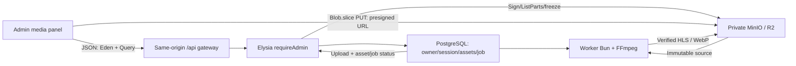

# Implementation plan: admin media upload

## Plan metadata

- Status: **plan disetujui pengguna** · 5 Oktober 2026; pengguna meminta melanjutkan mockup. Runtime belum diimplementasikan. Task proof/desain memiliki gate sebelum runtime berikutnya; hasil mockup memerlukan visual review tersendiri.
- Repository: `bayuaji17/vertical-movie-app`.
- Base ref: `main`; base SHA / last validated SHA: `d8417249de99611e1a661ade03bb4b03dd5f0538`.
- Context: [repository-context.md](repository-context.md), disimpan lebih dahulu.
- Backlog: [admin-media-upload](../../tasks/admin-media-upload.md); task ID ADUP-001–015.
- Branch planning: `chore/admin-media-upload-plan`; branch runtime yang direkomendasikan `feat/admin-media-upload`, dibuat setelah scope disetujui dan freshness diperiksa.
- Otorisasi: dokumen planning dan local task commit mengikuti workflow pengguna. Push/PR/merge sebelumnya berlaku pada dashboard yang sudah selesai, bukan otomatis pada branch baru. Plan ini tidak mengubah angka produk atau mengotorisasi rollout production.

## Objective

Admin mengunggah video asli dan sampul pada detail draft, melihat progres byte yang jelas, melanjutkan session setelah terputus/refresh dengan file yang sama, dan mengetahui upload selesai berbeda dari hasil media ready. Integrasi memakai Eden/TanStack Query dan komponen bersama, dengan real API/PostgreSQL/MinIO proof saat implementasi.

## Goals and non-goals

Dalam scope: Film/Standalone source+poster, Series poster; pemilihan/validasi awal/hash; multipart direct PUT; progress/retry/pause/resume/cancel/complete; private server-side rediscovery; basic processing status/readiness; desktop/mobile light/dark/System; auth/file cleanup dan commit per task.

Tidak termasuk: upload sebelum metadata owner tersimpan, episode/hierarchy editor, publication/archive actions, manual reprocess API, subtitle, public catalog, image crop/edit, original-video player, storage credentials dashboard, site settings, R2 staging provisioning, produksi atau benchmark VPS. Preview route/player existing digunakan melalui tautan readiness yang valid, tanpa mengubah player source.

## Current behavior

Dashboard metadata sudah merged pada base SHA. Lima template tetap `/admin`, `/admin/content`, `/admin/content/new`, `/admin/content/:type/:id` dan `/admin/content/:type/:id/edit`. API sudah mempunyai initiate/status/sign-part/complete/abort, durable worker dan HLS/WebP.

Gap teramati: status hanya berdasarkan session ID; detail metadata tidak membawa inventory/session ID. RequestHash adalah metadata, bukan fingerprint isi file. SourceAvailability bukan HLS readiness. Upload complete menaikkan rowVersion sehingga baseline form edit di tab lain tidak boleh diam-diam diganti. [Context](repository-context.md#domain-and-data-model) memetakan fakta/gap ke source.

## Desired behavior

### Halaman, resources dan design

**Tidak ada halaman baru wajib.** Tambahkan section Upload Media pada `/admin/content/:type/:id`, di bawah metadata. Create hanya membuat draft lalu menuju detail existing; edit tetap form metadata terpisah. Type Film/Standalone dipetakan ownerType video; Series dipetakan series dan hanya mempunyai poster. Published/archived/detail episode di luar scope hanya status read-only, tanpa uploader.

| Layout/state              | Spesifikasi proposal                                                                                                                                                                                            |
| ------------------------- | --------------------------------------------------------------------------------------------------------------------------------------------------------------------------------------------------------------- |
| Desktop ≥1024 px          | Sidebar/top bar/avatar existing; source dan poster cards dua kolom bila cukup ruang, metadata tetap di atas; nama file wrap, action/result di dalam card. Series poster + information, tanpa video card kosong. |
| Mobile 320/390/768 px     | Drawer/tema existing, cards satu kolom, actions wrap/stack, pilih file native tersedia selain drop target, tanpa sticky footer menutupi field.                                                                  |
| Light/Dark/System         | Token semantik current Rhea/lime/charcoal; tanpa redesign shell/palette/font. Switching theme tidak mereset File/attempt.                                                                                       |
| Empty/selected/hash       | Choose video / Choose cover; file name/size/rules; Checking file dengan hash progress dan Cancel check. Poster lokal preview 9:16 boleh melalui object URL sementara; video tidak diputar dari file asli.       |
| Uploading/paused/reselect | Progress sent dan verified, bytes/parts, Pause/Resume/Cancel upload. Sesudah refresh: Select the same file to resume; full digest harus match.                                                                  |
| Finalizing/processing     | Upload sent bukan completed; finalizing/check status; pemrosesan queued/running/retry dengan indeterminate progress. Tidak menampilkan persen transcode/ETA yang tidak didukung.                                |
| Ready/error/read-only     | Ready source/poster terpisah; preview hanya jika seluruh capability server valid. Error kode aman + action relevan; archived/published menjelaskan upload tidak tersedia.                                       |

Design task menghasilkan **empat layout acuan** desktop light/dark dan mobile light/dark pada [canonical desain](../../design/admin-media-upload.md), dengan state matrix/source/poster/Series dan modal cancel/replacement/pause-and-leave. English UI; accessible label, aria-invalid, live region throttled, keyboard focus/Escape dan target 44 px. Empat raster tersedia untuk review; state variants/modal dicatat sebagai specification, bukan screenshot runtime. Scope plan telah disetujui; hasil visual tetap perlu review pengguna sebelum runtime panel.

### Dataflow dan batas Eden



Eden hanya JSON control/data; gunakan native XHR transport terpisah untuk progress upload byte. PUT tanpa cookie/Authorization aplikasi; byte video tidak lewat metadata API proxy. Signed URL hanya berada dalam memory transport selama diperlukan, tidak dipersist atau dimasukkan ke UI/debug log. Request browser tetap terlihat di network DevTools; URL tidak dapat disembunyikan dari browser yang menggunakannya. Query keys prefix admin memasukkan principal/owner/kind/session. File/Worker/XHR/attempt di memory manager, bukan Query/persisted storage. Public auth boundary/source imports existing tetap berlaku.

### Kontrak API: existing dan proposed additions

Path tabel ialah upstream Elysia; browser menambahkan prefix `/api`.

| Endpoint                                    | Status/requirements                                                                                                                                                                                                     |
| ------------------------------------------- | ----------------------------------------------------------------------------------------------------------------------------------------------------------------------------------------------------------------------- |
| POST /admin/media/uploads                   | Existing; body ownerType/ownerId/kind/filename/contentType/sizeBytes/idempotencyKey. Tambahan **proposed optional** expectedSha256 lowercase 64 hex untuk binding file baru, legacy tetap kompatibel.                   |
| GET /admin/media/uploads/:id                | Existing; ListParts/bytes/session dan processing. Fingerprint/descriptor/capability untuk resume baru di-whitelist atau dibaca melalui inventory; signed URL tetap endpoint part.                                       |
| POST /admin/media/uploads/:id/parts         | Existing partNumber; alreadyUploaded/url/expiry. Jangan mengira successful part jika hanya optimistic client state.                                                                                                     |
| POST /admin/media/uploads/:id/complete      | Existing freeze+activate+enqueue; status reconciliation sebelum retry pada uncertain outcome. Tidak publish.                                                                                                            |
| POST /admin/media/uploads/:id/abort         | Existing; race complete bisa menang. Confirm server status sebelum cancelled.                                                                                                                                           |
| GET /admin/media/owners/:ownerType/:ownerId | **Proposed new read**, bukan endpoint yang sudah ada. Owner media inventory/config/capabilities/current asset + active session + last attempt, actor-scoped/no-store; tidak expose private storage identity/signatures. |

Inventory direkomendasikan mempunyai per-role current asset summary (state/readiness/job provenance/tombstone), active upload descriptor (session ID/filename/MIME/size/fingerprint/expiry/resume capability), last attempt summary, owner/version/canUpload dan canPreview untuk video. Pisahkan current pointer dari pending replacement dan last failed attempt; sesudah complete pointer baru uploaded menjadi current, sehingga output lama tidak dijadikan current readiness. `canPreview` reuse CatalogStore.preview dan unsigned PlaybackService profile/output/duration checks; extract helper DRY jika perlu, jangan presign setiap poll. Endpoint playback tetap otorisasi akhir, bukan janji UI.

Capabilities termasuk max bytes/extension-MIME rules dari server policy agar UX tidak menggandakan angka secara tersembunyi. Server tetap memvalidasi payload dan media sebenarnya. Inventory GET tidak melakukan state mutation/presign/abort/expiry atau ListParts untuk seluruh history; session yang sedang dipantau menggunakan endpoint status existing.

### Validasi dan identity

Aturan authoritative dimiliki [PRD](../../product/prd.md#sumber-video-dan-sampul) dan [upload contract](../../architecture/media-upload-contract.md):
Film/Standalone ≤1.500.000.000 byte/30 menit, poster ≤5.000.000 byte; sumber MP4/MOV/MKV/WebM sesuai MIME+codec allowlist; vertical 9:16, 480–1080 sisi pendek dan sisi panjang ≤1920; poster diam minimal1080×1920/outputWebP. Episode bukan selectable scope. Browser hanya melakukan extension/MIME/size dan hint; codec/duration/display geometry/animation/decode dicek worker. File MIME kosong boleh di-map allowlist extension, bukan bypass worker.

**Rekomendasi resume aman:** incremental full-file SHA-256 via Worker sebelum initiate, chunk target4 MiB, tidak membaca seluruh file ke arrayBuffer; current source limit1,5 GB dapat berat jika buffering. Field `expected_sha256` nullable ditambahkan pada upload_sessions melalui migration additive. Optional API field menjaga old clients; canonical request hash legacy tetap memakai urutan metadata lama tanpa menambahkan null fingerprint. New same-key/different fingerprint conflict. Legacy pending tanpa fingerprint tidak di-resume lintas reload: cancel/restart explicit, tidak backfill fingerprint fiktif. Worker membandingkan streaming digest existing dengan expected sebelum probe/transcode; mismatch terminal, tanpa activated HLS ready.

Setelah refresh/private cache clear, inventory menemukan session melalui server; pengguna memilih ulang File dan digest harus sama sebelum sign/PUT. Filename/size/lastModified/ETag saja tidak cukup. Pemilihan library incremental/browser memory proof selesai ADUP-002; package baru hanya jika gap native tercatat. Tidak menyimpan File, private descriptor/session IDs/hash/signed URLs di localStorage/IndexedDB; hanya theme preference existing yang dipersist. Binding hash adalah proof isi file, bukan proof codec/hak/publish readiness.

### Geometry, concurrency dan progress

Server menetapkan geometry sekali: partSize=max(ceil(size/50),5 MiB); target2%, last part boleh lebih kecil; sampul kecil satu part. Gunakan partSizeBytes/partCount/partConcurrency/expiry DTO, bukan menghitung persen part secara berbeda di client. Config default part concurrency3/session86400s/part URL≤900s tetap env API; worker concurrency1 adalah konfigurasi terpisah.

Proposal browser: satu file aktif per tab, source/poster mengantre; maksimum min(server cap,3) PUT total tab, bukan dua scheduler masing-masing3 yang menggandakan resource. Attempt manager tidak mengalokasikan semua part sebagai ArrayBuffer. Blob.slice range tepat; unknown size/geometry response fail safely sebelum PUT.

Progress **sent** = verified ListParts bytes + unique in-flight bytes yang dibatasi ukuran part, ≤fileSize. **Verified** hanya hasil ListParts/session completed. Retry/cancel tidak count bytes lama dua kali; sent progress boleh turun ketika attempt dikonfirmasi belum tersimpan dan diberi status penjelas. 100% sent → Finalizing, bukan ready. Complete success setelah DTO server confirmed; source/poster job masih dapat running/failed.

### State, retry dan recovery

| Kondisi                    | Perilaku proposal                                                                                                                                                                         |
| -------------------------- | ----------------------------------------------------------------------------------------------------------------------------------------------------------------------------------------- |
| Hash/selected              | File scoped owner/kind/attempt token; late result dari hash lama diabaikan.                                                                                                               |
| Initiate timeout           | Idempotency key satu per descriptor; owner inventory + retry request sama, tanpa membuat UUID/session baru otomatis.                                                                      |
| Pending/in-flight PUT      | Reconcile ListParts sebelum retry/resume/unknown PUT outcome. Part verified skip. Proposed3 attempts total dengan1s/2s+jitter; retryable network/5xx/expired signature yang bounded saja. |
| S3 403/signature error     | Tidak logout lewat auth fetcher. GET authoritative pending/expiry, presign baru missing part jika eligible; fatal CORS/config/auth shape error tampilkan tanpa URL raw.                   |
| Pause/offline              | Stop new PUT, abort in-flight dan reconcile; server session tetap pending, expiry24h tidak diperpanjang. Offline tidak busy-loop.                                                         |
| Reload/route return        | Rediscover owner/session; reselect file+full hash. Sesi/File tidak auto-persist; explicit pause-and-leave atau stay.                                                                      |
| Completing/gateway timeout | Check status, menunjukkan finishing; explicit retry finalization same session mengikuti claim server. Tidak membuat source/session baru karena respons lambat.                            |
| Abort                      | Explicit confirmation, stop PUT lebih dulu, POST abort; bila completed menang, refresh hasil dan jangan mengklaim cancelled.                                                              |
| Expired/failed/unknown     | No new PUT; explicit new attempt setelah server capability diperiksa. Legacy pending tanpa identity hanya abort/restart.                                                                  |
| Multi-tab                  | Best-effort browser lock bila tersedia + immutable file identity/idempotency/server claim. Fallback conflict/reconcile; browser lock bukan authorization atau exactly-once PUT.           |
| Auth loss                  | Stop hash/PUT/manager segera, release memory/locks/URLs dan clear private queries/mutations; tidak menghambat logout. URL terbit belum tentu langsung revoked.                            |

Client Query mutation retry:false. Scheduler retry terkontrol hanya part yang belum verified; session TTL/claim dan owner eligibility tetap server authority. Validation/409 codes ditampilkan sebagai safe actionable state; detail storage XML, raw FFmpeg atau signed URL tidak masuk toast/log.

### Status processing dan invalidasi

Polling proposed5s hanya visible/online ketika upload/session atau job nonterminal. Completed upload dengan job queued/running/retry **tetap** perlu polling. Terminal ready/failed stop; focus/manual read tersedia. Mapping raw status/job unknown neutral dan actions disabled. `progressSeconds` bukan persen encode atau wall-clock ETA tanpa denominator; tampilkan elapsed media processed/indeterminate. This iteration tidak membuat global job monitoring page/SSE.

Ready owner berasal dari current source+poster readiness/provenance/capability, bukan last attempt/latest createdAt atau sourceAvailability. Original yang sudah retired tidak mematikan HLS valid. Series poster ready bukan series video ready. Link existing preview hanya jika server eligible; tidak menambahkan original-video preview atau mengambil URL poster publik tanpa kontrak signing.

Sesudah complete invalidate owner inventory/content detail/list; rowVersion meningkat. Shared edit baseline di tab lain tidak ditimpa refetch; save berikutnya bisa409 dan mempertahankan input. Changing theme/recheck sesi yang masih valid tidak kehilangan File/attempt. Auth cleanup harus stop transport terpisah dari Query cancellation; route guard dan metadata dirty guard digunakan tanpa double dialogs/loops.

## Impact analysis

Pekerjaan utama web, dengan **dua area backend tambahan**: owner discovery/readiness dan identity binding/schema+worker verification. Backend multipart/storage/queue existing dipakai kembali, bukan diganti. Small additive migration kemungkinan diperlukan untuk recommended cross-reload resume; production apply tidak termasuk. Exact browser hash dependency menunggu proof. Publication/catalog policy tidak diubah; unsigned readiness helper hanya untuk reuse, wajib regression.

## Affected files and symbols

Tabel target task di bawah adalah evidence-backed planned set, bukan source yang sudah berubah. Semua create/modify berada pada app pemilik; path generated migration bersifat placeholder sampai schema HEAD reviewed.

| Area/path                                                                                                                                          | Action                                        | Symbol/reason                                                       | Evidence                                                            |
| -------------------------------------------------------------------------------------------------------------------------------------------------- | --------------------------------------------- | ------------------------------------------------------------------- | ------------------------------------------------------------------- |
| apps/api/src/modules/media/{index,model,service,repository}.ts                                                                                     | modify                                        | Inventory/descriptor/capabilities + identity; preserve control APIs | MediaStore.active/sessionForAsset, MediaService DTO/initiate/status |
| apps/api/src/db/schema/upload.ts; apps/api/drizzle/<generated-next-migration>*                                                                     | modify/create                                 | Nullable expected SHA and compatibility constraints                 | uploadSessions existing requestHash/actor/geometry                  |
| apps/api/src/workers/runner.ts                                                                                                                     | modify                                        | Compare expected vs already-computed streaming SHA before transcode | createJobRunner download/hash                                       |
| apps/api/src/modules/catalog/repository.ts; modules/playback/service.ts; shared/media-readiness.ts                                                 | modify/create if extraction needed            | Unsigned current readiness capability, no duplicate policy/signing  | CatalogStore.preview/PlaybackService.row                            |
| apps/web/src/lib/admin/{media-client,media-queries,media-errors,media-file,media-state}.ts                                                         | create                                        | Typed controls, config/status mapping, validation                   | Eden/Query current conventions                                      |
| apps/web/src/lib/admin/{file-fingerprint,file-fingerprint.worker,upload-transport,upload-scheduler,upload-progress,upload-manager,upload-state}.ts | create                                        | Bounded File lifecycle/worker/direct transport/recovery             | Existing uploader absent; current multipart DTO/flow                |
| apps/web/src/lib/api/private-result.ts; lib/admin/content-client.ts                                                                                | create/modify only if shared helper extracted | DRY private response decoding without changing content behavior     | Existing unwrap/network/auth handling                               |
| apps/web/src/components/admin/media-*.tsx; upload-session-provider.tsx; content-detail.tsx; routes/admin._authenticated.tsx                        | create/modify                                 | Shared role panel/basic status/leave/auth lifecycle                 | Current detail/shell/guards                                         |
| apps/web/src/components/ui/progress.tsx                                                                                                            | create after CLI dry-run                      | Existing Progress missing; semantic primitive reuse                 | shadcn info current @shadcn base-rhea                               |
| apps/web/package.json; bun.lock                                                                                                                    | modify conditionally                          | Hash dependency only after proof; one lockfile writer               | Current direct deps no selected digest implementation               |
| apps/web/test/admin-media-_.test.ts/.mjs; admin-upload-_.test.ts; auth-browser-smoke.mjs; media-eden-contract.ts                                   | create/modify                                 | Meaningful client/transport/state/browser/cache/type proofs         | Existing Bun/browser/Eden harness                                   |
| apps/api/test/integration/admin-media-upload-fixture.ts; media-upload-proof.test.ts; media-worker-proof.test.ts; module media tests                | create/modify                                 | Real PG/MinIO and guards/hash/migration/readiness proof             | Existing guarded test DB/bucket patterns                            |
| docs/design/admin-media-upload.md; <viewport>-<theme>.png                                                                                          | create at design task                         | Four raster acuan + state map; not generated in planning            | Approved shell/theme/resource baseline                              |
| docs/architecture/media-upload-contract.md; docs/operations/media.md; guides/environment.md; docs/README.md                                        | modify at owning tasks                        | Proposed additions become active only when implemented/proved       | Canonical ownership                                                 |
| docs/plans/admin-media-upload/*; docs/tasks/admin-media-upload.md                                                                                  | create/update                                 | Context-before-plan, execution/AC/actual receipt                    | Root workflow                                                       |

## Implementation DAG

```text
ADUP-001 planning
  ├─ ADUP-002 hash proof → ADUP-004 schema
  ├─ ADUP-003 owner discovery
  └─ ADUP-006 design/review
ADUP-003 + ADUP-004 → ADUP-005 identity/API/worker
ADUP-003 + ADUP-005 → ADUP-007 Eden/Query
ADUP-002 + ADUP-005 + ADUP-007 → ADUP-008 file/hash
ADUP-007 → ADUP-009 transport
ADUP-008 + ADUP-009 → ADUP-010 scheduler
ADUP-003 + ADUP-005 + ADUP-010 → ADUP-011 recovery
ADUP-006 + ADUP-007 + ADUP-008 + ADUP-010 + ADUP-011 → ADUP-012 panel
ADUP-003 + ADUP-005 + ADUP-007 + ADUP-012 → ADUP-013 processing
ADUP-011 + ADUP-012 → ADUP-014 auth/navigation
ADUP-003–014 → ADUP-015 acceptance
```

DAG menunjukkan dependencies, bukan instruksi subagent/parallel work. Execution satu task utama, commit setelah AC/checks lulus; task proof/desain refined sebelum dependent runtime. Planning request ini hanya menutup ADUP-001.

## Implementation steps

### ADUP-001 — Context, plan dan backlog Upload Media

- Outcome: Plan berbasis SHA terverifikasi tersimpan sebelum runtime.
- Depends on: none.
- Files: `docs/plans/admin-media-upload/repository-context.md`, `docs/plans/admin-media-upload/implementation-plan.md`, `docs/tasks/admin-media-upload.md`, `docs/README.md`.
- Symbols: Snapshot/evidence, requirement map dan task ledger.

Requirements:

- Context disimpan sebelum plan; user-approved limits tidak diubah.
- Scope/path/kontrak/status/state/error/desain/resume dan proof dipetakan; preserve worktree existing.
- Commit planning lokal setelah docs/format/whitespace; runtime/desain raster belum diklaim dibuat.

Validation: bun run docs:check; installed Prettier; git diff --check; staged-only docs snapshot dan preservation hashes; hooks.

Acceptance criteria:

- [x] Context dan plan memiliki base SHA serta evidence yang dapat ditelusuri.
- [x] Seluruh task/dependency/AC konsisten; proposed additions dibedakan dari current API.
- [x] Hanya file planning/navigasi milik task committed; receipt SHA aktual dicatat sesudah commit.

### ADUP-002 — Proof identitas file dan bounded hashing browser

- Outcome: Pilihan hashing mampu memeriksa seluruh byte tanpa buffer file penuh.
- Depends on: ADUP-001.
- Files: `apps/web/test/admin-media-fingerprint-proof.mjs`, `apps/web/test/admin-media-fingerprint.test.ts`, `docs/plans/admin-media-upload/implementation-plan.md`.
- Symbols: Incremental SHA-256 proof, browser worker cancellation.

Requirements:

- Buktikan digest terhadap Bun createHash, empty/boundary/multi-chunk dan same-name/same-size bytes berbeda.
- Uji file mendekati 1.500.000.000 byte, responsive/cancel/progress serta peak memory terukur; chunk target 4 MiB.
- Pilih library incremental browser terawat hanya jika native bounded API tidak memenuhi; jangan tulis algoritma crypto sendiri. Catat license/bundle/version/dependency dan fallback.

Validation: Native digest oracle + browser host proof pada ukuran kecil dan near-limit; record time/memory tanpa menyimpulkan kapasitas perangkat fisik.

Acceptance criteria:

- [ ] Digest sama dengan oracle dan berbeda untuk isi berbeda yang metadata filenya sama.
- [ ] Hash bisa dihentikan saat auth loss/unmount dan tidak mengirim stale result.
- [ ] Memory bounded pada chunks, bukan O(file size); pilihan algoritma/dependency dan batas platform dicatat.

### ADUP-003 — API private owner media inventory dan rediscovery

- Outcome: Detail konten dapat menemukan current assets dan upload aktif tanpa browser persistence.
- Depends on: ADUP-001.
- Files: `apps/api/src/modules/media/index.ts`, `apps/api/src/modules/media/model.ts`, `apps/api/src/modules/media/service.ts`, `apps/api/src/modules/media/repository.ts`, `apps/api/src/modules/media/index.test.ts`, `apps/api/test/integration/media-upload-proof.test.ts`, `docs/architecture/media-upload-contract.md`, `apps/api/src/modules/catalog/repository.ts`, `apps/api/src/modules/playback/service.ts`, `apps/api/src/shared/media-readiness.ts`.
- Symbols: GET /admin/media/owners/:ownerType/:ownerId; ownerMedia DTO/service/store query.

Requirements:

- Whitelisted ownerType video/series; Series hanya poster. Resource/access/actor/profile dipastikan server; requireAdmin/private no-store.
- Snapshot DB terpisah untuk current asset berdasarkan owner pointer, active session dan last attempt; order createdAt/id stabil, tidak ada mutation/expiry side effect di GET.
- Whitelist filename/MIME/size/session ID/status/expiry/readiness/version/capabilities. Tidak expose credentials, S3 uploadId/private object keys/URL/claim tokens. Bagian processing tetap terpisah.
- Discovery bersumber DB; ListParts hanya endpoint session pending yang sedang dipantau, bukan seluruh history.
- canPreview dari readiness query existing CatalogStore.preview + unsigned profile/output/duration checks; extract helper hanya jika kedua backend consumers memerlukan, tanpa duplicate policy/presign inventory. Playback HTTP/regression wajib tetap lulus.

Validation: HTTP app.handle guards/invalid DTO; real dedicated PG no-media/current+replacement/failed attempt/read-only/race/actor/profile; Eden compile-only; root gates.

Acceptance criteria:

- [ ] Refresh menemukan session dan current source/poster yang benar, termasuk replacement gagal.
- [ ] Anon/non-admin/other actor/malformed owner tidak memperoleh private descriptor.
- [ ] DTO aman dan typed; old cursor/metadata/control APIs tetap kompatibel.

### ADUP-004 — Schema additive expected file SHA-256

- Outcome: Session baru dapat menyimpan identitas file tanpa mengubah nilai legacy.
- Depends on: ADUP-002.
- Files: `apps/api/src/db/schema/upload.ts`, `apps/api/drizzle/<generated-next-migration>.sql`, `apps/api/drizzle/meta/<generated-migration-metadata>`, `apps/api/test/integration/media-upload-proof.test.ts`, `docs/architecture/media-upload-contract.md`.
- Symbols: uploadSessions.expectedSha256 nullable + check constraint; generated migration.

Requirements:

- Tambah expected_sha256 nullable, check lowercase 64 hex atau null; migration additive, tanpa backfill identitas palsu.
- Jangan overwrite journal/migration existing; nama/nomor mengikuti schema HEAD saat implementasi.
- Backup development sesuai runbook, apply db:migrate via command resmi dan periksa journal/data existing; destructive tests hanya dedicated DB.

Validation: Dedicated migration constraints/preservation/legacy null/new hash; generate/review migration, local dev apply/preservation; API test/types/build.

Acceptance criteria:

- [ ] Legacy sessions/assets/auth data tetap utuh dan existing API tetap berjalan.
- [ ] Digest invalid ditolak, null legacy valid; migration rerun tidak mengubah data.
- [ ] Development journal/schema terbukti; production migration tetap rollout terpisah.

### ADUP-005 — Bind fingerprint pada initiate dan verification worker

- Outcome: Reselection/multipart campuran tidak dapat menjadi hasil verified-ready.
- Depends on: ADUP-003, ADUP-004.
- Files: `apps/api/src/modules/media/model.ts`, `apps/api/src/modules/media/service.ts`, `apps/api/src/modules/media/repository.ts`, `apps/api/src/workers/runner.ts`, `apps/api/src/modules/media/index.test.ts`, `apps/api/test/integration/media-worker-proof.test.ts`, `docs/architecture/media-upload-contract.md`.
- Symbols: InitiateUploadBody.expectedSha256; requestHash compatibility; worker digest comparison; resume capability.

Requirements:

- Field expectedSha256 optional/additive; uploader baru wajib mengirim. Immutable per session, masuk canonical requestHash jika diberikan; hash payload legacy tanpa field tetap identik algoritma lama.
- Owner discovery memuat fingerprint/capability server. Legacy active tanpa fingerprint tidak resumable lintas reload: tampilkan cancel/restart; jangan menebak identitas dari nama/size/ETag.
- Worker membandingkan SHA-256 streaming yang sudah dihitung dengan expected hash sebelum probe/transcode. Mismatch terminal stable code, tidak ready/HLS aktif; old completed sessions tanpa hash tetap diproses sesuai behavior legacy.

Validation: Native HTTP request hash replay/conflict/legacy; dedicated PG immutable identity; worker mismatch/matching/legacy/no ready outputs; root gates.

Acceptance criteria:

- [ ] Metadata identik dengan fingerprint berbeda menghasilkan idempotency conflict, bukan session tercampur.
- [ ] Matching file bisa resume; mismatch tidak lanjut PUT pada UI dan hasil manipulasi ditolak worker.
- [ ] Tidak ada breaking change pada legacy clients, queue retry atau valid assets lama.

### ADUP-006 — Desain panel Upload Media desktop/mobile light/dark

- Outcome: Empat layout visual acuan dan state map siap ditinjau sebelum UI runtime.
- Depends on: ADUP-001.
- Files: `docs/design/admin-media-upload.md`, `docs/design/admin-media-upload-<viewport>-<theme>.png`, `docs/README.md`.
- Symbols: Shared media card, file selection/status/progress/recovery/confirmation states.

Requirements:

- Reuse approved AdminShell/avatar/Appearance/sidebar/drawer, English copy, Base UI Rhea/semantic tokens; Film/Standalone dua cards, Series hanya poster.
- Empat layout acuan desktop light/dark dan mobile light/dark, plus empty/hash/upload/pause/reselect/finalizing/processing/ready/error/read-only states sebagai specification.
- Confirm cancel/replacement/leave upload; gutter/dialog 320 px, 44 px controls, keyboard labels/live region tidak terlalu sering, motion respect; user review sebelum menutup visual acceptance.

Validation: Visual inspection/prompts/PNG/path tracking + docs/Prettier; raster bukan proof browser/contrast/touch behavior.

Acceptance criteria:

- [x] Layout dan resource conditional konsisten dengan detail halaman existing; tidak ada halaman upload baru.
- [x] Tidak menjanjikan publish/transcode percent/manual reprocess yang belum tersedia.
- [x] Prompts/status/review/batas raster tercatat; scope disetujui, implementasi panel menunggu visual approval.
- [ ] Pengguna menyetujui empat mockup baru untuk menutup visual acceptance ADUP-006.

### ADUP-007 — Typed media client, Query dan error mapping DRY

- Outcome: Semua JSON controls/read memakai Eden type-only dan private Query conventions.
- Depends on: ADUP-003, ADUP-005.
- Files: `apps/web/src/lib/admin/media-client.ts`, `apps/web/src/lib/admin/media-queries.ts`, `apps/web/src/lib/admin/media-errors.ts`, `apps/web/src/lib/admin/content-client.ts`, `apps/web/src/lib/api/private-result.ts`, `apps/web/test/media-eden-contract.ts`, `apps/web/test/admin-media-client.test.ts`.
- Symbols: MediaClient; admin identity owner/session keys; shared private response unwrap.

Requirements:

- Derive DTO/input types dari api/types; createPrivateApiClient tetap authoritative. Extract shared response/error helper hanya saat kedua client membutuhkannya, preserve content tests.
- Identity-scoped admin keys; reads AbortSignal/no-store; mutations retry:false. Signed URLs hanya short-lived transport memory, bukan persisted Query mutation payload/devtools/log.
- Whitelist safe stable error codes, unknown state/response safe; 5xx recheck tidak membuang valid File/form; S3 transport error tidak memakai auth fetcher.

Validation: Bun native client/cache/gateway/auth regression + compile-only Eden mismatches; types/lint/build.

Acceptance criteria:

- [ ] No server imports/secrets masuk bundle, control error bukan cached success.
- [ ] Logout/expiry membersihkan media query/mutations; public cache tetap utuh.
- [ ] Query invalidate owner/content detail/list sesudah confirmed complete tanpa mengganti dirty edit baseline.

### ADUP-008 — File selection, validation dan fingerprint worker

- Outcome: File valid dipilih sekali, dihash dan diikat pada attempt sebelum initiate.
- Depends on: ADUP-002, ADUP-005, ADUP-007.
- Files: `apps/web/src/lib/admin/media-file.ts`, `apps/web/src/lib/admin/file-fingerprint.worker.ts`, `apps/web/src/lib/admin/file-fingerprint.ts`, `apps/web/test/admin-media-file.test.ts`, `apps/web/package.json`, `bun.lock`.
- Symbols: Allowed file descriptor, bounded SHA worker bridge, File ownership.

Requirements:

- Limit Film/Standalone 1.500.000.000 byte, poster 5.000.000; ext/MIME allowlist sama backend. Browser MIME kosong boleh hint ext, MIME kontradiktif ditolak; worker authoritative codec/duration/ratio/animation.
- Chunked hashing via Worker; file/hash/start token memory-only; cancel/route change/auth loss revoke refs/object URLs and worker. Object URL hanya poster selection, bukan public/signed poster delivery.
- Reselection membandingkan seluruh digest dan size/descriptor terhadap server; mismatch minta file yang benar atau explicit abort/restart; jangan upload byte campuran.

Validation: Native descriptor tests + browser hash/cancellation/MIME fallback/big file; conditional frozen install bila dependency hash dipilih; root gates.

Acceptance criteria:

- [ ] Oversize/unsupported/zero file tidak membuat session; helper tidak mengklaim codec valid dari MIME.
- [ ] Fingerprint match diperlukan sebelum resume dan hasil worker stale diabaikan.
- [ ] Tidak membaca seluruh video ke satu buffer atau menyimpan File/signature ke storage persisten.

### ADUP-009 — Direct PUT transport dengan progress dan abort

- Outcome: Blob.slice part dikirim ke signed storage URL dengan byte progress nyata.
- Depends on: ADUP-007.
- Files: `apps/web/src/lib/admin/upload-transport.ts`, `apps/web/test/admin-upload-transport.test.ts`, `apps/web/test/admin-media-upload-browser-worker.mjs`.
- Symbols: Injected XHR PUT transport / browser adapter.

Requirements:

- XHR native dipilih untuk upload progress/cancel; request tanpa cookie/auth aplikasi, withCredentials:false, header hanya kebutuhan signed contract. Tidak proxy file ke API.
- Progress dari loaded bytes dibatasi panjang Blob; sukses hanya HTTP 2xx, aman jika ETag unavailable: reconcile ListParts, jangan klaim 0/opaque response sukses.
- Timeout/error/abort bentuk safe codes tanpa raw URL/XML/credential; abort listeners cleanup, no late callback atau reload replay otomatis.

Validation: Injected transport meaningful callbacks/cancel/status + real browser direct MinIO PUT/CORS/ETag; existing storage proof tetap valid.

Acceptance criteria:

- [ ] Gateway menerima JSON saja; storage mendapatkan range byte part yang tepat.
- [ ] Abort menghentikan request aktif; callbacks setelah dispose tidak mengubah state.
- [ ] CORS/network/signature failures aman dan tidak logout pengguna melalui auth handler.

### ADUP-010 — Scheduler multipart, retry dan aggregate progress

- Outcome: Part sukses tidak diulang dan concurrency/memory terkendali.
- Depends on: ADUP-008, ADUP-009.
- Files: `apps/web/src/lib/admin/upload-scheduler.ts`, `apps/web/src/lib/admin/upload-progress.ts`, `apps/web/test/admin-upload-scheduler.test.ts`.
- Symbols: Per-session scheduler, global manager transport cap, reconcile/retry map.

Requirements:

- Geometry/expiry/partConcurrency hanya DTO server; gunakan Number conversion setelah range/safe integer checked. Satu file aktif per tab; queue source/poster, maksimal min(server concurrency,3) PUT total tab.
- Target server 2%/minimum 5 MiB kecuali last; Blob.slice dari geometry. GET status/ListParts authoritative pada awal/resume/uncertain PUT; matching completed part skip.
- Proposed retry total 3 attempts/part dengan backoff 1s/2s+jitter dan bounded renewal; stop saat auth/owner/expiry/fatal error; offline pause tanpa busy loop.
- Progress sent=verified bytes + bounded in-flight unique part bytes, reset failed attempt bytes; tampilkan verified terpisah dan finalize setelah all parts reconciled. Jangan count duplicate/retry dua kali.

Validation: Native scheduler injected clock/I/O (small last part, 1 part poster, concurrency, race, retry, offline, expiry) + browser MinIO partial upload.

Acceptance criteria:

- [ ] Tidak lebih dari cap PUT aktif atau alokasi seluruh file; verified progress tepat dengan retries.
- [ ] Unknown PUT outcome direconcile, bukan replay sukses secara buta.
- [ ] 100% sent menampilkan finalizing; Upload completed hanya dari confirmed DTO.

### ADUP-011 — Resume, pause, finalization dan cancel recovery

- Outcome: Pause/reload/race/network failure punya recovery tanpa session duplikat.
- Depends on: ADUP-003, ADUP-005, ADUP-010.
- Files: `apps/web/src/lib/admin/upload-manager.ts`, `apps/web/src/lib/admin/upload-state.ts`, `apps/web/test/admin-upload-recovery.test.ts`.
- Symbols: Owner/kind attempt state machine; control operation reconciliation.

Requirements:

- Idempotency key UUID satu untuk satu descriptor attempt; ambiguous initiate reconcile owner inventory lalu retry request sama, tidak UUID baru. Completed/same-key replay mengembalikan result yang sama.
- Pause lokal stop new/active PUT; server session tetap pending sampai abort/24h expiry. Refresh discover owner, pilih ulang file dan full hash match; pre-fingerprint legacy session explicit abort/restart.
- Complete/abort retry:false via Query; ambiguous outcomes GET status dan owner snapshot. Complete 409/claim belum selesai tampilkan finishing/check status, explicit retry same session mengikuti server claim. Abort vs complete race tidak mengklaim cancelled jika complete menang.
- Best-effort cross-tab coordination memakai browser lock bila tersedia; fallback conflict/reconcile server, tidak menjanjikan exactly-once atau perlindungan lock client.

Validation: State machine/HTTP ambiguity/native race tests + reload/offline/tab conflict/different same-size file/expiry/cancel-vs-complete browser proof.

Acceptance criteria:

- [ ] Tidak ada completion/session ganda atau mixed source; zero byte/data corruption setelah resume terbukti.
- [ ] User tidak kehilangan hasil completed hanya karena response timeout/abort race.
- [ ] Stopped/expired/unknown states tidak menerbitkan PUT; server state/readiness tetap authority.

### ADUP-012 — Shared Upload Media panel pada detail draft

- Outcome: Admin bisa upload source/poster dari existing content detail tanpa menggandakan komponen.
- Depends on: ADUP-006, ADUP-007, ADUP-008, ADUP-010, ADUP-011.
- Files: `apps/web/src/components/admin/media-panel.tsx`, `apps/web/src/components/admin/media-upload-card.tsx`, `apps/web/src/components/admin/media-confirm-dialog.tsx`, `apps/web/src/components/admin/content-detail.tsx`, `apps/web/src/components/ui/progress.tsx`.
- Symbols: OwnerMediaPanel, generic role card, media dialog.

Requirements:

- Film/Standalone dua role cards, Series poster saja; source tidak ditawarkan untuk series/episode navigation yang belum ada. Read-only published/archived/current-state gate dari server.
- File chooser native/drag-drop optional dengan keyboard equivalent, live progress throttled dan visible sent vs verified; actions sesuai state: Choose/Upload/Pause/Resume/Cancel/Check status.
- New Progress primitive via configured @shadcn dry-run/diff only; reuse Field/Alert/Card/AlertDialog/Empty/Skeleton + theme; resource model DRY. Tidak menambah routeTree changes jika hanya panel existing.

Validation: Browser three kinds/read-only/loading/empty/errors + desktop/mobile light/dark widths/keyboard/labels/contrast; root gates.

Acceptance criteria:

- [ ] Tidak ada route baru wajib atau upload di create form sebelum owner tersimpan.
- [ ] Video/poster independent namun tab transport tetap capped; changing theme tidak kehilangan attempt.
- [ ] Control/error UX sesuai API state, tanpa publish/crop/quality selector atau storage credentials.

### ADUP-013 — Status pemrosesan dasar dan readiness owner

- Outcome: Upload completed tidak salah dilabel siap atau published.
- Depends on: ADUP-003, ADUP-005, ADUP-007, ADUP-012.
- Files: `apps/web/src/components/admin/media-processing-status.tsx`, `apps/web/src/lib/admin/media-state.ts`, `apps/web/src/lib/admin/media-queries.ts`, `apps/web/src/components/admin/content-detail.tsx`, `apps/web/test/admin-media-state.test.ts`.
- Symbols: Separate upload/asset/job badges, polling and preview capability.

Requirements:

- Poll session/owner hanya saat upload/job nonterminal (usulan 5 detik, pause hidden/offline); completed upload dengan job aktif tetap poll, terminal fail/ready stop dan focus/manual read tersedia.
- Map uploading/uploaded/processing/ready/failed + job queued/running/retry/succeeded/failed/cancelled secara terpisah, unknown neutral. progressSeconds sebagai waktu media diproses/indeterminate, bukan persen transcode tanpa denominator.
- Ready source tidak cukup preview: owner current source dan poster verified-ready, deleted original/tombstone tidak mematikan HLS valid. Server preview capability harus authority; link existing /admin/videos/:id/preview.
- Series hanya poster processed/readiness; tanpa video/HLS/self-preview. Terminal failure menyarankan upload baru pada draft, tidak menawarkan endpoint manual reprocess yang tidak ada.

Validation: Native state/polling tests + real MinIO/worker browser both roles completion/fail/ready, refresh, old current vs failed replacement; root gates.

Acceptance criteria:

- [ ] Tidak menampilkan Ready/Preview ketika hanya upload selesai atau satu role ready.
- [ ] Tidak ada polling loop terminal/background/offline atau presign logging/persistence.
- [ ] Existing player/watch/preview source tetap tidak diubah; preview readiness gating sesuai server.

### ADUP-014 — Auth cleanup dan navigasi upload aktif

- Outcome: File/transport stop saat keluar owner atau kehilangan otorisasi, tanpa memblokir logout.
- Depends on: ADUP-011, ADUP-012.
- Files: `apps/web/src/components/admin/upload-session-provider.tsx`, `apps/web/src/components/admin/media-leave-dialog.tsx`, `apps/web/src/routes/admin._authenticated.tsx`, `apps/web/src/lib/auth/session-cache.ts`, `apps/web/test/admin-upload-auth.test.ts`.
- Symbols: Identity-scoped upload lifecycle/provider, router leave blocker.

Requirements:

- Manager mounted authenticated scope; route leave saat active hash/PUT meminta stay atau pause-and-leave. Leaving pauses locally, server session tetap resumable/expiry; cancelled confirmation hanya abort setelah explicit action.
- Logout/expiry/revocation segera stop hashing/PUT/scheduler, release locks/Blob refs/signed URL/object URL, clear private queries/mutations. API auth 5xx valid recheck preserve attempt; authoritative error lock stop transport.
- New presign setelah lost auth ditolak server; sudah terbit mungkin valid hingga expiry. Tidak menjanjikan revocation URL atau background upload sesudah force-close. Existing metadata dirty guard tidak dibuat duplikat.

Validation: Existing auth SSR/cache/routes smoke + built browser in-flight hash/PUT logout/revoke/outage/cross-tab/back and leave cancel/confirm; no secret/file persistence.

Acceptance criteria:

- [ ] Auth transition tidak terhambat leave dialog dan private data tidak muncul lewat browser back.
- [ ] After auth stop tidak ada new requests/late callback yang menghidupkan attempt lagi.
- [ ] Unrelated public cache/theme dan baseline metadata tetap terjaga.

### ADUP-015 — Acceptance uploader MinIO dan closure dokumentasi

- Outcome: User flow uploader terbukti dan setiap task memiliki commit/evidence sesuai scope.
- Depends on: ADUP-003, ADUP-004, ADUP-005, ADUP-006, ADUP-007, ADUP-008, ADUP-009, ADUP-010, ADUP-011, ADUP-012, ADUP-013, ADUP-014.
- Files: `apps/web/test/admin-media-upload-browser-worker.mjs`, `apps/web/test/auth-browser-smoke.mjs`, `apps/api/test/integration/admin-media-upload-fixture.ts`, `apps/api/test/integration/media-upload-proof.test.ts`, `docs/operations/media.md`, `docs/architecture/media-upload-contract.md`, `docs/guides/environment.md`, `docs/tasks/admin-media-upload.md`, `docs/plans/admin-media-upload/implementation-plan.md`, `docs/README.md`.
- Symbols: Built admin UI→gateway→Elysia→PG→MinIO→worker proof; task receipts.

Requirements:

- Use existing DRY browser harness, real dedicated PG/MinIO fixtures; auth error controls dibedakan dari business/storage reality. File source valid kecil dan poster untuk all resource scope; same-size wrong file dan interrupted/resume scenarios.
- Native API/auth/web tests, check-types, available lint, build, docs/format/whitespace, frozen conditional deps, migration preservation. Snapshot source fresh sebelum proof; no parallel reset test DB/bucket atau build saat browser/SSR aktif.
- Desktop/mobile 320/390/768/1024/1440 light/dark/System, source/poster/series, one-part small poster, concurrency/retry/reload/offline/CORS/expiry/cancel/auth/version stale/progress/ready.
- Save actual browser screenshots/docs/receipt SHA setelah task commit. Tidak menyatakan R2/Safari/production capacity/perangkat fisik/whole MVP selesai.

Validation: Relevant native suite + guarded dedicated DB/storage + built browser/SSR/auth boundaries + root quality gates dan staged docs/preservation.

Acceptance criteria:

- [ ] End-to-end UI menghasilkan immutable source dengan matching fingerprint, exactly one activated session/job pada complete replay, lalu verified output.
- [ ] Semua meaningful failure/recovery/auth/layout cases lulus; evidence real-vs-fixture/platform jelas.
- [ ] Semua task implementasi committed lokal per task dan canonical docs diperbarui; delivery remote hanya jika diminta.

## Test requirements

| Area                     | Kasus acceptance implementasi yang diperlukan                                                                                                                                                                    |
| ------------------------ | ---------------------------------------------------------------------------------------------------------------------------------------------------------------------------------------------------------------- |
| Controls/identity/schema | owner discovery fresh/replacement/legacy/profile/actor, malformed input, same-key fingerprint conflict, same-size wrong bytes, generated migration/data preservation, worker mismatch no output readiness.       |
| Transport/scheduler      | Exact Blob slices, last small part/one-part poster, concurrent≤cap, sent-vs-verified progress, uncertainty ListParts, retries/backoff/offline/sign URL expiry/CORS/abort/late events.                            |
| Recovery/lifecycle       | Refresh/reselect same-file/different-file, active upload rediscovery tanpa private browser storage, pending/claim finalize timeout, cancel-complete race, legacy restart, multi-tab fallback, auth recheck/loss. |
| Dashboard compatibility  | Film/Standalone/Series capability, read-only episode/published/archived, theme/dirty input baseline, upload-triggered version409, existing preview routing/source unchanged.                                     |
| Browser                  | Built Bun/Nitro + native API/PG/MinIO; valid short vertical source and still poster; 320/390/768/1024/1440 × light/dark/System, keyboard/focus/labels/contrast/gutter; actual screenshots.                       |
| Resource                 | Full-file streaming fingerprint near1,5GB time/peak memory observed, one file/3 part cap, not whole-file buffer. Browser emulation bukan proof physical mobile/VPS.                                              |

Root implementation gates: `bun test apps/api/src packages/auth/src apps/web/test`, `bun run check-types`, `bun run lint`, `bun run build`, docs/Prettier/diff; conditional `bun install --frozen-lockfile` after scripts/deps. Dedicated DB/storage/worker/browser tests mengikuti [runbook](../../operations/media.md), serialized. Jika hash schema berubah, generated migration reviewed/applied local development melalui `bun run --cwd apps/api db:migrate` dengan preservation proof. Env samples/runbook diupdate hanya bila benar-benar ada config baru.

Planning sekarang hanya docs/format/whitespace/staged-doc/preservation dan commit hooks; tidak menjalankan destructive fixtures, migration, hashing large file, server/S3 upload atau browser uploader yang belum ada.

## Constraints

Current product media limits/provider/env/lifecycle/hard server auth tidak berubah. Backend Bun SQL/S3/SDK gap yang sudah terbukti tetap reused. No public bucket/source playback, no hosted CI, no hand-edited route tree, no File/ID/URL persistence. Clear private cache/transport while preserve public data/theme/unrelated worktree. Dependency/script changes diserialisasi terutama bun.lock; applicable skill docs current installed diperiksa lagi saat implementation.

## Acceptance criteria

- [ ] Film/Standalone source+poster dan Series poster dapat diunggah dari draft detail, tanpa source option untuk Series.
- [ ] File rules/geometry/concurrency/expiry mengikuti server; 100% send/completed/ready/published tidak disamakan.
- [ ] Server rediscovery + file fingerprint menjaga resume after reload; wrong same-size file ditolak dan worker membuktikan byte match.
- [ ] Retry/reconcile/pause/cancel/complete idempotency tidak menyebabkan mixed source atau duplicate activated job.
- [ ] Auth/leave/cross-tab/metadata stale baseline/query cleanup bekerja tanpa private persistence atau lost valid attempt karena transient recheck.
- [ ] Processing/readiness current source+poster dan preview link mengikuti server; unknown/failed/tombstone/replacement aman.
- [ ] Desktop/mobile light/dark/System accessible, bounded memory/time dan actual PG/MinIO/browser behavior dibuktikan.
- [ ] Per-task commits/gates/docs/migration evidence selesai dan tidak mengklaim R2/Safari/production/full MVP proof.

## Risks and mitigations

Full-file hash menambah waktu sebelum upload: visible Checking file progress, cancel Worker, bounded chunks dan measured proof. Wrong-file mixing: immutable full digest/client reselection + server worker verification, legacy restart. API read gap: separate inventory current/active/last, no guessed IDs or private localStorage. Presigned auth lifetime: stop local transport on session loss; signatures expire sesuai server, tidak menjanjikan immediate revocation. Slow freeze: reconcile same session after gateway timeout; no blind new UUID. Owner rowVersion change: invalidate data, preserve dirty baseline. Parallel tabs: server claims/identity remain authority; browser lock hanya UX. Old readiness: pointers/provenance authoritative, no latest-attempt shortcut.

## Rollback or recovery

Revert uploader task commits bertahap; leave current metadata/playback UI bekerja. Nullable additive hash field/legacy compatibility boleh tetap ada pada rollback binary lama yang tidak mengirim expected hash; jangan rollback migration dengan menghapus session/asset data. Stop uploader scheduler sebelum downgrade; active session dapat abort explicit atau expiry/sweeper menurut existing policy. No blanket bucket cleanup, worktree reset atau shared history rewrite.

## Evidence

[Context evidence index](repository-context.md#evidence-index) memiliki source/symbol pada immutable base. [Backlog](../../tasks/admin-media-upload.md) mengikat stories/task/AC/check/receipt. Source current DTO/worker proof adalah bukti backend existing, **bukan uploader frontend atau perubahan API proposed sudah selesai**.

## Open decisions

1. **Scope approved 2026-10-05:** pengguna menyetujui plan dan meminta melanjutkan mockup. Cross-reload resume dengan bounded full SHA dan small backend additions tetap scope; hash proof dan visual review belum selesai. Alternatives same-tab-only harus mengubah plan/AC secara eksplisit, bukan diam-diam memakai filename/size identity.
2. **Hash implementation:** native capability/browser incremental library/version/license/memory dipilih ADUP-002; tanpa proof ini task identity/file worker belum Ready.
3. **Visual review:** pengguna meminta mockup pada 2026-10-05; ADUP-006 membuat empat layout desktop/mobile light/dark dan state specification. English/theme/shell existing tetap requirement. Review hasil raster terpisah dari approval plan.
4. **Defaults UX approved melalui plan:** polling5s, retry3 attempts1s/2s+jitter, satu file aktif/3 PUT total tab; server config/cap/TTL tidak diubah. Bukti perilaku tetap task implementasi, bukan hasil mockup.
5. **Platform scope:** resume bergantung file reselection; tab/browser force-close menghilangkan File memory. R2 staging/perangkat fisik/Safari/full capacity adalah gerbang terpisah, bukan blockers menyusun plan.

## Validation history

### 2026-10-05 — Freshness planning

- Result: valid untuk analysis/draft.
- Plan base SHA dan current target remote/local main: `d8417249de99611e1a661ade03bb4b03dd5f0538`.
- Checked paths: root/index/skill contracts/manifests; media route/model/policy/service/repo/schema; worker digest; catalog/preview readiness; web detail/Eden/gateway/private cache; environment/product/runbook/test entrypoints.
- Changed relevant runtime paths: tidak ada; local design/receipt changes existing dipisahkan. Shadcn info read-only.
- Decision: context evidence mendukung proposed task map; runtime menunggu scope/design/hash proof, tidak dianggap approved/implemented.

## Execution log

- Branch `chore/admin-media-upload-plan` dibuat dari pinned merge snapshot.
- Context disimpan lebih dahulu, lalu plan dan backlog; source runtime/config/schema/dependency tidak diubah task planning.
- ADUP-001 review: `bun run docs:check` lulus (55 Markdown / 466 local links); installed Prettier write/check untuk empat file task lulus; `git diff --check` lulus.
- Staged-only checkout diperiksa melalui `checkDocumentation`: 48 Markdown / 447 links, tanpa error. Hanya context/plan/backlog dan dua entry index baru masuk staging; referensi desain lokal yang belum committed tetap di luar index commit.
- Read-only Bun checks: 15 ID task unik, dependencies plan/backlog sama dan DAG tanpa cycle; hash 22 file lokal unrelated tidak berubah, README lokal sebelum edit diverifikasi terhadap preservation snapshot.
- ADUP-001 selesai pada commit `5a165fb7410d81e09af81f1761419ebf0369c564` (`docs(web): plan admin media uploads (ADUP-001)`): empat file docs/index, tanpa runtime/config/schema/dependency. Receipt dicatat pada update dokumentasi sesudah commit, bukan SHA self-referential.
- Hook aktual lulus: `bun run docs:check` (55 Markdown / 466 links), `bun run lint` (1/1 task cache), `bun run check-types` (3/3 task cache), dan Commitlint pada commit-msg. Tidak ada hook yang dilewati.
- Riwayat saat closure ADUP-001: runtime ADUP-002–015, migrasi dan empat mockup belum dibuat; belum ada push/PR/merge branch planning. Plan saat itu draft untuk review scope; Done ADUP-001 hanya penutupan planning.
- 2026-10-05: pengguna menyetujui plan dan meminta mockup; ADUP-006 In Progress pada branch feature planning yang sama. Runtime/schema/dependency belum diubah. Source evidence base tetap valid untuk desain; freshness ulang wajib sebelum implementasi.
- ADUP-006: empat mockup final dan [state/modal specification](../../design/admin-media-upload.md) tersedia, status Review menunggu visual approval. Dua desktop1070×1470 dan dua mobile793×1983; lima built-in image_gen calls termasuk correction Edit metadata. Original generator dipertahankan; final docs/design diperiksa visual dan header PNG. Checks/receipt dicatat pada backlog setelah dijalankan.
- Commit artefak ADUP-006: `f93e9af81c18107f1d70e7c645a2ef496f26db05` (`docs(web): add media upload mockups (ADUP-006)`), delapan file task. Docs/Prettier/diff/staged snapshot/preservation dan seluruh commit hooks lulus; evidence di backlog. Receipt follow-up menetapkan empat PNG mode100644 tanpa mengubah byte gambar. Status Review; tidak ada push/PR/merge atau runtime implementation dari task mockup.
