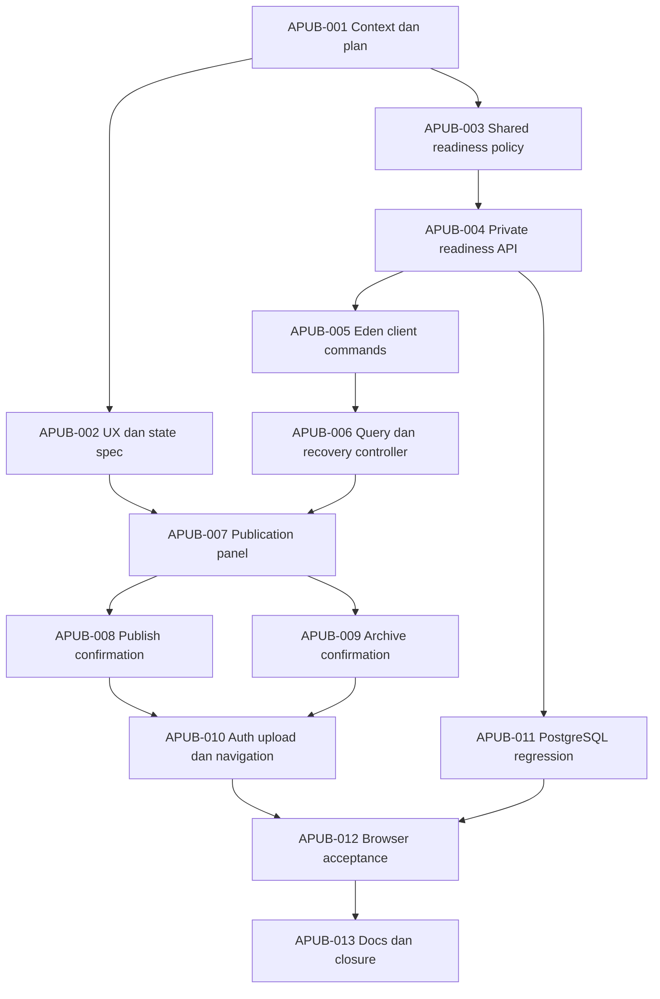

# Implementation plan: admin Publish & Archive

## Plan metadata

- Status: **executing — plan dan desain disetujui** · 7 Oktober 2026. Pengguna menyetujui plan melalui “oke setuju”; APUB-002 menghasilkan empat mockup/state specification untuk review visual. Approval plan tidak menyatakan raster baru approved, runtime implemented atau production verified.
- Repository: `bayuaji17/vertical-movie-app`.
- Base ref: `feat/api-request-logging`; base SHA: `313e31a14891ac0f91265a3557576b44791309d7`.
- Context: [repository-context.md](repository-context.md), ditulis lebih dahulu.
- Last validated SHA: `4cf00a97dffe9568a966f8889ae798fed3acdb17`.
- Backlog canonical: [admin-publication](../../tasks/admin-publication.md); APUB-001–013, lima user story.
- Pengguna menyetujui prioritas Publish & Archive Film/Standalone, meminta plan detail dan menyetujui plan melalui “oke setuju” pada 7 Oktober 2026. Plan menjadi acuan eksekusi; source belum diubah pada delivery desain APUB-002.
- Local documentation task commit mengikuti otorisasi standing di root AGENTS; implementation/push/PR/merge/deployment bukan hasil atau otorisasi baru dari dokumen ini.
- Branch planning: `chore/admin-publication-plan`, dibuat lokal dari base SHA. Branch eksekusi `feat/admin-publication` dibuat dari planning commit `4cf00a97dffe9568a966f8889ae798fed3acdb17` setelah approval dan freshness review. APUB-002 saat ini hanya mengubah desain/dokumentasi.

## Objective

Admin menyelesaikan alur Film/Standalone dari draft siap sampai publikasi dan archive melalui UI, mengetahui penghambat publikasi, mempratinjau HLS existing dan memastikan hasil mutation yang gagal dikonfirmasi tanpa publikasi ganda atau klaim visibility salah.

## Goals and non-goals

Dalam scope: section Publication pada detail Film/Standalone; GET readiness server; checklist metadata/hak/media/upload/lifecycle; tautan Preview; konfirmasi Publish/Archive; version/idempotency/reconciliation; invalidation private list/detail/inventory/readiness; responsivitas/tema/aksesibilitas; proof API/DB/browser dan dokumentasi per task.

Scope Archive UI pertama adalah **published → archived**. Existing API archive draft tetap tersedia bagi callers existing, tetapi tidak diperkenalkan sebagai shortcut dashboard pada iterasi ini. Semua action hanya berada pada detail; list tetap View/Edit serta badge yang mengikuti hasil server. Tidak menambah bulk publish/archive, filter status atau page template baru.

Series/episode publication UI, season/episode editor/upload, katalog pengunjung, subtitle, pengaturan situs, global job monitor, restore/republish, perubahan source published, audit-preview persisten, archive idempotency schema baru, hard delete, perubahan signing/retensi/worker, dependency baru dan rollout production berada di luar scope.

## Current behavior

Auth, metadata, uploader/source+cover, processing dan Preview tersedia. POST publish dan archive sudah ada. Belum ada client publish/archive, readiness publication read model, dialogs atau mutation recovery di detail. `canPreview` bukan `canPublish`; DTO metadata hanya memberi rights timestamp sementara API juga memerlukan actor. Publish menghasilkan DTO parsial dan persistent replay; archive menghasilkan VideoDto dengan version check. [Context](repository-context.md#runtime-and-data-flow) menjelaskan jalurnya.

## Desired behavior

### Halaman dan states

Section **Publication** berada setelah ringkasan metadata/record dan sebelum Upload media pada `/admin/content/:type/:id`, hanya untuk Film/Standalone non-episode. Actions boleh tampil pada header section agar metadata/page heading existing tetap konsisten. Tidak menaruh Publish/Archive langsung di list atau form edit yang memiliki unsaved input.

| State                         | Tampilan dan interaksi                                                                                                                                                                                                                                            |
| ----------------------------- | ----------------------------------------------------------------------------------------------------------------------------------------------------------------------------------------------------------------------------------------------------------------- |
| Initial loading               | Skeleton checklist; semua mutation disabled.                                                                                                                                                                                                                      |
| Readiness unavailable/stale   | Alert dan Refresh publication status; cached snapshot boleh terbaca dengan label stale tetapi tidak mengaktifkan aksi.                                                                                                                                            |
| Draft blocked                 | Draft / Not publicly available; checklist aman dan tautan Edit metadata/Upload media/Preview sesuai capability. Publish disabled dengan alasan dalam teks, bukan tooltip saja.                                                                                    |
| Draft ready                   | Ready to publish berbeda dari Published. Preview video tersedia; Publish membuka konfirmasi. Tidak autopublish.                                                                                                                                                   |
| Local upload work             | Hash/file preparation/initiate/transfer/finalizing milik owner yang sama menonaktifkan Publish; server tetap memeriksa active session. Upload owner lain tidak menjadi global blocker.                                                                            |
| Confirming publish            | Fresh readiness + inventory + metadata version harus cocok sebelum confirmation intent dikunci. Jika berubah, perbarui dialog dan minta acknowledgement lagi.                                                                                                     |
| Publishing                    | Single pending intent; aksi ulang/Archive disabled; tidak optimistically mengubah badge.                                                                                                                                                                          |
| Published                     | Published / Available through the public playback API; Open public video memakai `/watch/:slug`, hanya setelah current state confirmed. Archive tersedia, metadata/upload tetap mengikuti capability existing. Tidak menjanjikan homepage katalog sudah tersedia. |
| Confirming/archiving          | Konsekuensi visibility, expiry dan preservation ditampilkan; satu request memakai expectedVersion fresh.                                                                                                                                                          |
| Archived                      | Archived / Not publicly available; publish/archive/edit/upload/preview inactive sesuai kontrak. Tidak ada restore/republish/hard-delete. Source yang sudah deleted tidak ditampilkan sebagai dipulihkan.                                                          |
| Unconfirmed outcome           | “The result could not be confirmed. Check publication status.” Check status melakukan GET; tidak otomatis mengirim mutation baru.                                                                                                                                 |
| Conflict/not-ready/media-busy | Refresh snapshot, tampilkan blocker/current state dan batalkan intent lama jika payload berubah. Tidak mengganti expectedVersion otomatis lalu mengulang POST.                                                                                                    |

Copy UI English; developer docs Indonesia. Theme switcher Light/Dark/System, shell Rhea, lime/charcoal, Inter/Space Grotesk dan pagination existing dipertahankan. Desktop 1440/1024 dan mobile 768/390/320 px; actions wrap/stack, target minimal 44 px, tanpa fixed footer menutupi konten. Dialog memakai Base UI primitives existing, focus return/Escape/cancel jelas dan pending/error live region. Tidak perlu dependency baru untuk modal.

### Checklist dan batas authoritative

Tambahkan private `GET /admin/videos/:id/publication-readiness` pada publication module. Proposal DTO strict:

```ts
type PublicationReadiness = {
  videoId: string;
  kind: "movie" | "standalone" | "episode";
  rowVersion: number;
  publicationStatus: "draft" | "published" | "archived";
  archivedAt: string | null;
  canPublish: boolean;
  checks: Array<{
    code:
      | "ACTIVE_DRAFT"
      | "TITLE"
      | "SYNOPSIS"
      | "RIGHTS"
      | "VERIFIED_MEDIA"
      | "NO_ACTIVE_UPLOAD"
      | "ACTIVE_PARENTS";
    status: "passed" | "blocked" | "not-applicable";
  }>;
};
```

- `VERIFIED_MEDIA` menggunakan `CatalogStore.readyForPublish` serta verified-duration check yang sudah dipakai publish. Source/HLS/cover terperinci ditampilkan dari inventory existing; jangan menambahkan evaluator alternatif atau menjanjikan blocker granular yang belum dibuktikan server.
- RIGHTS memeriksa timestamp **dan actor** di server. TITLE/SYNOPSIS trim tidak kosong; NO_ACTIVE_UPLOAD mencakup initializing/pending/completing/aborting sebagaimana command existing. ACTIVE_PARENTS mengikuti aturan existing bila video episode; non-episode not-applicable.
- GET boleh mengevaluasi video episode agar policy konsisten; UI iterasi ini tetap tidak mengekspos workflow episode/series. Endpoint tidak mengubah capability publish episode backend existing.
- `canPublish` adalah AND seluruh publish gates existing, bukan AND status source bytes available. Source dengan original retained/deleted tetap eligible bila provenance/HLS/cover sah.
- Readiness mengevaluasi satu snapshot DB konsisten (repeatable-read read transaction mengikuti pola inventory existing). Missing row 404; dependency failure 503, bukan DTO blocked palsu. requireAdmin dijalankan sebelum service, private no-store berlaku pada success/error; DTO tanpa raw asset/job keys, credentials, signed URL, actor detail atau diagnostic DB.
- Shared video assessment dipakai GET dan publish setelah lock dalam transaksi, tanpa mengubah lock order, persistent replay, error precedence atau series behavior. SQL predicate catalog/preview tetap canonical dan reused untuk compound media gate.
- GET tidak mengubah status, enqueue job, mengambil HEAD/sign URL atau memanggil FFmpeg. POST memeriksa ulang setelah lock; checklist bukan reservasi state.
- `canPreview` tetap dari inventory dengan storage-profile/playback checks. UI mensyaratkan Preview tersedia untuk workflow publish manual, terpisah dari server editorial readiness. Mismatch menjadi status refresh/error; tidak memalsukan API readiness.

### Kontrak mutation yang dipertahankan

| Method/path backend                           | Request                               | Response dan perilaku                                                                           |
| --------------------------------------------- | ------------------------------------- | ----------------------------------------------------------------------------------------------- |
| GET `/admin/videos/:id/publication-readiness` | UUID params                           | Proposed DTO di atas; 200/401/403/404/422/503.                                                  |
| POST `/admin/videos/:id/publish`              | `{ expectedVersion, idempotencyKey }` | Existing PublicationDto, persisted exact replay. Guard/schema/no-store/error envelope existing. |
| POST `/admin/videos/:id/archive`              | `{ expectedVersion }`                 | Existing VideoDto. Tidak mengirim idempotencyKey ke body strict. Version mismatch 409.          |

Browser memakai prefix `/api` dan `createPrivateApiClient`; tipe diturunkan dari Eden/App type-only. Koreksi summary archive yang masih draft-only; tidak mengganti route atau response contract existing.

Publish confirmation menampilkan judul/type, pengaruh public availability, rights yang sudah tersimpan dan checkbox **“I have reviewed the preview and want to publish this video.”** Checkbox adalah acknowledgement UI per dialog, bukan field DB atau bukti menonton. Tidak meminta playback sampai selesai dan tidak menambahkan endpoint preview audit.

Archive confirmation menjelaskan: konten berhenti tersedia untuk akses/URL baru; link media yang sudah diterbitkan tetap dapat berlaku sampai expiry; valid file yang masih ada dipertahankan; original yang sudah deleted tidak pulih; restore/republish belum tersedia. Label Archive, bukan Delete, dengan Cancel sebagai safe action. Tidak menjanjikan revocation instan.

### Recovery, cache dan concurrency

1. **Intent publish:** key UUID baru dibuat setelah acknowledgement dan freshness confirmation, satu key untuk satu `(identity,id,expectedVersion)` intent. Retry teknis otomatis off; double click/same-tab pending mutex. Exact payload/key disimpan hanya di memory identity/owner scope selama outcome belum confirmed.
2. **Unconfirmed publish:** refetch detail + readiness + inventory; bila current published tampilkan state final dan jangan kirim ulang. Bila archived tampilkan archived, bukan sukses publish stale. Bila masih draft/version sama, explicit “Retry publish” boleh memakai exact key/payload; read saja belum membuktikan POST lama tidak sedang berjalan, sehingga mutex/idempotency tetap berlaku. Draft/version berubah memerlukan intent/acknowledgement/key baru setelah review.
3. **Replay result lama:** persisted PublishDto dapat valid tetapi lebih lama daripada state current (misalnya archive setelah publish). Verifikasi response id/status/version/dates lalu refetch; jangan memasukkan DTO parsial ke detail atau memaksa published setelah current archived diketahui.
4. **Archive tanpa key:** sesudah timeout/network/5xx/malformed response, Check status dulu. Bila archived, konfirmasi state akhir; bila published version sama, explicit retry exact expectedVersion diperbolehkan. Bila version berubah, review ulang snapshot/konfirmasi. Racing archive lama/new ditahan DB version check; 409 lalu GET dapat menunjukkan archived. Jangan mengklaim audit request tertentu.
5. **Error mapping:** domain codes `PUBLICATION_NOT_READY`, `PUBLICATION_MEDIA_BUSY`, `PUBLICATION_STATE_CONFLICT`, `PUBLICATION_IDEMPOTENCY_CONFLICT`, `CONTENT_VERSION_CONFLICT` mendapat copy/action spesifik. 404 terminal, 422 review payload, 401/403 auth pipeline, 5xx sesi admin valid mempertahankan intent/UI sampai authoritative session verdict. Jangan tampilkan raw server exception.
6. **Invalidation:** confirmed success atau outcome ambiguasi harus menandai list/detail/inventory/readiness owner stale. Confirmed state berasal dari GET; invalidation failure tidak boleh menghapus acknowledgement mutation yang sudah berhasil atau mengirim POST ulang. Tampilkan “Published. Status refresh is unavailable.” bila command confirmed tetapi refetch gagal.
7. **Freshness:** readiness query private identity-scoped, retry false, staleTime 0, poll 5 detik hanya saat visible/online dan known media/upload pending. Terminal state berhenti polling; manual refresh dan window-focus refetch menangani edit tab lain. Tidak persist cache/payload/key di localStorage. Command on network offline ditolak eksplisit; tidak antre diam-diam saat reconnect.
8. **Auth/unmount:** pending effects/key/mutex terikat identity + owner, dibersihkan pada logout/invalid sesi/resource change. Request yang sudah mencapai server mungkin commit walau browser abort; refresh/relogin merekonsiliasi current state. Mutation callback lama tidak boleh memasukkan data setelah identity berubah. Broadcast auth existing tetap authoritative; tanpa channel status konten baru.
9. **Upload interlock:** reuse registry/manager existing dengan selector owner-specific yang diperlukan. Jangan mengunci semua resource karena satu upload lain bekerja; jangan membuang File/hash/progress ketika hanya readiness refetch atau business outage.

## Impact analysis

API: refactor kecil video assessment + GET read model/contract/test; summary archive diperbaiki. Tidak ada skema/env/dependency berubah yang direncanakan. Web: private client/query/state, section Publication/dialog, interlock upload/auth, tautan return-to-detail Preview dan public watch existing. Test fixtures membutuhkan PublicationService/CatalogService wiring untuk proof visibility. Worker/storage/player code tetap boundary regression.

Dokumen API/runbook/PRD diperbarui **setelah** perilaku implemented dan verified; planning tidak menaikkan status PRD-06 menjadi selesai. Evidence historis pada media-publication tidak diganti dengan claim matriks baru.

## Affected files and symbols

Path create di bawah adalah target proposed; dibuat hanya pada task pemilik.

| Path                                                                                | Action | Symbols / reason                                                                                              | Evidence                                                         |
| ----------------------------------------------------------------------------------- | ------ | ------------------------------------------------------------------------------------------------------------- | ---------------------------------------------------------------- |
| `apps/api/src/modules/publication/{model,index,service}.ts`                         | modify | Readiness DTO/route/read method; shared assessment di GET + publish.                                          | Existing PublishBody/PublicationService/createPublicationModule. |
| `apps/api/src/modules/publication/readiness.ts`                                     | create | Pure `assessVideoPublication` dengan dependency evidence yang diinjeksi.                                      | Existing video checks dalam publish.                             |
| `apps/api/src/modules/publication/repository.ts`                                    | create | Snapshot/read assessment evidence; explicit DB connection, reused catalog ready gate.                         | Publish queries dan MediaRepository snapshot pattern.            |
| `apps/api/src/modules/publication/{readiness,index}.test.ts`                        | create | Policy parity, guard/schema/no-store dan failure before I/O.                                                  | Guide API/app.handle existing.                                   |
| `apps/api/src/modules/videos/index.ts`                                              | modify | Koreksi archive summary ke draft/published tanpa ubah behavior.                                               | VideosService.archive.                                           |
| `apps/api/src/app.ts`, `apps/api/src/index.ts`                                      | modify | Dependency seam/wiring hanya bila refactor constructor memerlukannya.                                         | Composition dan bootstrap current.                               |
| `apps/api/test/integration/media-publication-proof.test.ts`                         | create | PG readiness/parity/version/replay/concurrency/tombstone; serial dedicated DB.                                | media-series-proof/media-fixture existing.                       |
| `apps/api/test/integration/admin-media-browser-fixture.ts`                          | modify | Wire real publication/catalog + invalidation, controls dan cleanup for proof.                                 | Existing media browser harness.                                  |
| `apps/web/src/lib/admin/publication-{client,queries,state,errors}.ts`               | create | Eden wrappers, query keys, non-optimistic transitions, recovery copy.                                         | content/media-client/query/error patterns.                       |
| `apps/web/src/lib/admin/use-publication.ts`                                         | create | Owner/identity intent, fresh confirmation, Check status dan mutation orchestration.                           | use-content-api, auth/private-effects.                           |
| `apps/web/src/lib/admin/{content-queries,media-queries,upload-session-registry}.ts` | modify | Owner-specific invalidation/interlock integration bila perlu.                                                 | Cache scopes dan existing managers.                              |
| `apps/web/src/components/admin/publication-{panel,confirm-dialog}.tsx`              | create | Checklist/current status, publish/archive confirmation/recovery.                                              | Existing card/alert/alert-dialog primitives.                     |
| `apps/web/src/components/admin/{content-detail,content-resource,media-panel}.tsx`   | modify | Place Publication, propagate authoritative/stale view, share preview/inventory without duplicate controllers. | Existing detail resource/panel.                                  |
| `apps/web/src/routes/admin._authenticated.videos.$id.preview.tsx`                   | modify | Validated optional type context + Back to content details.                                                    | Existing preview route; player API unchanged.                    |
| `apps/web/test/publication-eden-contract.ts`                                        | create | Compile-only DTO/body parity and imports.                                                                     | Existing content/media Eden contracts.                           |
| `apps/web/test/admin-publication-{client,state}.test.ts`                            | create | Mock transport/schema and race/recovery/state invariants.                                                     | Existing native web unit patterns.                               |
| `apps/web/test/admin-publication-browser-worker.mjs`                                | create | Responsive dialogs, real mutations, lost-response/race/auth/visibility proof.                                 | Existing browser worker harness.                                 |
| `apps/web/test/admin-media-fixture.ts`                                              | modify | Harness controls/fixture entry for new browser worker.                                                        | Existing PG/MinIO/browser orchestration.                         |
| `docs/design/admin-publication.md`                                                  | create | Canonical layout/checklist/dialog state spec, review status and visual references.                            | Dashboard/upload canonical design.                               |
| `docs/product/prd.md`, `docs/operations/media.md`, `docs/architecture/overview.md`  | modify | Current UI/readiness contract after verification; limits retained.                                            | PRD-06/runbook/current architecture.                             |
| `docs/README.md`, plan/context and `docs/tasks/admin-publication.md`                | modify | Navigation/status/freshness/task acceptance/receipts.                                                         | Root documentation rules.                                        |

## Implementation DAG



DAG menjelaskan dependency, bukan instruksi spawn parallel agents. Pelaksana menyelesaikan task kecil satu per satu; implementation belum diotorisasi pada turn planning ini.

## Implementation steps

Acceptance detail dan evidence ledger berada pada [backlog](../../tasks/admin-publication.md). Setiap langkah berikut mempunyai hasil review tersendiri.

### APUB-001 — Context dan plan

- Outcome: tiga dokumen canonical + navigation, trace base SHA dan proposed UX/API/recovery.
- Depends on: none.
- Files/symbols: context, plan, backlog, docs index.
- Requirements: context disimpan pertama; scope approval dibedakan dari technical ready; preserve worktree unrelated.
- Validation: docs:check, changed Markdown Prettier, diff --check, staged-only doc snapshot, commit hooks.
- Acceptance criteria: semua requirements → task/tests; hanya planning committed dan bukti aktual dicatat.

### APUB-002 — Publication UX dan state specification

- Outcome: desain extension existing detail, checklist + dua confirmation dialogs + state/error matrix.
- Depends on: APUB-001.
- Files/symbols: `docs/design/admin-publication.md`, backlog/index; layout artifacts di `docs/design/` bila visual dibuat.
- Requirements: desktop/mobile light/dark; English copy; manual preview acknowledgement tanpa audit DB; published-only archive; current tokens.
- Validation: review empat layout dan dialog/state/focus behavior specification; docs/format/diff checks.
- Acceptance criteria: desain reviewable, approval visual dicatat hanya bila diberikan pengguna; runtime UI memakai desain yang diterima. Image generation mengikuti skill bila raster dibuat, bukan output wajib turn planning ini.

### APUB-003 — Shared video publication assessment

- Outcome: satu policy video untuk command dan snapshot dengan injectable evidence; publish semantics existing dipertahankan.
- Depends on: APUB-001.
- Files/symbols: publication readiness/repository/service + readiness tests.
- Requirements: media gate CatalogStore reused, rights actor+timestamp, busy states, duration/kind/parent/state; preserve error order/replay/owner locks.
- Validation: native policy unit/command parity tests, existing API tests dan applicable root gates.
- Acceptance criteria: media ready tidak berarti metadata/rights lengkap; retained original sah; series/episode publish tetap regression-safe.

### APUB-004 — Private readiness route dan DTO

- Outcome: guarded no-store GET, strict DTO, Scalar dan coherent snapshot read.
- Depends on: APUB-003.
- Files/symbols: publication model/index/service/index.test; composition bila perlu; videos route summary.
- Requirements: GET tanpa side effect/I/O storage; missing/invalid/dependency response jelas; type inference chaining.
- Validation: app.handle guard-before-service, schema/no-store/404/503; OpenAPI and root type gates.
- Acceptance criteria: DTO hanya safe checklist/capability state; GET tidak mengubah status atau data.

### APUB-005 — Eden publication client

- Outcome: readiness/publish/archive wrappers dan type-only body/DTO fixtures.
- Depends on: APUB-004.
- Files/symbols: publication-client/errors, client tests, publication Eden fixture.
- Requirements: PublishDto/VideoDto berbeda; response identity/status/version/date diverifikasi; no archive key; private auth behavior reused.
- Validation: mocked fetch correct routes/payload, invalid/malformed/lost responses, compile fixture/import boundary, applicable gates.
- Acceptance criteria: error ambiguity tidak disalahartikan sebagai mutation failed-safe atau success.

### APUB-006 — Query/state dan intent recovery

- Outcome: identity/owner query keys, controller intent dan Check status/retry yang dapat diuji.
- Depends on: APUB-005.
- Files/symbols: publication-queries/state/use-publication + state tests dan content/media invalidation edges.
- Requirements: retry false/networkMode always + explicit online guard, mutex, stable exact key, non-optimistic UI, session cleanup dan stale replay reconcile.
- Validation: unknown outcome/version/key/cache/auth race tests termasuk confirmed POST + failed refetch dan stale publish replay setelah archive.
- Acceptance criteria: tidak ada automatic mutation resend/queue, cross-owner lock atau stale data injection sesudah identity change.

### APUB-007 — Checklist Publication pada detail

- Outcome: panel state/readiness/correction actions, cached stale state dan Preview gate.
- Depends on: APUB-002, APUB-006.
- Files/symbols: publication-panel, content-detail/resource/media-panel.
- Requirements: Film/Standalone only, canPublish dan canPreview berbeda, metadata/updater tetap utuh, same inventory/query owner reused.
- Validation: component/browser spot checks untuk blocked/loading/ready/stale dan four layout modes; root gates.
- Acceptance criteria: blocking reason terbaca dan action disabled saat state tak authoritative; tidak render panel episode/series.

### APUB-008 — Publish confirmation dan result

- Outcome: preview acknowledgement → fresh validated intent → publish → confirmed/current status.
- Depends on: APUB-007.
- Files/symbols: confirmation dialog/panel/controller.
- Requirements: explicit confirm/key fresh, double-submit lock, current state refetch, Open public video sesudah confirmed; no frontend fake publish gate.
- Validation: successful/blocked/busy/409/unconfirmed/cancel flows dan keyboard dialog; root gates.
- Acceptance criteria: manual action menerbitkan sekali; changing rowVersion/readiness mengharuskan review, bukan auto-retry.

### APUB-009 — Archive confirmation dan result

- Outcome: published Film/Standalone dapat archive dengan copy expiry/retention yang benar.
- Depends on: APUB-007.
- Files/symbols: confirmation dialog/panel/controller.
- Requirements: expectedVersion-only, no optimistic archive, preservation/deleted source semantics, archived readonly state.
- Validation: success/cancel/409/lost outcome/new version dan dialog focus checks; root gates.
- Acceptance criteria: unavailable actions/restoration promise tidak muncul; reconciliation mengonfirmasi state final tanpa mengarang request attribution.

### APUB-010 — Integrasi auth, upload dan navigation

- Outcome: workflow detail → preview → detail, owner-local upload interlock, private state cleanup dan current badge/list.
- Depends on: APUB-008, APUB-009.
- Files/symbols: upload registry/query edges, preview route validated type/back link, private-effects integration.
- Requirements: working upload owner lain tidak mengunci panel; same owner publish saat local hash/initiate dihalangi; published/archived changes mengunci uploader existing.
- Validation: root auth/import/session regression, editor dirty-state regression, cross-tab business outage/logout/nav refresh; Video.js skill/docs bila preview file berubah.
- Acceptance criteria: key/intent/pending callback tidak melintasi admin/resource; tidak mengganti player source/renewal/control behavior.

### APUB-011 — PostgreSQL publication regression

- Outcome: parity readiness/command dan race/replay/version/retention invariants dengan real DB.
- Depends on: APUB-004.
- Files/symbols: media-publication-proof + existing media/content integration boundary suites.
- Requirements: dedicated media DB/reset guard; independent valid/invalid ready-generation facts; serial proof; bukan database development.
- Validation: matrix API/domain/DB pada Test requirements; applicable root gates.
- Acceptance criteria: exact replay no timestamp/version duplicate, changed payload conflict, stale readiness cannot bypass transaction gate, original tombstone eligible.

### APUB-012 — Browser acceptance dengan media nyata

- Outcome: desktop/mobile light/dark + failure/auth/visibility proof memakai actual API/DB/MinIO/HLS.
- Depends on: APUB-010, APUB-011.
- Files/symbols: new browser worker, fixture wiring/catalog invalidation, test harness dan backlog evidence.
- Requirements: dedicated DB/random private bucket, lost response injection sesudah real server commit, anonymous before/after access, no secret/signed URL logging.
- Validation: browser matrix berikut; root gates; run built runtime for acceptance, dev bila behavior dev-specific perlu dibandingkan.
- Acceptance criteria: draft hidden → publish public watch → archive new access denied sementara previously issued URL valid hingga expiry; tidak ada whole-MVP/R2 claim.

### APUB-013 — Documentation dan closure

- Outcome: current canonical docs, final gate receipt dan local task commit ledger.
- Depends on: APUB-012.
- Files/symbols: PRD/runbook/architecture/index, plan/context freshness dan backlog.
- Requirements: update hanya verified behavior, historical limits tetap; actual commit SHA dicatat pada update task berikutnya tanpa self-reference.
- Validation: relevant existing tests, check-types/lint/build + docs/Prettier/diff; frozen install bila manifest/script berubah.
- Acceptance criteria: semua AC wajib fulfilled dan bukti tersimpan; remote delivery/production tidak diklaim tanpa otorisasi/evidence.

## Test requirements

| Layer                      | Matrix minimum                                                                                                                                                                                                                                                                                                                          |
| -------------------------- | --------------------------------------------------------------------------------------------------------------------------------------------------------------------------------------------------------------------------------------------------------------------------------------------------------------------------------------- |
| Pure/API policy            | Title/synopsis whitespace, rights actor/timestamp tidak lengkap, draft/published/archived, absent/unverified/current-generation media, duration invalid/over limit, busy statuses, episode parent compatibility, source deleted/deleting dengan provenance/HLS sah.                                                                     |
| HTTP contract              | Anonymous/non-admin/expired session sebelum service I/O; UUID/schema/unknown fields; no-store success/error; DTO whitelist/Scalar; dependency 503 tanpa readiness false.                                                                                                                                                                |
| PG transaction             | GET snapshot consistent; concurrent same-key/same-owner replay satu rowVersion/timestamp/operation; same key different video/version/payload conflict; stale version/metadata/upload completion/readiness change; publish-versus-archive dua tab; tombstone; series/episode behavior regression.                                        |
| Web transport/state        | Correct paths/body, strict result identity/shape/dates, lost/malformed response, exact-key explicit retry, archived current state versus older replay, confirmed command/refetch failure, 401/403/5xx valid-session distinction, double click, offline/no reconnect queue, owner/identity/unmount race.                                 |
| Browser fake/deterministic | Loading/blocked/stale/checklist/cancel/confirmation states, stale version, media busy, lost response, session expiry/outage, list filters/page retained, unsupported kind no action, keyboard/Escape/focus/44px, widths 320/390/768/1024/1440, Light/Dark/System and theme persistence.                                                 |
| Browser real media         | Both Film and Standalone create/upload/process/preview/publish; before publish anon playback404; after publish public catalog/detail/playback + existing watch; archive catalog hidden/new playback/renewal refused; signed object issued before archive remains until TTL. Record native-auth versus injected-auth harness boundaries. |

Commands di bawah adalah **rencana validasi implementasi**, belum dijalankan untuk planning ini. Jalankan dari root dengan Bun sesuai requirement; integration environment mengikuti guards/env samples existing dan tidak dicetak ke terminal/docs.

```sh
bun run --cwd apps/api test
bun test apps/web/test/admin-publication-client.test.ts apps/web/test/admin-publication-state.test.ts
bun test apps/web/test/admin-content-client.test.ts apps/web/test/admin-content-list.test.ts apps/web/test/admin-content-form.test.ts apps/web/test/admin-media-client.test.ts apps/web/test/admin-media-state.test.ts
bun run --cwd apps/web auth:import:proof
bun test apps/api/test/integration/media-publication-proof.test.ts
bun run --cwd apps/api media:series:proof
bun run --cwd apps/api media:upload:proof
bun run check-types
bun run lint
bun run build
bun run docs:check
git diff --check
```

Browser entry command difinalisasi pada APUB-012 berdasarkan harness existing; tidak mengarang flag/script yang belum ada. APUB-004 menjadikan compile Eden fixture bagian check-types. API module tests berdampingan `src/modules`; web state/transport tests berada di `apps/web/test` mengikuti repo. Tidak menambah tests yang hanya menyalin markup; test behavior/race yang memengaruhi trust state.

## Constraints

Bun/Elysia chaining/Eden type-only, requireAdmin private-only, same-origin/auth boundaries, no manual routeTree edits, no secrets/generated outputs committed dan per-task local commits mengikuti root instructions. Tidak ada schema migration yang direncanakan; bila implementasi membutuhkan schema baru, lakukan refinement scope sebelum task baru, generate/review/test dedicated dan migrate development/preservation sesuai workflow. Production migration tetap rollout terpisah.

Freshness sebelum runtime: resolve target SHA, diff affected paths dan dependencies dari base, lalu catat valid/stale. Installed shadcn/videojs/Turbo docs dibaca sesuai task yang benar-benar mengubah komponennya; tidak mengganti tool/pipeline hanya karena feature baru.

## Acceptance criteria

- [ ] Admin Film/Standalone melihat readiness server, alasan blocked dan correction actions tanpa mengandalkan sourceAvailability/canPreview sebagai seluruh syarat publish.
- [ ] Admin mempratinjau HLS existing, mengonfirmasi Publish secara manual dan mendapat current published state; unknown outcome/version conflict aman direkonsiliasi.
- [ ] Admin mengonfirmasi Archive hanya pada published aktif; archived state readonly, retained asset/provenance dan expiry semantics benar.
- [ ] Pengunjung tanpa akun mendapat playback setelah publish dan ditolak untuk request/URL baru setelah archive; existing issued URL behavior sesuai kontrak.
- [ ] Draft, archived, series dan episode tidak memperoleh aksi unsupported; resource/auth/dirty-editor/upload existing tidak regresi.
- [ ] Empat mode layout, keyboard/dialog/44px dan network/auth/concurrency states mempunyai evidence; applicable gates lulus.
- [ ] Task wajib committed terpisah dan canonical docs menyatakan verified scope lokal secara tepat.

## Risks and mitigations

| Risiko                                                   | Mitigasi dan task owner                                                                                              |
| -------------------------------------------------------- | -------------------------------------------------------------------------------------------------------------------- |
| Readiness read/write drift atau preview dianggap publish | Shared assessment + canonical media predicate, parity tests; Preview capability terpisah (003/004/011).              |
| Lost response menerbitkan ulang / key berubah saat retry | Exact intent key, retry off, Check status dan explicit replay; partial DTO tidak overwrites detail (005/006/008).    |
| Archive tanpa persistent operation membingungkan result  | Read current state, expectedVersion retry, tidak mengklaim request attribution; no schema scope expansion (006/009). |
| Polling/checklist terlalu lama dianggap jaminan          | Coherent snapshot, freshness before dialog dan transactional POST; busy/job change races (004/006/011).              |
| Published badge success tetapi refetch gagal             | Confirmed mutation acknowledgement dipisah dari stale current UI, recovery read-only (006/008/009).                  |
| Local hash/upload atau identity race                     | Owner-specific interlock/private-effects/generation guards; direct server command tetap authoritative (010/012).     |
| Refactor mengubah series/episode/lock order              | Preserve branch/guard/error precedence; regression existing tests dan PG proof (003/011).                            |
| Claim revocation instan/source restore/production ready  | Copy expiry/retention tepat, proof URL lama vs baru, batas environment eksplisit (002/009/012/013).                  |
| Worktree desain/build unrelated terikut                  | Initial preservation manifest, partial staging indeks, staged-only doc proof dan diff review (001/all).              |

## Rollback or recovery

Modul tidak membutuhkan migration atau perubahan objek storage. Jika UI perlu dirollback, kembalikan wiring section/action/client dari reviewed commit tanpa mengubah publication row yang sudah commit. Backend publish/archive existing tetap berjalan; menghapus panel tidak mengembalikan konten archived atau menjadikannya draft. Endpoint readiness tambahan dapat dihentikan bersama UI yang bergantung padanya setelah rollout terkoordinasi; jangan meninggalkan client yang menganggap failure sebagai ready.

Unknown command outcome selalu pulih lewat GET. Jangan memakai inverse publish/archive sebagai kompensasi otomatis, langsung mengubah DB, mereset operation key atau menyimpan signed URL sebagai recovery. Refactor shared policy dirollback bersama route/client yang bergantung pada kontraknya jika diperlukan; reviewed revert harus mempertahankan series/episode semantics.

## Evidence

Base/context [evidence index](repository-context.md#evidence-index) memetakan claims ke source. [Backlog](../../tasks/admin-publication.md) menyimpan per-task AC/commands/results/commits. Evidence media historical di [runbook](../../operations/media.md) dan [backlog publication](../../tasks/media-publication.md) tidak diinterpretasikan sebagai browser publication UI baru sudah lulus.

## Open decisions

Pengguna menyetujui plan, termasuk placement section/actions, archive published-only dan preview acknowledgement checkbox per dialog. Tidak ada perubahan angka/retensi/policy produk. Empat raster dan state/dialog specification pada [desain Publication](../../design/admin-publication.md) disetujui pengguna melalui “ok setuju” pada 7 Oktober 2026. Sesuai APUB-002, runtime UI memakai desain yang diterima. Approval tidak ditanya ulang untuk plan yang sudah disetujui.

## Validation history

### 2026-10-07 — Initial planning freshness

- Result: **valid**.
- Plan base SHA/current target SHA: `313e31a14891ac0f91265a3557576b44791309d7`.
- Checked paths: publication/videos/catalog/media/playback, app/bootstrap/types/schema operation, web client/query/auth/uploader/detail/preview, relevant test fixtures, root guides/PRD/design ownership.
- Changed relevant runtime paths: tidak ada pada initial git status. 23 existing dirty paths adalah dokumentasi/desain/build receipt; overlay indeks/design-system diidentifikasi terpisah.
- Decision: source snapshot cukup untuk planning; runtime belum dimulai. Revalidate target dan any affected diff sebelum implementasi.

### 2026-10-07 — Freshness sebelum desain APUB-002

- Result: **valid**.
- Plan base SHA: `313e31a14891ac0f91265a3557576b44791309d7`.
- Current target SHA: `4cf00a97dffe9568a966f8889ae798fed3acdb17`.
- Checked paths: `apps`, `packages`, `AGENTS.md`, root manifests/lock/Turbo serta empat dokumen planning.
- Changed relevant runtime paths: tidak ada; diff hanya dokumen planning, existing worktree source tetap bersih.
- Decision: source evidence tetap current; desain baru belum mengubah implementation atau memperoleh approval visual.

## Execution log

### 2026-10-07 — Approval dan freshness APUB-002

- Approval: pengguna memberi “oke setuju” setelah delivery plan APUB-001; plan approved dan desain APUB-002 dimulai.
- Result: **valid**; base SHA `313e31a14891ac0f91265a3557576b44791309d7`, current target `4cf00a97dffe9568a966f8889ae798fed3acdb17`.
- Checked paths: `apps`, `packages`, root `AGENTS.md`, manifest/lock/Turbo; diff base→HEAD hanya empat dokumen planning. Worktree runtime paths tidak dirty. Existing 23 desain/build/index path dipertahankan.
- Decision: evidence policy/routes/schema/auth/cache tetap current; context tidak perlu diganti. Branch `feat/admin-publication` dibuat dari current planning SHA tanpa reset worktree.
- APUB-001 receipt: `4cf00a97dffe9568a966f8889ae798fed3acdb17`, `docs: plan admin publication (APUB-001)`; hook docs65/601, lint1/1/types3/3 valid cache dan Commitlint lulus, tanpa bypass.
- APUB-002 output: [canonical desain](../../design/admin-publication.md) + desktop/mobile light/dark PNG, lima built-in image_gen calls termasuk targeted mobile stack correction. Runtime belum berubah; visual approval pending. Hasil checks/commit baru dicatat pada backlog setelah observasi, bukan diasumsikan dari receipt APUB-001.

### 2026-10-07 — Planning

Context disimpan sebelum plan. Dokumen plan/backlog/index disusun sesuai permintaan pengguna, berbasis SHA di atas. Branch `chore/admin-publication-plan` dibuat dari base SHA tanpa mereset perubahan existing. Tidak ada perubahan runtime, migration, browser proof atau remote write.

Validasi aktual: `bun run docs:check` lulus 65 Markdown/601 links; Prettier empat dokumen dan `git diff --check` lulus. Staged-only checkout pada cache ignored lulus validator 58 Markdown/582 links, tanpa memasukkan desain untracked existing. Pemeriksaan DAG/backlog membuktikan dependency 13 task sama. Preservation SHA-256 membuktikan 22 unrelated path unchanged dan konten indeks existing identik setelah mengeluarkan dua addition admin publication. `bun run lint` lulus 1/1 task dan `bun run check-types` lulus 3/3 task, semuanya valid Turbo cache hit untuk source yang tidak berubah.

Staging hanya context/plan/backlog baru serta dua navigasi indeks milik fitur. Local task commit menggunakan hook normal; actual SHA dan hasil hook dicatat pada update ledger task berikutnya setelah commit berhasil agar tidak self-referential. Runtime test/build/database/provider/browser belum dijalankan untuk delivery dokumentasi ini.

### 2026-10-07 — Visual approval dan runtime freshness

Pengguna menyetujui empat desain melalui “ok setuju”. APUB-002 Done; commit `9e11b221d1d244bc486bb2be0d9b029619b47a87`, docs66/617, staged59/598, Prettier/diff/preservation, hook lint1/types3 serta Commitlint lulus. Freshness base313e31a→target9e11b22 valid: tidak ada diff runtime apps/packages/manifests/lock. Runtime dimulai dengan APUB-003; tidak ada schema atau remote write.

### 2026-10-07 — APUB-003

Assessment/checks video diekstrak ke readiness.ts; command existing memakai predicate CatalogStore dan assessment setelah parent/owner lock. Replay/hash/version/series semantics dipertahankan. Native policy tests6/56 assertions dan suite API115/618 lulus; root check-types3/3, lint1/1 dan build2/2 lulus. Fake policy tests bukan PG provenance proof; concurrency/generation DB diperiksa APUB-011. Tidak ada schema/storage/process I/O baru.

### 2026-10-07 — APUB-004

GET private publication-readiness memakai read-only repeatable-read snapshot dengan shared assessment. Strict whitelist DTO, auth-before-I/O, UUID validation, no-store success/errors, missing404/dependency503 dan Scalar/public scope diuji melalui app.handle. Policy+HTTP10 tests/79 assertions dan suite API119/641 lulus. Root types3/3/build2/2 lulus; lint web dari source unchanged diperiksa hook normal. TypeBox union dibuat explicit agar inferred Eden tetap literal; failure type-check awal diselesaikan. Tidak ada schema migration.

### 2026-10-07 — APUB-005

Eden-derived readiness/publish/archive client dan compile contract tersedia. Strict runtime validation memakai unknown record agar malformed responses tidak menjadi confirmed success; whitelist checks, lifecycle/id/version/dates diverifikasi. Tests client3/25 dan existing content/media client15/86 lulus. auth:import:proof membuktikan illegal server import ditolak dan fixture dipulihkan. Build awal bertabrakan dengan temporary import proof; proof di-serialize dan root build2/2, types3/3, lint1/1 rerun lulus. Domain copy aman; network/5xx/malformed dianggap unknown; no automatic POST retry.

### 2026-10-07 — APUB-006

Controller memory-only dengan single mutex, UUID setelah fresh review+ack, exact-key explicit retry, online guard, no reconnect queue dan no optimistic writes tersedia. Fresh snapshots membandingkan owner/kind/version/lifecycle/media fingerprint; server partial result tidak menjadi detail. Unknown/read reconciliation, old replay archived, confirmed POST+failed refresh, owner/identity late callback diuji. Controller tests10/40 dan session/route/client19/78 lulus; root types3/3/lint1/1/build2/2 lulus setelah memperbaiki union mutation inference. Identity/owner queries, invalidation empat family dan private-effects cleanup wired pada hook; owner upload selector/nav diselesaikan APUB-010.

### 2026-10-07 — APUB-007

Publication card dipasang setelah record/metadata sebelum uploader Film/Standalone non-episode. Checklist enam server checks, correction links, distinct canPreview/canPublish, error/stale/loading/read-only copy dan Refresh tersedia. MediaPanelView memakai inventory Query dan uploader/controller yang sama melalui wrapper, tanpa duplicate fetch/controller/Preview; Series workflow dipertahankan. Source spot review membuktikan semantic tokens, responsive grid/stack, min44px targets, no sticky footer dan status/alert semantics. Runtime browser/theme/focus proof lengkap tetap APUB-012. Publication/media state15 tests62 assertions dan root types3/3/lint1/1/build2/2 lulus. Cached metadata read error dipropagasikan sebagai stale untuk mutation guard.
