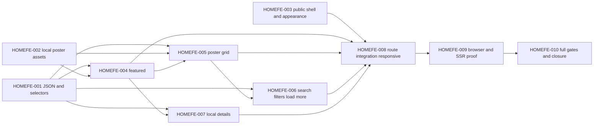

# Implementation plan: homepage dan katalog FE dengan dummy JSON

## Plan metadata

- Status: **ready — siap direview, belum executing**.
- Tanggal: 7 Oktober 2026.
- Repository: `bayuaji17/vertical-movie-app`.
- Base ref: `feat/home-catalog-mockup`.
- Base SHA: `b90edaaaca83187726218286fdaf253958a483fe`.
- Context: [repository-context.md](repository-context.md).
- Last validated SHA: `b90edaaaca83187726218286fdaf253958a483fe`.
- Backlog canonical: [HOMEFE-000–010](../../tasks/home-catalog.md).
- Otorisasi pengguna: mockup disetujui dan plan detail diminta; seluruh data tahap ini dummy JSON, fokus FE. Persetujuan ini tidak berarti runtime sudah dibuat atau playback/API diotorisasi.

## Objective

Mengganti starter route `/` dengan homepage/katalog sesuai [mockup approved](../../design/home-catalog.md), lengkap dengan interaksi lokal, tanpa dependency data/API/storage/auth. Hasil nanti harus dapat dilihat pada web dev dan build Bun/Nitro walau API dihentikan.

## Goals and non-goals

Dalam scope: public header/nav/appearance, intro, featured Film, poster catalog Film/Series/Standalone, pencarian, filter jenis/genre, latest ordering, Load more, empty/fallback, detail dialog lokal, responsive/light-dark/system dan page metadata.

Di luar scope: membaca API/Eden/gateway/TanStack Query untuk katalog, login pengunjung, database/migrasi, publication/admin, watch/HLS, signed URL, episode navigation/player, favorites/history/likes/rating, remote images dan hosted CI/deployment. Tidak membuat MSW/mock HTTP server karena JSON langsung cukup.

## Current behavior

Home masih starter dengan demo MP4 eksternal. Theme root sudah tersedia. Watch existing memanggil API playback. Komponen public catalogue belum ada; primitive shadcn sudah mencukupi. Tabel evidence/fakta berada pada [context](repository-context.md#evidence-index).

## Desired behavior

### Halaman, komposisi dan copy

Route tetap `/`; tidak membuat route baru untuk Browse atau detail pada tahap ini. Home/brand mengembalikan ke bagian atas dan reset filter; Browse mengarahkan focus/scroll ke section `#catalog`, mempertahankan filter. Di mobile menu berupa Sheet, menutup sesudah navigasi. Gunakan semantic anchor/link sesuai aksi, bukan tautan placeholder `href="#"`.

Header desktop: logo/brand, Home/Browse, search dan Appearance. Mobile: brand, Appearance/menu, search pada baris berikutnya. Satu search control aktif per breakpoint, keduanya membaca state yang sama; kontrol yang hidden tidak bisa menerima fokus. Navigasi tidak meminta sesi/admin.

Intro: STORIES IN PORTRAIT / Find your next story. / Films, series, and short stories. Watch without an account. Featured: After the Rain, metadata Film/Drama/18 min, synopsis pada desktop; mobile boleh menyembunyikan synopsis agar ringkas, thumbnail tetap portrait. Feature muncul hanya pada default query kosong, kind all dan genre all; saat melakukan pencarian/filter, fokus visual pada hasil katalog. Tidak membuat carousel/autoplay.

CTA dummy utama diusulkan **View film**, menggantikan Watch film dari raster untuk membuka detail tanpa menjanjikan playback. View details dan klik kartu membuka dialog yang sama. Series menampilkan detail title/synopsis/genre/jumlah episode; tidak membuka endpoint/list episode. Dialog mempunyai title/description, close button, Escape/focus trap/focus return, scroll internal bila layar pendek. Tidak ada disabled play button atau dummy URL menuju route watch API.

Footer: brand dan Vertical stories. Open to everyone. Copy English mengikuti desain; tidak menambahkan data demo/peringatan teknis ke flow utama. Batas dummy dicatat pada dokumentasi.

### Kontrak JSON dan tipe lokal

Satu source `apps/web/src/data/catalog.json`, imported statically. `catalog-schema.ts` memakai Zod existing untuk parse sekali dan menginfer tipe; UI menerima model lokal, bukan import DTO API. Aktifkan `resolveJsonModule: true` pada tsconfig web bila type check import JSON membutuhkannya; plan menetapkan setting eksplisit agar perilaku jelas.

```json
{
  "schemaVersion": 1,
  "featuredId": "film-after-the-rain",
  "genres": [
    { "id": "drama", "label": "Drama" },
    { "id": "mystery", "label": "Mystery" },
    { "id": "slice-of-life", "label": "Slice of life" },
    { "id": "comedy", "label": "Comedy" },
    { "id": "documentary", "label": "Documentary" }
  ],
  "items": [
    {
      "id": "film-after-the-rain",
      "slug": "after-the-rain",
      "kind": "movie",
      "title": "After the Rain",
      "synopsis": "A chance encounter on a rainy evening brings two strangers closer to home.",
      "genreIds": ["drama"],
      "poster": "/images/catalog/after-the-rain.png",
      "publishedAt": "2026-10-06T10:00:00Z",
      "durationMs": 1080000
    },
    {
      "id": "series-the-last-train",
      "slug": "the-last-train",
      "kind": "series",
      "title": "The Last Train",
      "synopsis": "A late departure turns an ordinary journey into a mystery.",
      "genreIds": ["mystery"],
      "poster": "/images/catalog/the-last-train.png",
      "publishedAt": "2026-10-06T09:00:00Z",
      "episodeCount": 8
    }
  ]
}
```

Contoh di atas parsial; fixture final berisi **18 items, masing-masing enam movie/series/standalone**. Enam pertama: After the Rain; The Last Train; A Small Beginning; Letters to Home; Midnight Kitchen; City in Motion. Durasi fixture mengikuti raster 18/4/24/6 min, episode counts 8/6. Dua belas sisanya fiktif, dapat reuse enam poster; ID/title/slug harus unik. Sediakan judul panjang/Unicode untuk proof layout, serta publishedAt sama untuk proof tie-break. Timestamp selalu string ISO UTC, bukan nilai runtime acak.

Validasi: kind discriminated union; movie/standalone durationMs positif, series episodeCount integer positif; field jenis yang tidak relevan ditolak; ID/slug unik, genre IDs tersedia, featuredId menunjuk movie, poster path lokal saja. Hindari casts `as CatalogItem[]` yang menutupi mismatch. Fixture tidak berisi token/credential/storage key, source URL, status worker atau metadata admin.

`catalog-data.ts` mengexport parsed read-only items/genres/featured. Tidak membuat class repository/service dengan async wrapper palsu. Boundary ini dapat diganti adapter pada task integrasi API berikutnya, tanpa mengimplementasikan adapter sekarang.

### Query, filter, urutan dan Load more

State React terpusat pada homepage: `query`, `kind`, `genreId`, `visibleCount`, `selectedItemId`. Dataset kecil; filtering lokal synchronous, tanpa debounce/timer/requests. State tidak dipersist ke URL atau storage dalam iterasi ini; reload kembali ke default, tema tetap mengikuti storage existing.

Pipeline pure: normalisasi query trim/case-insensitive → match substring title/synopsis → kind predicate → genre membership → publishedAt descending → id ascending sebagai tie-break → slice visibleCount. Filter gabungan memakai AND. Search kosong/whitespace sama dengan tanpa search. Tidak melakukan fuzzy/AI search atau melabeli relevance ranking.

Default `kind=all`, `genreId=all`, query kosong, batch **6**. Enam di mobile maupun desktop: perbedaan dua kartu pada raster mobile merupakan contoh viewport, bukan page size dinamis. Load more menambah enam, tidak mengubah urutan, tidak duplikat, menjaga posisi scroll; hilang setelah semua hasil muncul. Mengubah search/kind/genre atau reset mengembalikan visibleCount ke enam. ToggleGroup harus single-selection dan tidak boleh meninggalkan kind kosong. Genre memakai NativeSelect dan All genres; pilihan berasal dari fixture, tidak berubah diam-diam saat kind berubah.

Latest releases adalah **label urutan tetap**, bukan dropdown kosong/sort selector baru walau raster mobile menyerupai button. Semua genre/jenis tetap selectable untuk menguji hasil kosong. Empty memakai Empty primitive, teks No titles found dan Reset filters; reset mengembalikan query/kind/genre/batch serta fokus search yang aktif. Result count memakai live region polite dengan pesan ringkas, tanpa membanjiri announce saat mengetik.

### Poster, asset dan responsivitas

Enam source poster lokal berada di `apps/web/public/images/catalog/`; tidak memakai screenshot UI besar sebagai gambar poster dan tidak memakai URL Unsplash/CDN/API. Recreate scene approved lewat imagegen bila tidak ada source mandiri, simpan prompt/metode pada backlog/design. Assets dipilih/diperiksa sebelum implementasi page; fallback SVG lokal netral dapat dibuat sebagai code-native asset.

Frame selalu `aspect-[9/16]`; source image portrait dan object-fit cover, tidak stretch. Width/height intrinsic diketahui. Poster hero eager; grid memakai lazy/decoding async sesuai posisi, semua frame punya reserved space untuk mencegah layout shift. Failed image mengganti src sekali ke fallback lokal; fallback failure tidak membuat retry loop. Gambar di tombol kartu dekoratif memakai alt kosong bila accessible name sudah title; hindari announce ganda.

Gutter mobile 16px, desktop 24–48px; content max sekitar1376px, padding menyesuaikan lebar. Default grid dua kolom pada320–639px, tiga pada640–1023px, empat pada1024–1279px, enam pada≥1280px. Title boleh wrap dua/baris alami; type/genre dapat wrap. Pada320px, filter jenis dapat wrap ke dua baris; hindari horizontal overflow halaman. Mobile feature thumbnail dan text sejajar bila cukup ruang; pada320px dapat ditumpuk, tetap dalam panel.

Touch actions/search/filter target44CSSpx, visible keyboard focus, landmarks/skip link, heading order, contrast dan reduced motion. Sheet/Dialog bounded viewport dengan safe-area padding sesuai kebutuhan. Feature/grid bukan forced fixed-height canvas. Tidak menggunakan window.innerWidth untuk menentukan hasil SSR atau batch count.

Light mengikuti mockup approved; Dark/System memakai token CSS existing tanpa nilai hardcoded tiap halaman. Appearance dropdown publik hanya tiga mode, tidak mengambil Admin ThemeMenu yang menyertakan identity/session. Reuse useTheme dan theme bootstrap; hindari provider kedua. Fidelity dark adalah semantic rendering/contrast, bukan mockup dark baru.

## Impact analysis

Data/UI/state entirely apps/web; docs mencatat approval dan batas dummy. Tidak ada perubahan kontrak/schema API. Route index mengganti starter beserta import/player demo lama, override title/description pada head. Provider root/router/gateway/watch/auth tetap current. Type config hanya import JSON. Shared UI source hanya disentuh bila target44px tidak bisa dicapai dengan props/layout existing; harus direview tersendiri, tidak merombak primitive global.

## Affected files and symbols

| Path                                                                           | Action | Symbols / hasil                       | Alasan dan evidence                                                 |
| ------------------------------------------------------------------------------ | ------ | ------------------------------------- | ------------------------------------------------------------------- |
| `apps/web/src/routes/index.tsx`                                                | modify | Route/Home/head                       | Entry starter pada context lines1–30; compose public page/metadata. |
| `apps/web/tsconfig.json`                                                       | modify | compilerOptions.resolveJsonModule     | Import JSON typed; strict config existing.                          |
| `apps/web/src/data/catalog.json`                                               | create | 18 fixture items, genres, featuredId  | Satu source dummy; tidak mempunyai API fetch.                       |
| `apps/web/src/lib/catalog/catalog-schema.ts`                                   | create | CatalogDataSchema/CatalogItem         | Zod existing, local discriminated union.                            |
| `apps/web/src/lib/catalog/catalog-data.ts`                                     | create | catalogData                           | Parse JSON; provide immutable data.                                 |
| `apps/web/src/lib/catalog/catalog-selectors.ts`                                | create | filter/sort/paginate/metadata helpers | Pure local behavior, meaningful tests.                              |
| `apps/web/src/components/catalog/public-shell.tsx`                             | create | PublicShell/Header/MobileNavigation   | Public UI composed from installed primitives.                       |
| `apps/web/src/components/catalog/appearance-menu.tsx`                          | create | AppearanceMenu                        | Public theme menu uses useTheme, no admin import.                   |
| `apps/web/src/components/catalog/featured-film.tsx`                            | create | FeaturedFilm                          | Approved hero/compact mobile.                                       |
| `apps/web/src/components/catalog/poster.tsx`                                   | create | Poster                                | Aspect9/16, fallback, reserved space.                               |
| `apps/web/src/components/catalog/catalog-card.tsx`                             | create | CatalogCard                           | Movie/Series/Standalone metadata; local detail action.              |
| `apps/web/src/components/catalog/catalog-filters.tsx`                          | create | CatalogSearch/CatalogFilters          | InputGroup, ToggleGroup, NativeSelect.                              |
| `apps/web/src/components/catalog/catalog-grid.tsx`                             | create | CatalogGrid/empty/loadMore            | Grid, results state and button, no async data logic.                |
| `apps/web/src/components/catalog/catalog-detail-dialog.tsx`                    | create | CatalogDetailDialog                   | Installed Dialog; callback/focus return, no watch routing.          |
| `apps/web/src/components/catalog/home-page.tsx`                                | create | HomePage/local reducer or state       | Own query/visibleCount/selectedItem and compose page.               |
| `apps/web/public/images/catalog/*`                                             | create | Six PNG posters/fallback SVG          | Static local assets; folder absent at base.                         |
| `apps/web/test/home-catalog-data.test.ts`                                      | create | Fixture/selector behavior tests       | bun:test conventions existing.                                      |
| `apps/web/test/home-catalog-browser-worker.mjs`                                | create | DOM/network/SSR screenshots proof     | Existing host-module Playwright pattern.                            |
| `docs/design/home-catalog.md`                                                  | modify | Approval/asset/runtime limits         | Canonical visual source.                                            |
| `docs/product/prd.md`, `docs/product/global-rules.md`                          | modify | Scope/status update                   | Approved direction ≠ implemented MVP.                               |
| `docs/plans/home-catalog/*.md`, `docs/tasks/home-catalog.md`, `docs/README.md` | modify | Plan/ledger/evidence/index            | Canonical planning and task closure.                                |

No planned routeTree change because no routes are added. No planned package manifest/lock change; generated dist/.output/.turbo artifacts stay ignored. Source can co-locate smaller components if the ownership remains clear; update impact table before deviating.

## Implementation DAG



DAG menunjukkan dependensi; tidak mewajibkan agent paralel. Commit per task setelah AC/checks pass; perubahan bun.lock tetap satu writer jika akhirnya dependency diperlukan.

## Implementation steps

Detail acceptance, affected files, requirements dan validation untuk setiap ID disimpan satu kali pada [backlog canonical](../../tasks/home-catalog.md). Tabel ini memetakan urutan/outcome tanpa menyalin checklist backlog.

| Step       | Outcome                                            | Depends on  | Files/symbols                       | Validation/completion                                                                           |
| ---------- | -------------------------------------------------- | ----------- | ----------------------------------- | ----------------------------------------------------------------------------------------------- |
| HOMEFE-001 | Typed fixture18 + selector deterministik           | None        | data JSON/lib catalog/tsconfig/test | Fixture/AND filter/stable order/batch-boundary tests dan web types pass.                        |
| HOMEFE-002 | Six separate local posters + fallback              | None        | public images/design evidence       | Native size,9:16 assets, local paths, no remote source, format/file review.                     |
| HOMEFE-003 | Accessible header/nav/appearance                   | None        | public-shell/appearance-menu        | Reuse primitives/theme; shell web lint/types, pending browser flow on009.                       |
| HOMEFE-004 | Featured desktop/mobile section                    | 001,002     | featured-film/poster                | Correct metadata/9:16 frame, action callback, selectors and types/lint pass.                    |
| HOMEFE-005 | Three-kind poster cards/grid                       | 001,002,004 | poster/card/grid                    | Metadata count/duration + responsive grid, tests/types/lint pass.                               |
| HOMEFE-006 | Search/AND filters/batch6/empty                    | 001,005     | catalog-filters/grid/home-page      | Selector tests show reset/boundary/no duplicate; types/lint.                                    |
| HOMEFE-007 | Local metadata detail dialog                       | 001,004     | catalog-detail-dialog               | No API/watch import, title/focus return/viewport behavior planned on009.                        |
| HOMEFE-008 | Replace route / and responsive polish              | 003–007     | index/home-page/catalog components  | Route head, coherent callbacks, web build/types/lint; visual/browser debug.                     |
| HOMEFE-009 | Browser, SSR and API-independent proof             | 008         | browser worker/evidence             | Matrix below pass; console/network/ratio/layout assertions and screenshots.                     |
| HOMEFE-010 | Full root gates, canonical status and final review | 009         | docs + only necessary fixes         | Relevant existing tests/types/lint/build/docs/format/diff + task commit, no source API changes. |

## Test requirements

### Unit behavior and fixture integrity

Use bun:test in web/test; no snapshots/component test framework. Cases: unique IDs/slugs and local poster paths, referenced genre/featured kind, field exclusivity by kind, empty fixture allowed for pure selector, trim/case-insensitive title/synopsis search, AND filter combination, unknown genre gives zero results, equal timestamps tie-break, batch6→12→18 cap/no duplicate, visibleCount reset when filter/query changes, duration formatting versus episodeCount. Tests assert observable lists/metadata rather than duplicating implementation logic.

Relevant existing theme tests must pass. Broad auth/browser database suites are not required solely because public components use the existing theme hook; run impacted suites if a shared/auth/provider file actually changes.

### Browser proof

Development and built Bun/Nitro: no cookies or admin fixture, API upstream stopped/unreachable, public interactions work. Observer must see **zero catalog/auth/playback/API requests** throughout initial load, search, genre/type, Load more, drawer, theme and detail. Block `/api/**` and any external API origin, fail on attempted request rather than treating failed requests as proof. Same-origin HTML/router module/JS/CSS/font/image requests are expected.

Viewports320×800,390×844,768×1024,1024×900,1440×1000,1920×1080. Light and Dark on all sizes; System preference/persistence tested on one mobile and one desktop. At each size check no page horizontal overflow, all poster bounding boxes width/height9/16 within1CSSpx, controls visible, title/genre wrap, dialog/sheet safe bounds, viewport resize preserves query/results/theme and does not reset loaded count.

Flows: default6; Load more12/18 and exhausted button; query by title/synopsis and whitespace; kind/genre AND; no results and reset; featured hidden on search/filter and restored on reset; Home reset and Browse focus; mobile drawer closes; details correct for movie/series/standalone; Escape/focus return; theme roundtrip/reload; keyboard-only search/filter/cards/menu; long title; failed image fallback once; zero page/hydration errors.

SSR built proof: anonymous GET / yields brand/title/initial fixture content, no API dependency, matching initial six before/after hydration, no random dates/window-count mismatch. Page title/description identify Vertical Movie rather than starter. Network proof must cover HTML/server dependency via unreachable API, not only browser intercept. Capture light desktop/mobile and dark examples under docs/design with distinct implemented filenames; actual commands/harness args/results in backlog. Reuse available Playwright runtime, do not install browser dependencies into web for this proof.

### Commands planned for implementation

From root with Bun1.4.2; these are future checks, not results observed during planning:

```sh
bun test apps/web/test/home-catalog-data.test.ts apps/web/test/admin-theme.test.ts
bun run check-types
bun run lint
bun run build
bun run docs:check
bun run --bun prettier --check <changed-supported-files>
git diff --check
```

Browser worker arguments mirror existing workers: base URL, host Playwright module/executable and screenshot prefix. Confirm actual available paths before invoking; record the exact command at execution. Frozen install after script/dependency changes; no DB migration unless scope is separately refined to a schema task. API test suite remains unchanged by this plan.

## Constraints

No request/API/session behind apparently static UI, including prefetch of /watch. No fake API errors/loading delay or global error pages for bundled JSON. Fixture parse error is a build/test authoring failure; valid data renders synchronously. User-visible recoverable states are empty results and image fallback. Reuse installed shadcn source and read version-matched component docs before coding. Keep theme/primitive dependencies explicit, no global state store/library unless concrete need emerges.

## Acceptance criteria

- [ ] Approved light visual reproduced using real components, not a full-page raster background.
- [ ] Typed local JSON18 items drives all visible metadata/search/filter/details; no duplicated hardcoded item arrays.
- [ ] No API/auth/playback requests; dev and SSR/build remain functional with API down.
- [ ] All/Film/Series/Standalone + genre/search + stable latest + Load more work according to specifications.
- [ ] Empty/reset, image fallback, focus/nav/dialog and appearance behave correctly.
- [ ] Exact CSS9/16 poster ratio, responsive matrix, no overflow, meaningful targets/contrast verified.
- [ ] No starter/Mux demo on homepage; watch/admin/auth behavior not redirected or replaced.
- [ ] Tests, root gates, browser proof, screenshots, canonical docs and per-task local commits have actual evidence.

## Risks and mitigations

| Risk                                                 | Mitigation                                                                                               |
| ---------------------------------------------------- | -------------------------------------------------------------------------------------------------------- |
| Dummy slug sent to live watch route                  | Local dialog only, no router link/prefetch to watch; observer fails on attempted API request.            |
| Raster ratios/copy do not map to real mobile CSS     | Lock9/16, deliberate breakpoint grid, wrap, measured DOM proof; raster is hierarchy reference.           |
| Different counts between SSR/mobile hydration        | Batch6 at all widths; CSS handles columns, no viewport-based data selection.                             |
| Photo asset depends on external service              | Bundle six local assets + fallback; generation/source proof tracked.                                     |
| Filter excludes loaded cards but stale count remains | Single owner for query/filter/visibleCount, selectors plus transition tests.                             |
| Shared admin/theme regressions                       | Import hook/primitives directly, do not import admin shell/session; run theme test and scoped freshness. |
| Main checkout changes during parallel work           | Keep worktree, pinned SHA, inspect affected diff before coding/delivery; no force merge.                 |
| UI model mistaken for current public API             | Local catalog union documented; future API adapter/resource mapping is a separate task.                  |

## Rollback or recovery

Each task local commit is a bounded rollback point. Revert relevant feature commits when authorized; preserve unrelated parallel changes. Dummy fixture errors fixed in JSON/schema before task Done, asset failures use fallback. No DB/storage rollback or production migration involved. Do not deploy/push/merge as part of this plan.

## Evidence

Planning evidence and source index are in [context](repository-context.md). Design generation/commits historic in [HOMEDES-001](../../tasks/home-catalog-design.md). Plan authoring validation and later task results belong to [HOMEFE ledger](../../tasks/home-catalog.md); intended checks are not marked passed in this plan.

## Open decisions

Default proposal for missing CTA decision: local detail dialog and View film wording, playback outside this iteration. Optional question has been presented; no reply at plan authoring. If user chooses a local player, plan must be refined for fixture media, videojs skill, player action and playback tests before implementation. No choice is inferred to authorize API.

Other choices above (batch6, exact selector semantics, fixed Latest releases label,18fixtures, local state) are proposed implementation details for this plan review. Mockup approval applies to visual direction; real API/production catalog order remains a later decision.

## Validation history

### 7 Oktober 2026 — pre-authoring freshness

- Result: valid for planning.
- Plan base SHA/current worktree SHA: `b90edaaaca83187726218286fdaf253958a483fe`.
- Main checkout current SHA: `4cf00a97dffe9568a966f8889ae798fed3acdb17`.
- Checked paths: apps/web routes/components/lib/theme/config/tests; catalog API models; manifests/lock/AGENTS.
- Changed relevant runtime paths between main and mockup baselines: none; intervening main APUB commit adds docs only.
- Decision: write context first then plan on attached worktree; refresh again after implementation is requested.

## Execution log

Runtime tasks not started. Planning/approval/index updates and documentation checks are recorded in HOMEFE-000. Git task SHA recorded after commit in a subsequent ledger update; no push/PR/merge/deploy performed.
