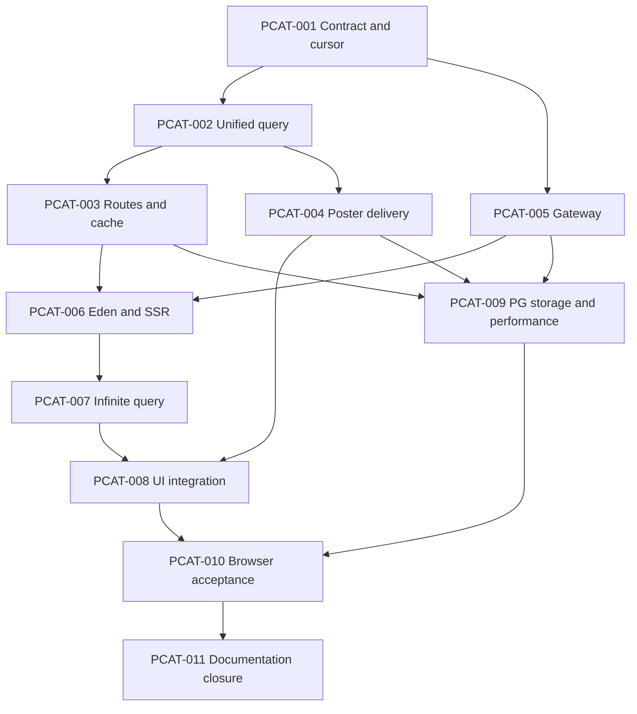

# Implementation Plan — Integrasi katalog API ke homepage

## Plan Metadata

- Status: **draft — lengkap untuk review, menunggu persetujuan proposal kontrak/UX**.
- Repository: `bayuaji17/vertical-movie-app`.
- Base ref: `main` / `origin/main`.
- Base SHA: `ba42d00728e66dd9cbeb0f3d916ae8ddea339f4b`.
- Context: [repository-context.md](repository-context.md).
- Backlog: [PCAT](../../tasks/public-catalog-api.md).
- Last validated SHA: `ba42d00728e66dd9cbeb0f3d916ae8ddea339f4b`, 7 Oktober 2026.
- Approval: pengguna memilih point1 dan meminta plan detail. Detail di bawah adalah rekomendasi untuk disetujui; API/FE runtime belum diimplementasikan oleh task planning.

## Objective

Homepage menampilkan Film/Standalone/Series nyata yang efektif published, dengan tampilan existing, filter server dan cursor pagination melalui TanStack useInfiniteQuery. Load more tetap manual dan menambahkan skeleton tanpa menghilangkan kartu lama. Tidak ada fallback diam-diam ke JSON dummy ketika API kosong/gagal.

## Goals and Non-goals

Goals: satu feed lintas jenis, genre publik, featured nyata, poster9:16 dari output privat, SSR first page, search/filter/cancellation/cache/error states, kontrak Eden typed, kompatibilitas legacy dan proof DB/storage/browser.

Non-goals: route detail baru, tombol/alur watch baru, perubahan player/HLS/signing playback, editor/upload/publication Series/Episode, autoplay/automatic infinite scroll, ranking personal, konfigurasi situs/subtitle dan deployment production. Series card tetap memakai dialog metadata; browser proof menyiapkan published Series melalui backend/test fixture existing tanpa membangun editor.

## Current Behavior

Home memakai18 fixture lokal; SSR6, offset pagination6→12→18, search/filter langsung, initialData dummy, staleTime Infinity. CatalogGrid belum menangani initial pending/error. Genre, featured dan card labels terikat catalogData. Backend `/videos` hanya limit/cursor; `/series` terpisah/max100/N+1 count; public metadata tidak menyediakan poster/genre/publishedAt/total. Gateway belum menerima namespace catalog dan membatasi buffered responses1MiB. Detail evidence ada pada context, bukan asumsi dari mockup.

## Desired Behavior

### Proposal keputusan produk

| Keputusan       | Rekomendasi untuk plan ini                                                                                                     | Alasan / batas                                                                                                 |
| --------------- | ------------------------------------------------------------------------------------------------------------------------------ | -------------------------------------------------------------------------------------------------------------- |
| Isi homepage    | Movie + Standalone + Series; episode individual tidak muncul sebagai kartu                                                     | Sesuai tiga filter existing; episode dihitung pada parent efektif playable.                                    |
| Latest releases | publishedAt DESC, UUID ASC, kind ASC sebagai tie-break terakhir                                                                | Selaras label dan fixture; tidak mengubah order endpoint legacy.                                               |
| Featured        | Film efektif published terbaru, nullable bila tidak ada; tampil hanya pada filter default                                      | Tidak perlu CMS/featured column baru; item masih boleh ada di grid seperti UI sekarang.                        |
| Search          | Title atau synopsis, case-insensitive menurut PostgreSQL collation, literal substring; trim/lowercase canonical; debounce300ms | Mengurangi request per keystroke; bukan fuzzy/full-text search. `%`, `_`, backslash di-escape sebagai literal. |
| Paging          | 6 kartu per page, tombol Load more, cursor opaque backend                                                                      | Tidak menambah IntersectionObserver/auto scroll; bukan offset atau pagination browser dari seluruh dataset.    |
| Filter state    | Tetap state lokal; jenis/genre apply langsung, search debounce; pergantian filter/reset kembali first page                     | URL search/shareable filters ditunda agar scope point1 terjaga.                                                |
| Poster          | URL same-origin menuju output WebP dari bucket privat, response binary no-store                                                | Metadata tetap unsigned; tidak memakai playback endpoint per card atau signed URL dalam catalog cache.         |
| Detail          | Dialog existing dengan metadata API item                                                                                       | Integrasi route detail/watch tetap tahap berikutnya.                                                           |

Jika proposal disetujui, catat approval pengguna pada plan/backlog lalu jadikan tugas implementasi Ready. Jangan menyebut pilihan order/featured/poster sudah disetujui hanya karena point1 dipilih.

### Kontrak HTTP yang diusulkan

API internal memakai path di tabel; browser mengakses prefix `/api` melalui gateway same-origin. Route baru public GET, tanpa requireAdmin/session. Endpoint `/videos`, `/series`, `/next` dan playback lama tetap utuh.

| Endpoint baru                   | Input                                                                                                                                | Output / status                                                                                                                                                                                      |
| ------------------------------- | ------------------------------------------------------------------------------------------------------------------------------------ | ---------------------------------------------------------------------------------------------------------------------------------------------------------------------------------------------------- |
| `GET /catalog`                  | limit(default6,max100), cursor(optional), search(max200 code points), kind(optional movie/standalone/series), genreId(optional UUID) | 200 `{ items, total, nextCursor, freshForMs }`; valid kosong `{items:[],total:0,nextCursor:null}`.422 invalid query/cursor;503 dependency; gateway502/504.                                           |
| `GET /catalog/genres`           | limit(default100,max100), cursor(optional)                                                                                           | 200 `{items:[{id,slug,name}],nextCursor,freshForMs}` dari genre terkait item publik; empty sah. Cursor scope sendiri; semua halaman dibaca adapter sebelum dropdown lengkap, tanpa cap100 diam-diam. |
| `GET /catalog/featured`         | Tidak ada filter/cursor                                                                                                              | 200 `{item: MovieItem                                                                                                                                                                                | null,freshForMs}`; tidak menciptakan fallback fiktif. |
| `GET /catalog/:kind/:id/poster` | kind movie/standalone/series dan UUID                                                                                                | 200 WebP;404 hidden/missing,503 storage/profile/provenance failure. GET saja; tidak menerima storage key/URL dari pengunjung, tidak redirect.                                                        |

`freshForMs` integer0–60000 mengungkap sisa umur cache unsigned saat respons diberikan, bukan signature expiry. FE memakai ini untuk menghitung deadline lokal; backend/frontend tidak menumpuk staleTime60 baru di atas cache server yang hampir expired. List/genre/featured memakai contract metadata TTL60; poster private,no-store. Error tetap DTO aman existing, tanpa raw DB/provider diagnosis.

Public item union yang diusulkan:

```ts
type CatalogCommon = {
  id: string; // UUID backend
  slug: string;
  title: string;
  synopsis: string;
  publishedAt: string; // UTC, sort key berasal dari timestamp asli DB
  genres: Array<{ id: string; slug: string; name: string }>; // boleh kosong
  posterPath: string; // /catalog/<kind>/<uuid>/poster; tanpa storage key/signature
};
type MovieItem = CatalogCommon & { kind: "movie"; durationMs: number };
type StandaloneItem = CatalogCommon & {
  kind: "standalone";
  durationMs: number;
};
type SeriesItem = CatalogCommon & { kind: "series"; episodeCount: number };
type PublicCatalogItem = MovieItem | StandaloneItem | SeriesItem;
```

DTO tidak mengekspos rights actor, source/HLS key, original URL, admin row state, provider credential atau stream URL. View model browser membentuk poster `/api` + validated posterPath, composite card key `${kind}:${id}` dan display genre dari DTO. UUID dan slug tidak dianggap unik lintas tabel secara global. Tidak perlu releaseYear/fields baru yang belum ditampilkan UI.

### Query database dan visibility

1. Feed memakai UNION ALL dua sumber: video kind movie/standalone dan parent Series. Normalisasi kolom untuk satu global sort/count/limit; jangan merge dua pagination result di browser.
2. Video mengikuti effective published/active, rights, verified duration, current source/HLS/poster generation/provenance dan owner checks existing. Series published aktif, title/synopsis lengkap, current parent poster ready dan minimal1 child effectively playable. Parent/season/child hidden tidak menambah episodeCount.
3. Reuse/extract predicate CatalogStore dengan parity tests. CatalogStore.playable/preview/readyForPublish/next yang dipakai Publication/Playback tidak boleh berubah semantik.
4. Filter genre memakai EXISTS join pada owner; aggregate genre data dan playable episode count tanpa per-card/series loop query. Tidak mensyaratkan konten punya genre agar bisa tampil.
5. Page limit+1 dan total dihitung dari visibility/filter/asOf yang sama, dalam satu SQL statement/statement snapshot. Total adalah matching count saat respons, bukan jaminan dataset beku selama seluruh sesi.
6. New cursor memuat version/scope/filter fingerprint (search,kind,genreId,limit,sort), asOf first page dan posisi publishedAt/UUID/kind. Server memvalidasi ukuran/base64/JSON/schema/date/kind/UUID dan equality query. Cursor lain/modified filter gagal422, tanpa fallback offset.
7. Gunakan exact SQL timestamp precision untuk cursor; jangan round-trip sort position melalui JS Date tiga digit. Predicate mixed direction: publishedAt lebih lama, atau waktu sama/UUID lebih besar, atau waktu+UUID sama/kind lebih besar. Unit/PG tests mencakup timestamp berbeda hanya mikrodetik dan collision UUID video/Series.
8. asOf mengecualikan publish baru di atas boundary dari traversal existing; refresh/reset membuat traversal baru. Archive menghapus eligibility page berikutnya. Tidak menjanjikan snapshot lintas HTTP/instant removal atas kartu yang sudah diterima. FE dedup composite identity dan refetch whole traversal; tidak mengandalkan total untuk menentukan EOF.

Tidak ada schema mutation default. Existing timestamps/genre/media sudah cukup. PCAT-009 mengukur query plan sebelum memutuskan index; index baru berarti schema change dengan generate/review migration, development db:migrate dan preservation gate normal.

### Cache dan poster delivery

- CatalogService mempertahankan cache unsigned TTL60/bounded100 entries dan callback invalidate existing. Key baru canonical dan berbeda scope dari legacy. Generation fence mencegah slow read mengisi ulang cache lama setelah invalidation. freshForMs dihitung ketika respons dikirim.
- Metadata/genre/create relation mutations yang memengaruhi tampilan harus invalidate setelah commit. Tambahkan optional invalidation hook GenresService bila relevan; jangan mengubah constructor/caller legacy tanpa compatibility check.
- Poster route mengambil owner/effective visibility/current poster yang fresh, melewati metadata cache. Native S3 membaca hanya output poster.webp dengan provider/bucket/owner/generation/readyJob/provenance terverifikasi.404 hidden; failure storage fallback hanya pada image UI.
- Response image private,no-store; tidak membuat bucket public atau mengubah playback TTL. Metadata page boleh masih stale dalam batas cache; poster GET baru menolak owner hidden sesuai read visibility. Data/image yang sudah diterima tidak dapat ditarik kembali.
- Gateway tambahkan namespace catalog saja. Pisahkan request-body limit1MiB existing dari response-body limit khusus GET poster (usulan maksimum5.000.000 byte). Respons dibaca bounded dengan abort/timeout, MIME WebP dan status divalidasi; tidak menaikkan limit global/private route atau menerima arbitrary redirect. Output melampaui limit gagal aman, tidak dibaca tanpa batas.
- Usulan limit poster bukan perubahan syarat publish/upload. PCAT-004/009 membuktikan ukuran WebP hasil existing; jika batas ini tidak cukup, revisi strategi delivery sebelum menutup acceptance. Jangan diam-diam memperbesar limit atau menyembunyikan item karena thumbnail gagal.
- Tradeoff: thumbnail bytes melalui API dan gateway web. Gunakan eager hero/lazy grid existing, pengukuran actual byte/concurrency, tanpa CDN/new signing design pada tahap ini.

### Adapter, SSR dan TanStack Query

- Tambahkan public catalog client memakai createApiClient/type-only App, tanpa createPrivateApiClient/auth effects. Browser target same-origin `/api`; adapter tidak menggantungkan public catalog pada VITE_API_URL bila location.origin tersedia. URL/response shape salah menjadi error aman, bukan empty result.
- SSR memakai API_INTERNAL_URL melalui server-only transport; tidak request ke origin yang dibentuk dari inbound Host, tidak forward cookie/session dan tidak membocorkan internal URL/env pada dehydration. Request abort digabung dengan query AbortSignal.
- Route `/` loader memuat first page6, genre options dan featured(default view) secara paralel dengan request-scoped QueryClient, queryClient.infiniteQuery/queryClient.query sesuai installed Query core5.104.0; ensureInfiniteQueryData/ensureQueryData ditandai deprecated pada paket terpasang. Halaman berikutnya hanya diminta saat Load more; tidak prefetch seluruh feed saat SSR.
- Success dihydrate sekali. Initial server failure ditransmisikan sebagai bootstrap error aman untuk section UI/Retry; tidak seed fake empty page dan tidak serialize raw Error. Detail cara bootstrap error mengikuti installed TanStack Start SSR integration, diverifikasi oleh PCAT-006/010.
- Genre pages dapat dikumpulkan berurutan pada satu read dengan signal dan repeated-cursor guard; tidak cap100 options, tidak memuat taxonomy privat. Failure genre tampil localized dengan Retry; All genres dan feed tetap bisa dipakai. Empty genres tidak dianggap error.
- Query key: `['catalog','public',1,{search,kind,genreId,limit:6,sort:'publishedAt-desc_id-asc_kind-asc'}]`; featured/genres namespace sendiri di bawah public. Cursor/asOf bukan key filter baru per page.
- initialPageParam null/undefined untuk menghilangkan query cursor; getNextPageParam mengambil nextCursor dan mengubah null menjadi undefined. Tidak initialData dummy, offset atau total-based EOF. networkMode online(default), retry false/manual; queryFn throw non-success/malformed dan meneruskan signal melalui Eden.
- staleTime maksimal sisa freshForMs; refetchOnMount/focus/reconnect untuk stale data. Tidak polling/live push dan tidak mengklaim kartu langsung hilang ketika tab diam. Whole infinite traversal refetch konsisten memakai first page baru/cursor hasilnya; explicit Refresh tersedia untuk katalog.
- Search raw input dipertahankan, canonical trim/lower diberi debounce300ms; composition IME tidak memicu request parsial. Jenis/genre apply segera bersama nilai search terbaru. Filter/reset/Home membatalkan exact old/destination public keys, menghapus pages lama untuk destination lalu meminta first page tanpa synchronous dummy seed. Cancel timer on unmount/reset; latest revision wins.
- Saat query sama sedang paging, loading button disabled dan single request; fetchNextPage memakai guard !isFetching dan cancelRefetch false. Error page berikutnya mempertahankan kartu dan cursor, menyediakan Retry load more. Cancel/race tidak menjadi user error; 422 cursor requires Refresh from first page.
- Cache admin tidak dibersihkan saat katalog503/401/403. Cache public tidak dipersist ke browser storage dan tidak dipakai sebagai sumber hak playback.

### State UI

| State                             | Perilaku observable                                                                                             |
| --------------------------------- | --------------------------------------------------------------------------------------------------------------- |
| Initial pending / uncached filter | Grid6 skeleton, hero placeholder bila bootstrap belum selesai, aria-busy/live status; bukan empty state.        |
| Initial error                     | Pesan aman + Retry, shell/filter/theme tetap usable; tidak menampilkan fixture.                                 |
| Success empty                     | No titles found/reset; featured absent bila default feed tidak punya Film.                                      |
| Load more pending                 | Kartu lama tetap; maksimal6 skeleton sesuai known remaining count, button disabled.                             |
| Load more error                   | Kartu lama tetap, skeleton berhenti, Retry load more mengambil cursor yang gagal.                               |
| Background refresh                | Existing cards dipertahankan dengan status refreshing; gagal memberi warning/retry, tidak full-screen empty.    |
| Offline/paused                    | Status koneksi, busy controls sesuai fetchStatus; online melanjutkan GET aman, tidak replay mutation.           |
| Genre/featured gagal sendiri      | Pesan/retry localized; kegagalan supplementary data tidak menyembunyikan feed berhasil.                         |
| Poster gagal/hidden/oversized     | Bounded fallback SVG existing, tanpa retry loop; layout9:16 tidak berubah.                                      |
| Total berubah akibat archive      | Dedup/EOF mengikuti cursor; hindari label N of M ketika N>M. Tampilkan N titles shown sampai refresh konsisten. |

Pertahankan keyboard/dialog focus return,44px controls,320–1920 responsive layout, Light/Dark/System dan reduced-motion skeleton. Tidak menambahkan delay loading buatan.

## Impact Analysis

Perubahan menyentuh API metadata read, public image delivery, gateway dan FE data flow. Publication/player legacy menjadi regression surface karena memakai store/cache shared, tetapi bukan target fitur baru. Tidak memerlukan library/dependency/env baru secara default. Reuse existing components; perubahan tampilan terbatas pada pending/error/retry/refresh states.

## Affected Files and Symbols

Evidence setiap row mengacu context pada base SHA; path baru adalah proposal.

| Path                                                                                                                                                                  | Action | Symbols / purpose                                                           | Evidence                                           |
| --------------------------------------------------------------------------------------------------------------------------------------------------------------------- | ------ | --------------------------------------------------------------------------- | -------------------------------------------------- |
| `apps/api/src/modules/catalog/model.ts`, `index.ts`, `service.ts`                                                                                                     | modify | PublicHome DTO/routes, home/genres/featured, cache generation/freshness     | Existing catalog module/TTL.                       |
| `apps/api/src/modules/catalog/home-repository.ts`, `home-pagination.ts`, `visibility.ts`                                                                              | create | Unified feed/facets/count, exact cursor, reusable predicates                | CatalogStore/schema/content-pagination.            |
| `apps/api/src/modules/catalog/repository.ts`                                                                                                                          | modify | Reuse shared predicate without legacy semantics change                      | Publication/playback depend CatalogStore.          |
| `apps/api/src/modules/catalog/poster-service.ts`                                                                                                                      | create | Fresh public owner lookup/read-only bounded storage output                  | media-readiness/native S3/Series poster gate.      |
| `apps/api/src/{app,index}.ts`                                                                                                                                         | modify | Additive DI/invalidation; typed route chaining                              | createApp/bootstrap.                               |
| `apps/api/src/modules/genres/service.ts`                                                                                                                              | modify | Optional after-commit invalidation hook                                     | Taxonomy cache dependency.                         |
| `apps/web/src/lib/server/auth-gateway.ts`, `business-gateway.ts`                                                                                                      | modify | Catalog allowlist and response-only poster limit/MIME                       | Existing reject redirect/1MiB buffer.              |
| `apps/web/src/lib/catalog/public-catalog-model.ts`, `catalog-client.ts`, `catalog.server.ts`                                                                          | create | DTO validation/view model/Eden/request-only SSR                             | Fixture schema unsuitable; client/server patterns. |
| `apps/web/src/lib/catalog/catalog-queries.ts`                                                                                                                         | modify | Real infinite cursor, public namespace/cancellation/freshness               | Dummy options/transition.                          |
| `apps/web/src/components/catalog/{home-page,catalog-card,catalog-grid,catalog-filters,catalog-detail-dialog,featured-film,poster}.tsx`                                | modify | Remove fixture imports; real metadata/pending/error/retry/refresh           | Current direct fixture assumptions.                |
| `apps/web/src/routes/index.tsx`                                                                                                                                       | modify | SSR bootstrap/loader; same head/layout                                      | Current HomePage route.                            |
| `apps/api/src/modules/catalog/*.test.ts`                                                                                                                              | create | Domain/HTTP/cursor/cache/poster/legacy parity                               | Native test conventions.                           |
| `apps/api/src/app.test.ts`                                                                                                                                            | modify | Additive app/public route and OpenAPI checks                                | Existing app injection.                            |
| `apps/api/test/integration/public-catalog-proof.test.ts`                                                                                                              | create | Real PG+storage visibility, precision, plans and poster denial              | Existing guarded media fixtures.                   |
| `apps/web/test/public-catalog-{client,query}.test.ts`, `public-catalog-eden-contract.ts`                                                                              | create | Eden types, network errors/abort, pagination/races/cache                    | Existing client/query contract testing pattern.    |
| `apps/web/test/{business-gateway,home-catalog-data}.test.ts`                                                                                                          | modify | New public allowlist/binary limits; replace obsolete dummy-query assertions | Tests must follow current query behavior.          |
| `apps/web/test/public-catalog-browser-worker.mjs`, `apps/api/test/integration/public-catalog-browser-fixture.ts`                                                      | create | Actual public catalog worker/guarded PG and private storage fixture         | Existing media-browser fixture pattern.            |
| `apps/web/test/auth-browser-smoke.mjs`                                                                                                                                | modify | Add public-catalog phase/fixture dispatch, retain existing phases           | Existing auth/media publication harness.           |
| `docs/product/{prd,global-rules}.md`, `docs/architecture/overview.md`, `docs/operations/media.md`, `docs/design/home-catalog.md`, `docs/README.md`, PCAT plan/backlog | modify | Approved contract and final actual evidence                                 | Canonical ownership.                               |

`catalog.json`, catalog-data/schema/selectors and six dummy posters may remain test/design assets, but homepage runtime must have zero imports from them. Keep public poster-fallback.svg. Inspect dummy-data tests and retain still-valid fixture proofs; obsolete query tests are replaced with injected API tests, not falsely reported as network coverage. No hand-edit routeTree or watch route. Shared files beyond this table require impact refresh.

## Implementation DAG



API query work and gateway can proceed independently after contract. API service and poster work can proceed independently after query. Existing fixtures requiring database reset/build must run serially, not in parallel.

## Implementation Steps

### PCAT-001 — Kontrak typed dan cursor

- Outcome: DTO/query/errors/order/precision contract executable dan type-checkable.
- Depends on: approval plan / PCAT-000.
- Files/symbols: catalog/model.ts, new home-pagination.ts dan unit tests; PublicCatalogItem/HomeQuery/cursor codec.
- Requirements: Union3jenis, nullable featured, genres kosong, UUID/composite identity; strict limit/search/genre/kind; versioned/filter-bound/asOf cursor dengan exact precision. Tidak mengganti parser legacy.
- Validation: bun test affected cursor/model suites; API/web check-types untuk DTO consumer.
- Acceptance criteria: malformed/foreign-scope/filter-changed cursor ditolak; tie/microsecond round-trip lossless; serialized DTO tanpa private fields; contract decisions approved tercatat.

### PCAT-002 — Unified read repository

- Outcome: Satu query feed terurut dengan count/genre/episode data dan fresh poster identity lookup.
- Depends on: PCAT-001.
- Files/symbols: home-repository.ts, visibility.ts, catalog/repository.ts; homePage/publicGenres/featured/publicPoster.
- Requirements: DB-side UNION/filter/EXISTS/count, no child cards/no N+1, parent poster+playable eligibility; shared predicate parity; exact cursor comparator/asOf.
- Validation: relevant legacy unit tests; query parity melalui guarded PG fixture pada PCAT-009; root types.
- Acceptance criteria: contract-compatible rows; boundary/check failures hidden; duplicate genre joins tidak menggandakan item/count; legacy methods parity. Mandatory PG acceptance tetap terbuka sampai009.

### PCAT-003 — Public endpoint, DI dan cache

- Outcome: List/genre/featured HTTP typed tersedia dengan metadata TTL/invalidation aman.
- Depends on: PCAT-002.
- Files/symbols: catalog/index/model/service, app/index bootstrap, genres/service; preserve CatalogService constructor existing args via additive home dependency.
- Requirements: append home routes, no auth dependency, safe 422/503/empty, generation fence/freshForMs, callback setelah commit. Existing factory callers/EmptyCatalog tests tetap valid atau diperbarui secara additive.
- Validation: app.handle HTTP/cache race tests, OpenAPI runtime schema and Eden consumer checks; API tests/types/build.
- Acceptance criteria: anonymous200, invalid input422 before I/O, outage503 bukan empty; response unsigned, stale fill sesudah invalidate tidak menetap; legacy DTO/order/route unchanged.

### PCAT-004 — Poster publik dari output privat

- Outcome: Validated same-origin poster endpoint menyajikan actual WebP tanpa signature dalam katalog.
- Depends on: PCAT-002.
- Files/symbols: poster-service.ts, module route/schema, app/index DI; native storage + current owner read.
- Requirements: movie/standalone/series fresh visibility, owner/generation/provenance/profile validation, read bound/max5.000.000 byte proposal, no-store/no redirect; cancel cleanup dan sanitized404/503. Jangan call PlaybackService.info.
- Validation: injected storage unit/HTTP tests plus actual MinIO proof009; MIME/size/hidden/tampered profile/path tests.
- Acceptance criteria: published actualposter200, archive/draft404 pada GET baru; prefix/key bukan input publik; missing/oversized output gagal aman; tidak mengubah signed playback policy.

### PCAT-005 — Same-origin gateway

- Outcome: Browser `/api/catalog` dapat membaca DTO/WebP tanpa perlu private session.
- Depends on: PCAT-001.
- Files/symbols: auth-gateway/business-gateway and existing business-gateway tests.
- Requirements: bounded namespace allowlist, poster-specific response limit terpisah dari request limit, content-type/status checks; preserve cookies/private routes/timeout/redirect rejection.
- Validation: bun test apps/web/test/business-gateway.test.ts apps/web/test/auth-gateway.test.ts; types/lint/build.
- Acceptance criteria: cataloganonymous200, large validposter≤limit forwarded, oversize502 bounded, abort/timeouts cleanup; arbitrary/protocol/encoded path/redirect/private behavior regression lulus.

### PCAT-006 — Eden adapter dan SSR bootstrap

- Outcome: Data actual API dapat dikonsumsi aman browser dan request-scoped SSR.
- Depends on: PCAT-003, PCAT-005.
- Files/symbols: new catalog-client/catalog.server/public-catalog-model; routes/index loader; public-catalog-eden-contract/client tests.
- Requirements: type-only API App, DTO/view model safe, no fixture imports; first6 SSR+genre+featured reads, safe partial/bootstrap error, AbortSignal, trusted API_INTERNAL_URL/no cookies. Verify installed TanStack exports/integration sebelum menulis helper.
- Validation: compile-only Eden good/bad input/error/private-field cases; unit malformedHTTP/abort/config/genre pagination; SSR multi-request/cache isolation/import boundary via built proof010.
- Acceptance criteria: SSR sukses mempunyai6 API cards atau empty sah; API failure tidak hydrate dummy/false empty; requests berbeda punya QueryClient berbeda; browser bundle bebas config/storage/auth runtime.

### PCAT-007 — Infinite query, filter dan cache

- Outcome: Cursor pages dan latest filter state benar pada actual asynchronous network.
- Depends on: PCAT-006.
- Files/symbols: catalog-queries.ts + query tests; public query key/transition/search debounce.
- Requirements: nullable initial cursor/getNextPageParam, freshForMs deadline, no dummy initialData/offset; canonical keys/namespace, AbortSignal, dedup composite, debounce300/IME/latest wins, exact public reset, manual Retry/Refresh.
- Validation: QueryClient/InfiniteQueryObserver fake controlled requests; duplicate clicks, stale response, reset cache revisit, missing/invalid cursor, next-page failure/retry, offline/focus/reconnect; no admin cache mutations.
- Acceptance criteria:6→12→18/EOF or actualdataset lengths; cursor server digunakan utuh; canceled/filter-old response tidak repopulate; next-page error tidak menghapus cards dan retry memakai cursor yang sama.

### PCAT-008 — Integrasi komponen homepage

- Outcome: Tampilan approved memakai DTO aktual dengan semua loading/error/empty states.
- Depends on: PCAT-004, PCAT-007.
- Files/symbols: HomePage, filters/cards/grid/dialog/featured/Poster and public view model.
- Requirements: remove catalogData imports; genre props, nullable Film featured, no-genre/UUID keys, initial skeleton6, retained paging skeleton, localized error/retry/Refresh/offline, safe changing total, no artificial delay.
- Validation: source import review/types/lint/build and browser010; keyboard/focus/live status/reduced-motion/longUnicode titles.
- Acceptance criteria: API failure/empty tidak menampilkan fixture; source paths9:16/fallback bounded; no watch/auth/playback requests; card data berasal API untuk semua jenis.

### PCAT-009 — Dedicated PG/storage dan query performance

- Outcome: Visibility/pagination/cache/actual poster dan query cost terbukti pada dependency nyata.
- Depends on: PCAT-003, PCAT-004, PCAT-005.
- Files/symbols: public-catalog-proof.test.ts; existing guarded media fixtures; optional index schema/migration jika evidence perlu.
- Requirements: mixed>18 records, genre multi-join, tie/microseconds/UUID cross-table collision, >100 Series/genre boundary, hidden parents/no-child, asOf/newpublish/archive-between-pages, metadata invalidation race; actual known MinIO WebP and profile/missing/oversize cases; query count + EXPLAIN ANALYZE representative data.
- Validation: bun test apps/api/test/integration/public-catalog-proof.test.ts with configured MEDIA_TEST_DATABASE_URL; existing media-publication/series suites serial. No dev DB reset. Jika index dibuat: generate/review migration, dedicated upgrade proof, development db:migrate + preservation.
- Acceptance criteria: global cursor tidak skip/duplicate, counts/single-statement consistent, no N+1, actual200/404/error for poster; observed query/byte results recorded tanpa mengarang SLA/capacity4core4GB.

### PCAT-010 — Browser acceptance actual API

- Outcome: Alur pengunjung dari SSR sampai filters/paging/recovery terbukti development dan built.
- Depends on: PCAT-008, PCAT-009.
- Files/symbols: public-catalog-browser-worker.mjs, public-catalog-browser-fixture.ts; new public-catalog phase pada existing auth-browser-smoke.mjs harness.
- Requirements: actual Elysia/PG/MinIO, synthetic data hanya di dedicated test fixtures; public no session; permit catalog+poster requests saja, forbid admin/auth/playback/watch requests. Delay/fault injection hanya di harness.
- Validation: existing `bun apps/web/test/auth-browser-smoke.mjs` dengan new implemented phase public-catalog dan runtime dev/built; launcher flag/env ditambahkan/didokumentasikan saat task ini, belum runnable pada baseline.
- Acceptance criteria:320/390/768/1024/1440/1920 Light/Dark + System/mobilemenu, SSR6/hydration no duplicate first fetch, paging6/12/18, alltypes/genres/search300ms/IME/races, initial/next-page/partial errors, offline/reconnect, nullablefeatured/empty, poster200/fallback, keyboard/dialog/reducedmotion/longtitles, errors0. API down tetap error tanpa JSON fallback.

### PCAT-011 — Canonical docs dan closure

- Outcome: PRD/design/runbook/index serta PCAT ledger mencatat actual approved/verified behavior.
- Depends on: PCAT-010.
- Files/symbols: canonical docs in affected-file table, PCAT backlog/plan.
- Requirements: approval choices recorded, every task receipt actual, preserve dummy history/production limits; module tidak menutup PRD-07 playback atau Series editor.
- Validation: relevant API/web tests, root check-types/lint/build, docs:check/Prettier/diff and normal hooks; no rerun irrelevant runtime gates for docs-only post-validation.
- Acceptance criteria: mandatory AC/evidence complete, branch/scoped diff clean; local commits per task. Push/PR/merge baru hanya sesudah pengguna mengotorisasi delivery fitur ini.

## Test Requirements

Unit: HTTP schema/public access/error, cursor precision/binding/boundary, filter literal wildcard, no-genre/empty, store/cache generation, poster access/limit/profile, Eden contract/error/AbortSignal, query paging/races/retry/debounce/IME/isolatedcache.

Integration: guarded PG query/cursor/count/parity/EXPLAIN and actual MinIO bytes; run reset/build suites serial. Browser: development+built actual dependencies, responsive/theme/accessibility/SSR/network/recovery; generic mocks/unit tests alone tidak menutup data nyata.

Existing commands setelah implementasi:

```sh
bun test apps/api/src apps/web/test
bun run check-types
bun run lint
bun run build
bun run docs:check
git diff --check
```

New test-file/phase commands di steps hanya boleh dijalankan setelah file/phase tersedia. Planning tidak menjalankan DB/storage/browser atau melaporkan hasil feature yang belum dibuat. Frozen install hanya bila scripts/dependencies berubah; migration development hanya bila schema/index berubah.

## Constraints

Same-origin publik, request-only SSR, native Bun/typed Eden, no new dependencies by default, no auth-required genre, no signed/cache secrets/logs, no generated-route editing, no resetting dev data, scoped commits/local changes preserved. Public failures tidak memicu private auth cleanup. Playback URLs lama/expiry tidak diubah dan tidak diuji sebagai fitur baru plan ini.

## Acceptance Criteria

- [ ] AC-01: Real eligible Movie/Standalone/Series only; no dummy import/fallback, no individual episode card.
- [ ] AC-02: Global server filters/order/count/cursor exact and stable; search/genre IDs validated, no N+1/cap100 loss.
- [ ] AC-03: Real featured nullable + public genre metadata + same-origin private-bucket poster9:16/fallback; unsigned DTO.
- [ ] AC-04: SSR first6 or actualempty/error, no cross-request cache/cookie/env leakage or duplicate hydration request.
- [ ] AC-05: Manual infinite query cursor paging/skeleton/dedup/EOF; next-page failure retains cards and can retry.
- [ ] AC-06: Debounce/IME/filter races/cancel/reset/cache expiry/refetch and offline behave correctly without clearing admin data.
- [ ] AC-07: Initial/background/supplementary/poster errors clear, keyboard/focus/theme/layout preserved.
- [ ] AC-08: Effective visibility/invalidation/poster denial and legacy publication/playback/DTO parity proved with guarded dependencies.
- [ ] AC-09: Tests/types/lint/build/docs/hooks/conditional migration gates pass, actual evidence committed per task.
- [ ] AC-10: Point1 closure excludes watch/editor/production claims; approved decisions/history preserved.

## Risks and Mitigations

Mixed-feed pagination: global SQL/keyset, kind+UUID tie, timestamp precision proof. Slow union/count: bounded pages, EXISTS/group aggregate, EXPLAIN before measured index decision. Shared visibility regression: parity + publication/series unit/integration. API errors disguised as empty: sanitized typed throw and dedicated state tests. Race/cache stale fill: generation fence and current poster lookup. Buffered poster traffic/size: bounded route-only limit, lazy images, real size/concurrency measurement; reconsider strategy if evidence fails. Browser metadata staleness: remainingTTL and explicit refresh/refetch semantics, no instant-archive promise. SSR accidental secrets: server-only transport, trusted config and bundle/request isolation proof.

## Rollback or Recovery

Development rollout additive backend/gateway first, then FE. Jika integrasi belum selesai, jangan mengganti homepage menjadi setengah wired API. Kegagalan runtime setelah rollout ditangani error/retry UI; tidak switch otomatis ke dummy. Rollback release lewat revert scoped FE integration ke commit homepage known-good; endpoint additive boleh tetap tersedia sampai cleanup disepakati. Jika index migration ada, jangan drop/destructive restore spontan; gunakan documented migration/recovery. Production deploy/migration/revert memerlukan scope rollout tersendiri.

## Evidence

Material conclusions/targets ditelusuri pada [Evidence Index](repository-context.md#evidence-index) terhadap full base SHA. API `/catalog`/poster/routes/tests baru adalah proposal; historical HOMEFE/APUB proof tidak membuktikan PCAT.

## Open Decisions

Persetujuan diperlukan untuk paket rekomendasi tiga jenis/episode exclusion, publishedAt order, latest Film featured, debounce300ms, same-origin binary poster dan scope dialog tanpa watch. Tidak ada keputusan tambahan database schema sebelum query measurement. Jika pengguna mengganti salah satu pilihan, refresh impacted steps/contracts/tests sebelum runtime.

## Validation History

### 2026-10-07 — Planning freshness

- Result: valid untuk evidence baseline; proposal tetap draft.
- Plan base/current target SHA: `ba42d00728e66dd9cbeb0f3d916ae8ddea339f4b` setelah git fetch origin.
- Checked paths: catalog/playback/publication/schema/app/bootstrap, home/query/client/gateway/router, canonical docs/test harness/manifests.
- Changed relevant paths: none; old home worktree HEAD tree sama dengan target merge, branch planning dimulai dari target.
- Decision: lanjut dokumentasi PCAT-000; tidak menjalankan implementasi001–011 dari permintaan plan.

## Execution Log

- 2026-10-07 / PCAT-000: Pengguna memilih point1 dan meminta plan detail. Context disimpan sebelum plan. Branch lokal `feat/public-catalog-api` dibuat dari base main untuk memisahkan artifact planning dari source branch homepage yang telah di-merge. Perubahan planning hanya context/plan/backlog/index Markdown. Observed planning checks: docs69/689, Prettier empat Markdown/diff pass; structural18 sections/11 steps/12 backlog tasks/15 dependency edges konsisten. Local commit receipt tersedia di Git setelah hook normal; tidak ada runtime API/FE, push/PR/merge baru atau deployment pada task planning.
