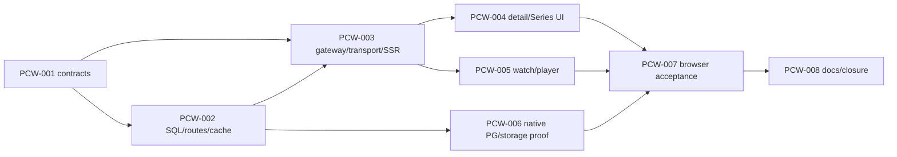

# Implementation Plan — Detail publik dan tonton dari katalog

## Plan Metadata

- Status: executing — user meminta lanjut dan memilih semua jenis, termasuk Series/episode, 7 Oktober 2026.
- Repository: bayuaji17/vertical-movie-app.
- Base ref: feat/public-catalog-api, dependency lokal belum merged.
- Base SHA / last validated SHA: `c75080f6febf07312b90a6d79ef945b7a96ab84d`.
- Context: [repository-context.md](repository-context.md).
- Tasks: [PCW](../../tasks/public-content-watch.md).
- Working branch: feat/public-content-watch, stack di atas PCAT; local implementation/task commits saja. Remote delivery/deploy belum diotorisasi.

## Objective

Pengunjung membuka detail dari katalog, melihat metadata Film/Standalone atau daftar season/episode Series, lalu menonton HLS tanpa akun dengan metadata dan navigasi kembali/Next episode yang jelas.

## Goals and Non-goals

Goals: fresh server eligibility untuk detail/episodes; bounded episode cursor/order/count; SSR metadata; typed public Eden same-origin; CTA semantik/link deep URL; watch metadata/Series context/back/Next manual; player identity/cancellation/retry; actual dependency/browser proof.

Non-goals: redesign/skin/dependency upgrade, autoplay/auto-next, watch-progress persistence, playlist personalization, admin editor/upload/publication Series, subtitles, account/login wall, new signed expiry policy/schema, R2/production rollout. Existing user-controlled Play tetap diperlukan. PCAT layout/Load more/error behavior dipertahankan.

## Current Behavior

PCAT card/dialog mempunyai metadata aktual tetapi tanpa detail/watch links; featured View film masih membuka dialog. Watch route minimal/player-only dan VITE-only API origin. Legacy Series detail membaca list100/N+1 sehingga Series yang eligible di homepage bisa404 karena cap. `/videos` bukan daftar episode menurut hierarchy. Player renewal tersedia tetapi callback tidak abortable dan identity perlu explicit remount saat slug berubah. Evidence pada context.

## Desired Behavior

### Routing dan UX

| Entry                  | Destination/behavior                                                                                                                          |
| ---------------------- | --------------------------------------------------------------------------------------------------------------------------------------------- |
| Card click             | Dialog metadata existing; tambahkan Open details dan Watch untuk Film/Standalone, View episodes untuk Series                                  |
| Featured View film     | Direct `/watch/$slug`, tanpa player request saat hover/preload                                                                                |
| Featured View details  | Dialog existing dengan detail/watch links                                                                                                     |
| Film/Standalone detail | `/titles/$kind/$slug`, kind hanya movie/standalone; metadata/genres/private thumbnail/duration, Watch, Back to catalog                        |
| Series detail          | `/series/$slug`, metadata/private parent thumbnail dan episodes grouped per seasonNumber; 20 per page/Load more manual/total/order            |
| Episode row            | `/watch/$slug`, hanya eligible published child; seasonNumber/episodeNumber/title/duration, tanpa meminta signed playback per row              |
| Watch                  | `/watch/$slug` existing; SSR unsigned title/synopsis/type/duration/hierarchy, Back to details/Series/catalog dan Next episode manual saat ada |

Deep URL/refresh/direct anonymous access bekerja. Missing/bad kind/slug/hidden owner menampilkan not found; server outage menampilkan unavailable/Retry. Detail tidak hydrate item homepage sebagai authoritative initialData. Back links menggunakan known typed route, tidak arbitrary return URL/history fallback. Return to catalog memuat/reset first page; persistence filter katalog lintas halaman ditunda. Bookmark/SEO hanya title metadata, tanpa sitemap/ranking baru.

### Kontrak API additive

| Endpoint                              | Contract                                                                                                                                                                                                  |
| ------------------------------------- | --------------------------------------------------------------------------------------------------------------------------------------------------------------------------------------------------------- |
| GET `/catalog/details/:kind/:slug`    | kind movie/standalone/series; slug schema existing; `{item:PublicHomeItem,freshForMs}`;404 missing/hidden/wrongkind;422 invalid;503 dependency                                                            |
| GET `/catalog/series/:slug/episodes`  | limit default20/max100, cursor nullable; `{items:[{id,slug,title,synopsis,durationMs,seasonNumber,episodeNumber}],total,nextCursor,freshForMs}`; published parent validated directly, tidak seriesList100 |
| New GET `/catalog/watch/:slug`        | Unsigned watch metadata/hierarchy dan remaining `freshForMs`; memakai eligibility yang sama. Legacy `/videos/:slug` tetap tersedia.                                                                       |
| Existing GET `/videos/:slug/next`     | Fresh ordered next published-ready episode;404 pada end/non-episode ditafsirkan no next,503 section Retry; bukan auto-play                                                                                |
| Existing GET `/videos/:slug/playback` | Browser-only private,no-store capability; original policy unchanged                                                                                                                                       |

Detail mengambil home eligible item by kind+slug, bukan search substring atau list/limit100. Episode rows memakai playable/current canonical outputs dan parent home visibility, ordered seasonNumber ASC/episodeNumber ASC/id ASC. Count/page/snapshot parent dalam satu SQL statement; output unsigned, tanpa editor fields/job/storage key/signature. Genre dan episode card tidak menjadi top-level homepage item baru.

Cursor version/scope Series identity/limit/order/asOf/last season/episode/id, strict length/base64/JSON/schema/binding validation before I/O where possible. asOf mengecualikan child baru; archive/parent hidden menghapus eligibility current page/new reads; received pages tidak menjanjikan beku. Keyset limit+1 dan count satu statement, EOF nextCursor null, composite visible identity no duplicate. Validation mencakup >100 Series, >100 episodes, sparse hidden children dan cross-season boundaries. No schema/index default.

Metadata memakai existing CatalogService bounded TTL60/generation fence + after-commit invalidate dan remaining freshForMs. Detail/list/next unsigned; playback/source tidak masuk SSR/dehydration/QueryClient metadata cache. Fresh playback/poster tetap authoritative setelah archive, received metadata/bytes mengikuti existing contract.

### Transport, SSR dan query

New public-content client strict DTO/status parsing, Eden type-only App; browser target location.origin/api, credentials omit/cache no-store/redirect error, AbortSignal/timeouts. SSR trusted API_INTERNAL_URL/server-only/no cookies/request-scoped QueryClient. Detail/first20 episodes/unsigned watch metadata only; safe bootstrap error tanpa serialized internal errors/config. Success hydration dengan actual remaining TTL, tanpa duplicate first metadata fetch; signed capability hanya setelah watch mount.

New query namespace catalog/public/content; no private cache cleanup atau auth recheck on public503. Episode infinite query retains previous rows/skeleton on next page, cursor422 requires first-page Refresh; all state reset/cancel on Series identity change. Next episode query enabled hanya kind episode dan fresh read, missing404=terminal list, failed503=localizedRetry tanpa menutup current player.

### Player reuse dan recovery

Reuse10.0.0-rc.4 VerticalVideoPlayer/VideoSkin/HlsJsVideo; version-matched installed docs acuan. Public watch mounted keyed by canonical video UUID, so old source never rendered under new title. loadPlayback menerima signal optional-compatible dengan preview callback existing; abort pending capability on unmount/retry/identity change and ignore stale completion. Existing expiry/play/seek/quality refresh/position/pause preserved. Explicit Retry untuk terminal failure reloads fresh capability with bounded concurrent requests; no uncontrolled same-source loop. No autoplay/auto-next. Loading/status/error app-level accessible dan no raw signedURL/error logs. Private preview regression wajib.

## Impact Analysis

API additive read store/model/routes/service/DI; reuse HomeStore eligibility SQL tanpa semantic mutation dan keep legacy constructors optional-compatible. Public gateway exact canonical detail/episode allowlist. FE links/3route categories/adapter/query/public shared layout; generated routes via CLI. Player signal/identity/error reset affects preview, so regression actual preview proof diperlukan. Integration/browser phase memakai dedicated fixture actual HLS; SQL facts-only PCAT fixture tidak dihitung playback proof.

## Affected Files and Symbols

| Path                                                                                                        | Action        | Symbols                                  | Reason                           | Evidence                              |
| ----------------------------------------------------------------------------------------------------------- | ------------- | ---------------------------------------- | -------------------------------- | ------------------------------------- |
| apps/api/src/modules/catalog/content-model.ts/content-pagination.ts                                         | create        | DTO, parse/bind cursor                   | Separate additive contracts      | Legacy model/home-model               |
| apps/api/src/modules/catalog/content-repository.ts                                                          | create        | PublicContentStore.detail/episodes       | Direct parent/ordered page       | HomeStore eligible, CatalogStore.next |
| apps/api/src/modules/catalog/home-repository.ts                                                             | modify        | eligible builder visibility              | Reuse exact canonical gates      | eligible()                            |
| apps/api/src/modules/catalog/service.ts/index.ts                                                            | modify        | content reads/routes                     | Cache/generation fence/OpenAPI   | entry/invalidate/createCatalogModule  |
| apps/api/src/index.ts                                                                                       | modify        | PublicContentStore injection             | Explicit DB boundary             | catalogService bootstrap              |
| apps/web/src/lib/server/auth-gateway.ts                                                                     | modify        | canonical GET allowlist                  | Only new public paths            | targetPaths                           |
| apps/web/src/lib/catalog/content-{model,client,server,queries}.ts                                           | create        | Strict reader/SSR/query                  | Same-origin unsigned transport   | PCAT equivalents                      |
| apps/web/src/components/catalog/{catalog-detail-dialog,featured-film}.tsx                                   | modify        | navigation CTA                           | Real typed links                 | existing onDetails                    |
| apps/web/src/routes/titles.$kind.$slug.tsx / series.$slug.tsx                                               | create        | detail loaders/components                | Direct public routes             | Router/Query integration              |
| apps/web/src/routes/watch.$slug.tsx                                                                         | modify        | unsigned metadata/context/Next           | Complete watch flow              | existing Watch                        |
| apps/web/src/components/vertical-video-player.tsx                                                           | modify        | signal/retry/identity guards             | Cancel/recovery compatibility    | preview caller                        |
| apps/web/src/routeTree.gen.ts                                                                               | modify        | Generated route metadata                 | CLI only                         | generate-routes script                |
| apps/api/src/modules/catalog/_test.ts / apps/web/test/content-_.test.ts                                     | create        | Contract/store/cache/adapter/query tests | Meaningful edge/race proof       | existing native tests                 |
| apps/api/test/integration/public-content-*.ts                                                               | create        | Dedicated DB/HLS fixtures                | Real hierarchy/read/access proof | media fixtures                        |
| apps/web/test/auth-browser-smoke.mjs / public-content-browser-worker.mjs                                    | modify/create | public-watch phase                       | Anonymous actualHLS navigation   | existing harness                      |
| docs/product, architecture/overview.md, design/home-catalog.md, operations/media.md, README.md, plans/tasks | modify        | Canonical behavior/evidence              | Preserve PCAT/history/limits     | Documentation ownership               |

## Implementation DAG

Independent read/test preparation may run parallel; shared DB resets/builds serialized. Tidak dispatch agent/chat baru tanpa authorization.

## Implementation Steps

### PCW-001 — Kontrak detail dan daftar episode

- Outcome: DTO/strict scoped keyset cursor/type boundaries frozen.
- Depends on: PCW-000 planning.
- Files/symbols: content-model.ts/content-pagination.ts + test.
- Requirements: unionexistingHomeItem; positive duration/hierarchy; strictkind/slug/limit/cursor/scope/asOf validation; no private fields.
- Validation: bun:test invalid/tampered/parent/limit/order, sparsepositions/nullEOF/type compile.
- Acceptance criteria: invalid422 before store; no scope reuse or offset fallback; >100 pagination supported.

### PCW-002 — Server detail/episodes dan cache

- Outcome: Published parents/children read directly with one statement/page, no N+1/list100.
- Depends on: PCW-001.
- Files/symbols: content-repository/HomeStore eligible; CatalogService/content routes/bootstrap.
- Requirements: same canonical gates, direct kind+slug, global season/episode keyset/count/snapshot; remainingTTL/generation fence/aftercommit callbacks; additive constructor, OpenAPI/error contract; legacy unchanged.
- Validation: injected HTTP/cache unit plus query type/build; later native006 verifies SQL.
- Acceptance criteria: anonymous200, missing404/invalid422/dependency503; hidden parent/child excluded; legacy routes regressions pass.

### PCW-003 — Public adapter, SSR dan query

- Outcome: Safe typed reads for detail/watch/episodes, independent sections and identity reset.
- Depends on: PCW-001, PCW-002.
- Files/symbols: content-model/client/server/queries, auth-gateway tests.
- Requirements: strict exact allowlist, omit credentials, signal/timeouts, no malformed=>empty; trusted server-only URL/queryClient per request; success hydrate, safeerror; metadata TTL/no signed cache; Next404only=none.
- Validation: Eden compile + client/query/gateway tests partial/abort/race/binding/offline/cache namespace.
- Acceptance criteria: browser sameorigin with VITE_API_URL absent; no cookie/internalURL/private fields; detail doesn't seed homepage item.

### PCW-004 — Detail/Series halaman dan CTA

- Outcome: Anonymous deep links, metadata/currentposter and grouped ordered playable episodes.
- Depends on: PCW-003.
- Files/symbols: detail/Series routes, public content layout/components, catalog dialog/featured links/generated routes.
- Requirements: exactkind dispatch, detail+watch/Series links, public shell/backlinks; initial/error/404/loading/nextpage retry/422/empty, no request playback on browsing/hover; 20episodes/page retaining loaded rows.
- Validation: types/lint/build + generatedroute/source audit; browser007.
- Acceptance criteria: allthreekindCTA correct, directURL/refresh works, typed relative links, theme/portrait/keyboard/focus preserved, hidden child never clickable.

### PCW-005 — Watch metadata, Next dan player recovery

- Outcome: Current video HLS with metadata/Series context/backlinks/manual Next and explicit Retry.
- Depends on: PCW-003.
- Files/symbols: watchroute/VerticalVideoPlayer/public playback reader.
- Requirements: signed only browserstate, player keyUUID, abort pending source and ignorelateold completion, no oldvideo/newtitle; compatible preview; existing expiry/quality/seek/play restore, terminalRetry and singleinflight; Next manual/404none/503localizedretry.
- Validation: relevant type/unit callbacks/races plus actual HLS/preview browser007.
- Acceptance criteria: Movie/Standalone/Episode plays on user action, no autoplay/auto-next, currentTime progresses; switchidentity resets position/error/source and stops old media; archivefreshcapability denied, no auth effects.

### PCW-006 — Native hierarchy dan access proof

- Outcome: SQL and private actual HLS ownership/order/cursor/fresh access verified.
- Depends on: PCW-002.
- Files/symbols: dedicated public-content proof/fixture plus existing publication/Series/PCAT proofs.
- Requirements: >100 Series directlookup; >100 episodes/multipleseasons/gaps/wrongparent/hidden/currentgeneration, snapshotnewpublish/archive/count/querycount; actual FFmpeg-produced HLS manifests/init/segments stored knownfixturekeys; no DBdevelopment mutation.
- Validation: native guarded tests serial; legacy tests per impacted predicate; EXPLAIN only if changed SQL raises unresolved cost concern, noindexwithoutmeasurement.
- Acceptance criteria: first/next/end cross-season stable, singlequery/page, actual signed objects playable, afterarchive new404; object/facts fixture limitations honest.

### PCW-007 — Browser detail-to-HLS dev/built

- Outcome: Real anonymous journey through alltypes/Series/episodes verified in development and built Bun/Nitro.
- Depends on: PCW-004, PCW-005, PCW-006.
- Files/symbols: existingharness new public-watch phase/worker+dedicatedfixture.
- Requirements: clickdialogCTA/featured/directdetail/refresh/back/Series Loadmore/Watch/Next; actual HLS currentTime/seek/pause/renew/archive, controlled unavailable/404/retry/heldoldslug/filter; no admin/authrequest/upstreamcredentials; metadataSSR only unsigned.
- Validation: Chromium320/390/768/1024/1440/1920 Light/Dark/System; keyboard/touch44px/focus/reduced-motion/nooverflow/9:16; privatepreviewregression; no page/hydrationerrors/unexpectedexternalrequests. Signed MinIOobjects expectedonlyonwatch.
- Acceptance criteria: alljourneys/controls/errorcases pass againstactualAPI/PG/MinIO, no testreadyJSON substitutedforHLS proof; source/runtimefresh, screenshotsboundariesrecorded.

### PCW-008 — Canonical docs dan closure

- Outcome: Approved scope/current behavior and actual evidence recorded with localtaskreceipts.
- Depends on: PCW-007.
- Files/symbols: canonicalPRD/GR/architecture/design/runbook/index/context/plan/backlog.
- Requirements: no claimfullMVP/R2/Safari/editor/progress/autoplay; PCAT/HOMEFEhistory preserved; stackedbase andremote status explicit.
- Validation: relevantexistingtests/roottypes/lint/build, docs:check/changedMDPrettier/diff/normalhooks; migrations onlyifschemaactuallychanges.
- Acceptance criteria: requiredACevidencecomplete, scopedbranchclean, localcommitsperstep, no push/PR/merge/deploy withoutnewauthorization.

## Test Requirements

Contract/store/cache HTTP native; adapter strict DTO/status/signal/deepurl; SSRrequestisolation/remainingTTL/no signed leak; query paging/reset/503/422; playeridentity/cancellation/retry/privatepreview. Native guarddedicatedDB/storage/actualFFmpegHLS thenbrowserdevelopment+builtwithcriticalfaults. ExistingAPIfull/web tests/rootgates normalhooks.

## Constraints

Bun-first, typedEden, no signup/authrequired public, no schema/dependency/envchange default, no generatedroutehandedits, no secrets/rawsignedlogs, no developmentdatareset, existingstorage/signing/playerpolicy compatible.

## Acceptance Criteria

- [ ] AC-01: Alltypes dialog/featured opencorrectpublicdetail/watchroutes, deepURL/refresh/backlinks safe.
- [ ] AC-02: DirecteligibleSeries/detailworks beyond100parent cap; orderedpagedepisodes >100/crossseason/count/asOf/hiddenwithnoN+1.
- [ ] AC-03: SSRunsignedmetadata/firstepisodepage andsafe404/503; no signedcache/secret/cookie/duplicatehydration read.
- [ ] AC-04: ManualHLSMovie/Standalone/Episode actuallyplays; Nextonlyeligibleorderedmanual; EOF404notoutage.
- [ ] AC-05: Expiry/seek/quality/position/pause/Retry/identityabort work andprivatepreview preserved.
- [ ] AC-06: Publicerrors/offline/retry/cursor422 preserveoldvalidrows/player appropriately; fresharchivedaccessdenied.
- [ ] AC-07: Responsive/themes/portrait/keyboard/focus/reducedmotion/44px targets anderrors0 verifieddev+built.
- [ ] AC-08: Fullrelevanttests/rootgates/docs/hooksreceipts pass; scope/stack/history/providerlimits honest.

## Risks and Mitigations

List100cap solveddirectparentSQL; episodesmany/crossseason solvedserverkeyset+count. StalemetadataversusfreshaccessexplicitTTL/newcapabilitydenial. Signedcache/SSRleakavoidedbybrowser-onlyplaybackstate. Oldsource/latecompletion solvedkeyUUID+AbortSignal+epoch. Playerpreview sharedchanges requireactualpreviewregression. HLSfacts-onlyfixturegap closedactualmanifest/segmentproof. Layoutlongtitle/sharedtheme solvedexistingclasses/browsermatrix. No capacityclaimwithoutmeasurement.

## Rollback or Recovery

Revert scopednewCTA/routes toPCATknown-goodclosure ifintegrationfails; additive APIreads canremainpendingcleanup. Runtimeoutage usesRetry/error, nodummyfallback. No destructive schema/restore assumed. Productionrollout/revert separateauthorization.

## Evidence

[Context evidence index](repository-context.md#evidence-index) pinsbaseline; newfiles/commands areplanned untilimplemented. PCAT proofdoesnotprovewatch/episodes; newresultsbelongbacklogPCW.

## Open Decisions

Alltypes/Seriesepisodes scopeconfirmedbyuser7October2026. Technicalrecommendations above bound this implementation: preserve dialog, typed detailroutes, manualPlay/Next, groupedpagedepisodes; progress/autoplay/auto-next postponed. Scopechanges refreshimpactedsteps first; remote deliveryneedsseparateinstruction.

## Validation History

- 2026-10-07: valid againstbaseSHA c75080f6febf07312b90a6d79ef945b7a96ab84d; currenttreeclean, relevantPCAT/watch/player/API/schema/harnesspathsinspected. VersionedVideo.jsCLI printedinstructionswithoutskin/repositorymutation; packageversionsunchanged. Primary23unrelatedchangespreserved.

## Execution Log

- PCW-000: User askedcontinue andconfirmedalltypes/Seriesepisodes. Branchfeat/public-content-watch createdfromPCATclosure; repositorycontextsavedbeforeplan. Planningonlychecks/commitreceipt recordedinbacklogafteractualcompletion. No remote mutation/deployment.

- PCW-001: Kontrak DTO detail/episode strict dan cursor scope Series/limit/order/asOf/hierarchy selesai. Bun test content-pagination.test.ts: 3 pass, 31 assertions; API check-types pass, root build pass. Invalid slug, foreign cursor, extra fields, future date dan numeric overflow ditolak. No schema change. Previous verified commit: 80cc7e240b88a3d37d5917274759ca612e740fcc docs: plan public details and watch flow (PCW-000).

- PCW-002: Detail direct kind/slug dan episode SQL one-statement dengan parent eligibility, hierarchy cursor/asOf/count/cache selesai. Catalog suite 18 pass 125 assertions; dedicated PostgreSQL direct detail/page smoke 5 assertions pass, API types/build pass. Constructor legacy compatible dan callback invalidate existing reused; routes additive, no schema or legacy order change. Full native boundary proof pada PCW-006. Previous verified commit: 92d0ff68b796b695ce49b0a5feb606cfc4b7ecde feat(api): define public content detail contracts (PCW-001).

- PCW-003: Public Eden adapter, strict DTO, abort/timeout, same-origin GET-only gateway dan unsigned SSR loader selesai. Endpoint tambahan /catalog/watch/:slug membawa remaining freshForMs karena legacy /videos/:slug tidak menyediakan TTL. Catalog/client/gateway tests: 36 pass, 228 assertions. Root check-types pass; final lint/build dan normal hooks diverifikasi sebelum commit. Signed playback reader hanya mengembalikan capability ke component state. Previous verified commit: a6876c9e34644eb6189627f0421688a6f3d7d1e7 feat(api): expose public details and ordered episodes (PCW-002).

- PCW-004: Public detail Film/Standalone dan Series, grouped episode rows, initial/append skeleton, same-cursor Retry dan resetQueries untuk cursor422 selesai. Dialog Open details/Watch dan featured directwatch berupa typed Link, tanpa capability preload. Route tree dihasilkan tsr. Root types/lint/build pass; actual URL/hydration/theme/playback proof dijalankan bersama PCW-007. Previous verified commit: 0fa16870d57984dc2e117c1cea5c66b6c05793e3 feat(web): load public detail metadata and episodes (PCW-003).

- PCW-005: Watch SSR unsigned metadata dan per-video UUID player, backlinks Film/Standalone/Series/catalog, manual ordered Next dengan localized Retry503/EOF404 selesai. AbortController/epoch guard, loader-owned source, explicit Retry fresh capability dan bounded singleinflight renewal ditambahkan tanpa upgrade/skin changes; preview callback tanpa argumen tetap compatible. Root types/lint/build pass. Actual HLS/race/privatepreview proof ditutup PCW-007. Previous verified commit: 015182a3b92f590e3a4ab247b4c60a9bde13e328 feat(web): add public title and series detail pages (PCW-004).

- PCW-006: Dedicated native public-content-proof.test.ts: 4 pass, 57 assertions, 159.59s. Proven >100 Series directlookup satu SQL/read; 103 sparse episodes dua season, count/cursor/asOf/new publish/hidden child/wrong parent; stale source/parent generation disembunyikan dan foreign owner ditolak FK. Native video Archive memakai actual VideosService; parent hidden state adalah SQL fixture, bukan published-Series archive command. Actual production FFmpeg 12s portrait HLS dipasang pada owned private MinIO outputs; signed init/segments/poster200, unsigned403, fresh capability/master404 setelah archive. Cleanup known objects/bucket selesai. Fixture SQL readiness bukan full upload/worker provenance proof. Relevant units43 pass/258 assertions dan root build pass; normal hooks memverifikasi source terkini. Previous verified commit: 0c18eae307e8a9115651f44acc70c66cbd038aaa feat(web): add contextual watch and player recovery (PCW-005).
