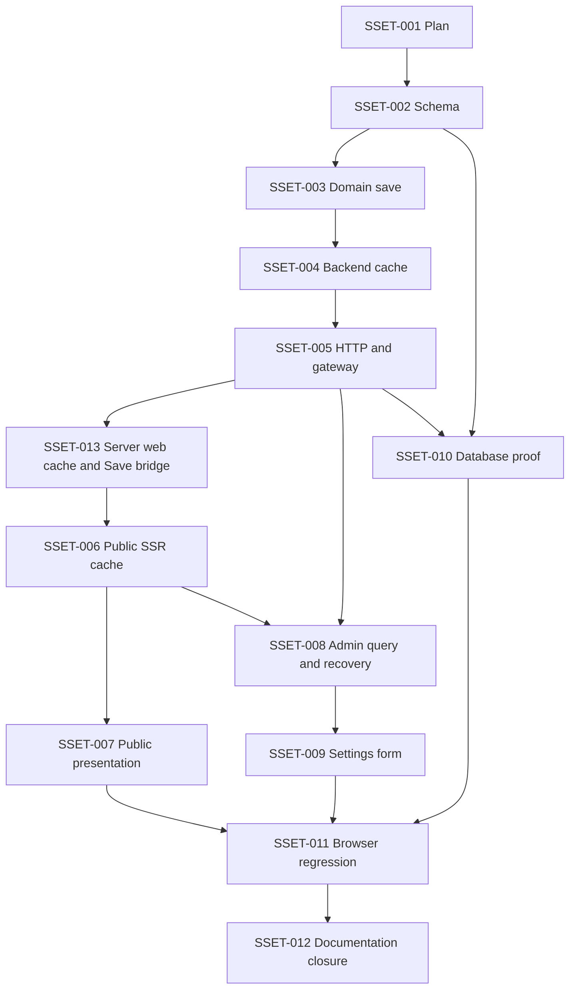

# Implementation plan: Site Settings

## Plan metadata

- Status: approved and executing; user requested implementation on 2026-10-09.
- Date: 2026-10-09; decision owner: pengguna. Pengguna menyetujui plan lengkap dan meminta implementasi9Oct: empat field/default/validasi, cache tiga lapis TTL1 jam/shared deadline, Save update dan recovery/UI. Approval implementasi berlaku untuk seluruh SSET-002–013.
- Repository: `bayuaji17/vertical-movie-app`; base ref: `main`.
- Base SHA and last validated SHA: `36f185e275bc90fa609cf071405848ff021c3223`.
- Context: [repository-context.md](repository-context.md), saved before this plan.
- Backlog: [site-settings](../../tasks/site-settings.md), SSET-001–013. Existing IDs retained; SSET-013 is the added web-server cache task and runs after005, before006.
- Planning branch: `chore/site-settings-plan`; implementation branch: `feat/site-settings`.

## Objective

Admin edits site identity once; public headers, footers and metadata use saved values. Warm browser navigation avoids a settings request, warm web SSR avoids a settings API request, and warm API reads avoid a settings SELECT. Initial cold reads are coalesced; confirmed saves update the writer API/web process and browser without an older response restoring prior values.

## Goals and non-goals

Include four plain-text fields, singleton persistence/versioning, private read/save, public projection, API memory cache, public snapshot cache in the server web process, SSR/browser Query cache, responsive admin form with preview, conflict/unknown-outcome/auth recovery, and actual migration/API-call/query-count/browser proofs. Settings freshness starts at1 hour and is preserved as remaining time across hops.

Logo/favicon upload, visual theme/token editing, infrastructure credentials, analytics, genres, playback configuration, Redis/distributed cache, realtime visitor broadcasts, SEO indexing-policy changes, production migrations and deployment remain separate scope. No storage/worker/player changes or additional package/environment variables are expected.

## Current behavior

Settings table/module/routes do not exist. Branding/tagline/footer/title/description are literals in current web shells/routes. Existing catalog cache supplies TTL60, generation fencing and `freshForMs`, but lacks single-flight. Gateway admits only known paths/methods. Public SSR uses internal API readers and request-scoped QueryClient; private queries are identity-scoped and removed on auth loss. Full evidence: [context](repository-context.md#evidence-index).

## Desired behavior

### Four-field contract and defaults

Lengths apply after trim, consistently across API/UI/database; implementation must choose a Unicode character-count convention that matches PostgreSQL `char_length`, including non-BMP test cases. Plain text only, no HTML/Markdown rendering. Reject control characters and multiline input; normalize surrounding whitespace. All four keys are required on Save; optional-display fields may be empty. Reject unknown keys and oversized bodies.

| Field         | Proposed allowed length | Initial value                                                          | Public use                                                                                        |
| ------------- | ----------------------- | ---------------------------------------------------------------------- | ------------------------------------------------------------------------------------------------- |
| `siteName`    | 1–80 characters         | `Vertical Movie`                                                       | Header/mobile brand, accessible home label, footer brand where present and public title suffix    |
| `tagline`     | 0–160 characters        | `Find your next story.`                                                | Homepage intro and mobile navigation description; omit when empty                                 |
| `description` | 0–500 characters        | `Discover films and standalone stories in portrait. Open to everyone.` | Homepage description; fallback for public routes that lack a content description, omit when empty |
| `footerText`  | 0–300 characters        | `Stories made for portrait.`                                           | Footer text in both live public shells; omit when empty                                           |

The main current public shell is the default source. The other shell currently has a different footer; one persisted footer intentionally unifies both. Preserve content-specific titles/descriptions when present, add site branding through a shared title helper, and preserve current `noindex,nofollow`, language, theme, catalog/search/pagination and content HTTP statuses. Fixed admin/login product labels are outside public-branding replacement; Settings navigation/form still uses the current admin shell.

### Persistence and save semantics

- Add `site_settings`: integer primary key constrained to1, four not-null text fields with length/nonblank-name checks, positive integer `row_version` default1 and UTC `updated_at`. No arbitrary key/value store or credentials.
- Additive generated/reviewed Drizzle migration inserts defaults once. No request-time seeding or overwriting existing values. Fresh database, populated upgrade, rerun and development data preservation must be proved.
- Save is full-field conditional update with `expectedVersion`; atomically increment version and return committed row. Missing singleton is dependency/configuration failure503, never silent insert. Invalid422, version conflict409, dependency failure503.
- Do not automatically retry a mutation. Two submissions from one base version cannot overwrite each other. A late completion with a lower version cannot replace a newer cache entry.

### HTTP and gateway contract

Proposed exact routes (Eden types inferred from chained module):

| API route               | Browser gateway             | Behavior                                                                                   |
| ----------------------- | --------------------------- | ------------------------------------------------------------------------------------------ |
| `GET /site-settings`    | `GET /api/site-settings`    | Anonymous cached public read; strict empty query; no private auth dependency               |
| `GET /admin/settings`   | `GET /api/admin/settings`   | Guarded cached admin snapshot; optional exact `fresh=1` for explicit reload/reconciliation |
| `PATCH /admin/settings` | `PATCH /api/admin/settings` | Guarded full save body containing four fields plus `expectedVersion`                       |

Public response: `{ item: { siteName, tagline, description, footerText }, version, freshForMs }`. `version` is nonsecret cache-coherence metadata. Private response: `{ item: { four fields, rowVersion, updatedAt }, freshForMs }`; no raw SQL/server/session objects. Save returns the authoritative committed snapshot and remaining freshness. Public success200/errors422/503; private200/401/403/409/422/503 as applicable, safe error DTO and documented response schemas. All settings HTTP responses use no-store so browser/CDN caching cannot stack a separate TTL over application cache. API and web memory/query caches still work.

`freshForMs` is0–3,600,000 for settings only; catalog retains its existing contract. The browser GET gateway and root SSR reader use the same server-web snapshot cache; cache hits do not forward to API. Private reads/saves still forward through authorization, and private fresh reads are never answered from the public snapshot.

Separate public scope from admin macro. Exact gateway paths/methods only; arbitrary suffixes/encoded paths rejected. Public forwarding strips Cookie/Authorization; private PATCH preserves existing same-origin guard. `fresh=1` is private only and normalizes no other truthy values. It bypasses a warm snapshot and uses a separate fresh-read flight at the current generation; it cannot join an old pre-save fill. Public API cannot force database reads via query options.

### Backend cache algorithm

One settings service/cache per API process, injected from bootstrap with existing repository/pool and test clock. Keep one validated immutable snapshot, expiry, generation, at most one in-flight normal read and one in-flight fresh read per generation. Different HTTP consumers project DTOs from the same snapshot; private authorization is never cached here.

1. Valid normal cache hit returns snapshot and remaining TTL without settings SELECT. Initial TTL is3,600,000ms (1 hour), approved by user9Oct. Anchor read freshness at read start conservatively so query duration does not extend the window.
2. A cold/expired normal read joins the current generation's single-flight Promise. Target:100 simultaneous successful public reads → one settings SELECT; warm repeats → zero additional SELECTs.
3. Clear settled flights in finally, including rejected reads. One request's cancellation does not abort a shared read needed by other waiters. No timers, locks or state grow with request count.
4. Successful Save primes from returned committed row, advances generation, clears failure cooldown and detaches old flights. Cache replacement is monotonic by rowVersion, including writes completing out of order. Mutation completion does not require a second SELECT just to refill cache.
5. An old generation's fill cannot repopulate the cache. Its waiter receives the newer committed snapshot when available, otherwise freshness0; caller-side version/epoch checks prevent restoring obsolete UI values.
6. Failed Save does not prime draft values. On an uncertain database commit outcome, expire/fence any possibly obsolete snapshot without claiming success; subsequent authorized fresh read reconciles the stored state.
7. Read failure/missing row never becomes a successful default snapshot. Add bounded5-second read-failure cooldown: return safe503/Retry-After while no read is in flight, so a sequential outage cannot hammer the DB. Clear on confirmed save/success; clocks/failures injected for tests. No unbounded negative cache or endless stale server responses.

Existing catalog cache remains unchanged; settings cache is module-specific rather than a repo-wide cache framework. Private cached reads still run authoritative native auth each request. Database-read savings are measured for settings reads, not a promise that auth/other endpoints never access the DB.

### Server web snapshot cache and gateway coherence

Add a server-only factory and one default public snapshot instance per web process, shared by root SSR reads and exact `GET /api/site-settings`. Cache only the validated four public fields, version and freshness, never request/session/header/private DTO data or a QueryClient. Bound namespace to the configured canonical internal API origin plus DTO version; switching origin fences/replaces the slot instead of growing an unbounded map. Unit tests inject isolated cache instances and clocks into readers/gateway.

- A warm snapshot serves each SSR request or public GET without a settings API call. An empty/expired cache has one shared fill:100 concurrent SSR/public reads within the same process → one API GET. API independently coalesces its own DB read. Recompute remaining `freshForMs` for every returned response.
- Web expiry is at most the upstream remaining deadline after deducting fill transport time, never a new hour from the time web received the snapshot. Preserve that deadline into request-scoped Query data and browser hydration. Example: upstream has10 minutes remaining → web and browser have at most10 minutes, not another hour each.
- The shared fill uses a cache-owned bounded10-second upstream signal and no cookies/authorization/redirects. Request abort cancels only that waiter. Clear settled flights and use the existing5-second outage cooldown pattern; never cache errors/defaults as successful settings. Track generation/version so a detached old fill cannot replace a new Save result.
- Exact public GET validation/method/origin configuration checks happen before the cache shortcut: reject query fields/encoded/suffix routes, accept only GET, return the documented no-store DTO. This branch changes only settings and must not weaken the existing gateway allowlist or other routes.
- After an exact private PATCH receives an API200, validate its already bounded response buffer and project only public fields/version/freshness. Before returning confirmed success, advance/fence the web cache and prime it from committed values using the remaining deadline. A lower-version completion never replaces a newer snapshot. No extra settings API refill or database read is needed.
- Unauthorized/invalid/conflicting writes never prime attempted data. An uncertain forwarded-write result expires/fences the web snapshot without claiming success. Successful authorized `GET /admin/settings?fresh=1` reconciliation may prime the same public projection; ordinary cached admin reads do not bypass the public cache generation rules.
- Cache-refresh failure after a committed write must not report the write as rolled back: clear the web snapshot and preserve the API response/observed outcome. Browser still validates the response before showing success. Public fallback is presentation-only, and a later cold read can refill.
- Same-process immediate Save coherence requires the save to pass through that web gateway. Direct API writes or writes through another web/API instance may leave this slot stale for its remaining TTL. Fleet-wide immediate updates require invalidation propagation (for example a shared cache/event channel) as a rollout prerequisite; no new Redis dependency or secret is added in this scope.

Request HTML still reaches the SSR web server. Warm-cache acceptance counts settings API calls and settings SELECTs separately, not a claim of zero web requests or zero unrelated catalog/auth requests.

### Frontend and SSR cache

- Public query key `['site-settings', 'public', 1]`, one per router/browser, `gcTime`1 hour, no periodic polling, retry disabled; deduplicate mounted consumers. Retention does not renew freshness. Fetch stale on route entry/mount, focus and reconnect when online. Navigation while fresh reuses data.
- API/web expose remaining `freshForMs` in0–3,600,000. Transport computes a conservative receipt deadline, deducting elapsed request time; Query staleTime never renews another hour. SSR serialization preserves the existing deadline, hydration does not restart it, including slow render/transfer. A deadline already elapsed may legitimately cause a new read on hydration.
- Root loader bootstraps only public settings from the shared server-web snapshot into its request-scoped QueryClient, preserving route-specific loaders/status. A process-global public snapshot is allowed; a process-global QueryClient, admin settings read or private DTO dehydration is not. Failed bootstrap uses presentation defaults at render time, not a cached/dehydrated successful database result; existing content/auth routes remain available. No automatic retry loop caused by fallback mounting.
- Separate model/client/query/isomorphic reader/server-only reader and root `use-site-settings` hook. Shared presentation helper handles defaults, metadata title/description and plain-text rendering. The root fallback title ceases to expose starter branding. Route head values must update on client navigation and confirmed Save; verify installed router/query APIs in source rather than assuming static head data updates automatically.
- Public render may retain last good data during offline/refetch failure. Admin shows stale/error state and retains draft. No guarantee of immediate updates for another visitor's open idle tab; it sees settings on its next stale-triggered refetch. Same writer QueryClient updates immediately after confirmed save.
- Admin key `['admin', identity, 'settings']`, browser-only Query, no-store transport, retry:false, gcTime1 hour, no polling and remaining freshness. This private query never reuses the shared public snapshot for authorization or fresh recovery. Register abort/editor cleanup in existing private effects; remove query/mutation/draft on logout/role loss, fence late responses.
- On confirmed Save: cancel public and identity-scoped settings reads, advance local response epoch, then set private committed snapshot and its public projection from the Save response; enforce monotonic version. Update route metadata/loaders without clearing/refetching catalog/playback caches. Dirty editor inputs are never reset by background refetch.
- On409 preserve input and offer **Reload saved values** with discard confirmation, using fresh private GET. On network/503/abort with uncertain Save, show **Check saved values** and compare authoritative fields/version against attempted values; report observed stored state without claiming which request caused it. No automatic mutation replay or optimistic public branding.

### Admin form

Route `/admin/settings`, Settings entry in desktop/sidebar/mobile nav. English labels Site name, Tagline, Site description, Footer text; existing Rhea cards/input/textarea/buttons/alerts/toasts. Single-column mobile and two-column form/preview desktop where space allows. Text-only preview mirrors header/intro/footer, no iframe/media rendering.

States: loading, saved/default values, dirty, saving, invalid, conflict, outcome unknown, stale/offline, auth loss. Save disabled for pristine/invalid/pending/offline; prevent duplicate clicks. Cancel restores last confirmed form baseline with confirmation when dirty; route leave/beforeunload guards follow existing patterns. Field errors remain associated by aria attributes; status live region, keyboard/focus restoration, minimum44px interactive targets, long-name wrapping at320px, Light/Dark/System.

## Impact analysis

New schema/module and exact proxy admission; shared server snapshot, gateway committed-write handling and public root dataflow/head are the largest compatibility surfaces. Share only the public DTO between SSR requests, preserve per-request QueryClient and individual response status/headers, and isolate test caches. Keep settings separate from content/auth caches. Legacy shells share settings values; writes update settings caches only. No auth config, playback TTL/cache, worker/storage or route-tree hand edits.

## Affected files and symbols

Paths below are targets, not source already created. Evidence references the [context index](repository-context.md#evidence-index) at the pinned SHA.

Additional targets for the approved9Oct server-web cache revision:

| Path                                               | Action | Symbols                                               | Reason / evidence                                                                         |
| -------------------------------------------------- | ------ | ----------------------------------------------------- | ----------------------------------------------------------------------------------------- |
| `apps/web/src/lib/settings/server-cache.server.ts` | create | Server-only public cache factory and process instance | Shared SSR/GET snapshot; existing reader currently fetches API per request                |
| `apps/web/test/site-settings-server-cache.test.ts` | create | Shared-fill/TTL/Save bridge tests                     | Inject clock/upstream and isolated instances; current gateway has bounded response buffer |

The existing `reader.server.ts` target consumes this cache; the existing gateway target gets injected cache access and exact GET/PATCH/fresh-reconciliation branches. No process-global QueryClient is introduced.

| Path                                                                                                                   | Action | Symbols                                             | Reason / evidence                                              |
| ---------------------------------------------------------------------------------------------------------------------- | ------ | --------------------------------------------------- | -------------------------------------------------------------- |
| `apps/api/src/db/schema/site-settings.ts`                                                                              | create | `siteSettings`                                      | Singleton table; existing schema ownership                     |
| `apps/api/src/db/schema/index.ts`                                                                                      | modify | Schema export                                       | Expose settings table to current Drizzle pool                  |
| `apps/api/drizzle/<generated migration>.sql`, generated `drizzle/meta/<snapshot>.json`                                 | create | Migration and snapshot                              | Additive persistence/defaults; inspect next sequence           |
| `apps/api/drizzle/meta/_journal.json`                                                                                  | modify | Migration journal                                   | Generated append; preserve historical entries                  |
| `apps/api/src/modules/settings/{model,repository,service,cache,index}.ts`                                              | create | DTOs, `SettingsService`, cache and module factories | API module pattern, native SQL and admin macro                 |
| `apps/api/src/modules/settings/{service,cache,index}.test.ts`                                                          | create | Native behavior/HTTP tests                          | API test guide and catalog cache tests                         |
| `apps/api/src/{app,index}.ts`                                                                                          | modify | `createApp`, bootstrap DI                           | Static composition/inferred API contract                       |
| `apps/api/test/integration/site-settings-{proof,migration-proof}.test.ts`, `site-settings-fixture.ts`                  | create | Guarded SQL/migration/cookie/query-count proofs     | Existing dedicated content fixture and DASH proof              |
| `apps/api/test/integration/content-http-proof.test.ts`                                                                 | modify | OpenAPI operation assertions                        | Derive actual new route count; preserve previous operations    |
| `apps/web/src/lib/settings/{model,client,queries,reader,reader.server,presentation}.ts`                                | create | Public DTO/transport/Query/SSR/title helper         | Existing public readers and freshness contracts                |
| `apps/web/src/hooks/use-site-settings.ts`                                                                              | create | `useSiteSettings`                                   | Root hooks/use naming; shared public observer                  |
| `apps/web/src/lib/admin/settings-{client,queries,editor-scope}.ts`                                                     | create | Private client, scoped keys, editor controller      | Private API errors/session cleanup/editor conventions          |
| `apps/web/src/hooks/use-settings-editor.ts`                                                                            | create | `useSettingsEditor`                                 | Standalone hook location and auth-loss fences                  |
| `apps/web/src/routes/admin._authenticated.settings.tsx`, `components/admin/settings-form.tsx`                          | create | Settings route/form/preview                         | Existing admin shell and editable form patterns                |
| `apps/web/src/components/admin/admin-shell.tsx`                                                                        | modify | Navigation                                          | Add Settings entry                                             |
| `apps/web/src/lib/server/auth-gateway.ts`, `test/auth-gateway.test.ts`                                                 | modify | Exact path/method/public headers                    | Actual gateway admission and protection                        |
| `apps/web/src/routes/__root.tsx`                                                                                       | modify | Root loader/head                                    | Request-scoped public settings bootstrap and fallback          |
| `apps/web/src/routes/{index,videos.$slug,watch.$slug,titles.$kind.$slug,series.$slug}.tsx`                             | modify | Public route head/loader data                       | Brand/title/description; preserve content status/robots        |
| `apps/web/src/components/public/{public-shell,catalog-browser}.tsx`, `components/catalog/{public-shell,home-page}.tsx` | modify | Public brand/tagline/footer                         | Both active public shell families                              |
| `apps/web/test/site-settings-{client,query,admin}.test.ts`, `site-settings-eden-contract.ts`                           | create | DTO/deadline/epoch/admin tests                      | Existing web native test conventions                           |
| `apps/web/test/site-settings-browser-worker.mjs`                                                                       | create | Built browser worker                                | Existing serial proof harness                                  |
| `apps/web/test/auth-browser-smoke.mjs`                                                                                 | modify | Settings phase dispatch                             | Run real dev/built browser proof                               |
| `docs/product/{prd,global-rules}.md`, `architecture/overview.md`, `operations/video-metadata.md`, `docs/README.md`     | modify | Current spec/contract/runbook/index                 | Canonical ownership; planning only adds index links now        |
| `docs/design/site-settings.md`                                                                                         | create | Layout/state specification                          | Existing design category; code preview is implementation proof |
| `docs/plans/site-settings/{repository-context,implementation-plan}.md`, `docs/tasks/site-settings.md`                  | create | Snapshot/DAG/backlog/receipts                       | User-requested planning artifacts                              |

## Implementation DAG

SSET-013 is added without renumbering001–012. It owns the new server-web cache and Save bridge; runtime order is005 →013 →006.

Independent dependency edges do not imply subagent delegation; work remains sequential unless separately authorized.

## Implementation steps

### SSET-001 — Evidence-backed planning

- Outcome: context saved before complete plan/backlog with preservation and freshness evidence.
- Depends on: none.
- Files/symbols: context, this plan, module backlog and owned docs index links.
- Requirements: pinned SHA, four fields/cache contracts, constraints, matching dependency graph and observable AC; detailed field/UI review remains pending while three-layer/TTL1-hour cache revision is already user-approved. Preserve original planning proof and actual prior commit receipt when revising.
- Validation: scoped Prettier, docs:check, diff/staged-tree checks, unrelated preservation and normal commit hooks.
- Acceptance criteria: links valid; each requirement covered below; only owned docs in local task commit.

### SSET-002 — Singleton schema and additive migration

- Outcome: persisted initial settings and safe upgrade.
- Depends on: SSET-001.
- Files/symbols: `db/schema/site-settings.ts`, schema export, generated migration/meta; `siteSettings`.
- Requirements: singleton id/checks, four text fields, rowVersion/update timestamp, idempotent default insertion; generate/review current migration sequence. Apply pending development migration only after preservation snapshot and test upgrade review.
- Validation: dedicated test fresh/populated/rerun proof, full gates, `bun run --cwd apps/api db:migrate` on configured development DB, journal/schema and existing-row preservation evidence.
- Acceptance criteria: exactly one initialized row; invalid singleton/length writes rejected; existing auth/content/media unaffected.

### SSET-003 — Domain validation and versioned persistence

- Outcome: valid full Save atomically returns committed values or safe conflict/error.
- Depends on: SSET-002.
- Files/symbols: settings model/repository/service and service tests; normalized fields, conditional update.
- Requirements: exact body keys, character-count parity, trim/control rules, positive expectedVersion, updatedAt UTC, no request seed; missing row503, wrong version409, validation422.
- Validation: native deterministic service tests and real SQL smoke against isolated fixtures; root gates.
- Acceptance criteria: racing writes from same version yield one success; inputs survive failure; no partial fields or credential output.

### SSET-004 — Backend cache, single-flight and save fencing

- Outcome: public/cached admin settings reads avoid repeated SELECTs and stale fills.
- Depends on: SSET-003.
- Files/symbols: settings cache/service/cache tests; snapshot, generation, flights, cooldown and prime.
- Requirements: approved TTL1 hour, remaining freshness, warm/cold coalescing, separate authorized fresh flight, no per-consumer abort of shared work, monotonic save prime, uncertain-commit expiry and5-second failure cooldown.
- Validation: fake clock/deferred read tests including100 parallel reads, expiry boundary, rejected flight cleanup, late pre-save fill, out-of-order successful commits, missing row/outage/cooldown and detached aborted waiter; root gates.
- Acceptance criteria: normal cold100 calls one SELECT; warm calls zero extra; Save refill zero extra SELECT; old data cannot replace new cache; bounded state and no success-cached errors.

### SSET-005 — Typed HTTP composition and exact gateway

- Outcome: public GET and protected admin GET/PATCH accessible through real paths with safe DTOs.
- Depends on: SSET-004.
- Files/symbols: settings index/model/tests, API app/bootstrap, web gateway/tests, Eden contract proof.
- Requirements: separate public/private hook scope, existing native guard, strict query/body, public/private projections, no-store, fresh=1 private only, supported errors/OpenAPI, one injected process cache; exact proxy paths/methods/header behavior.
- Validation: app.handle200/401/403/409/422/503; dependency call counts, auth failure isolation, malformed repository response, gateway405/encoded/suffix/origin/header cases; Eden good/bad compile proof; root gates.
- Acceptance criteria: anonymous GET works even when auth dependency fails; unauthorized writes never reach repository; guarded routes remain guarded; browser path does not404.

### SSET-013 — Server web snapshot cache and committed Save bridge

- Outcome: warm SSR/public GET serves settings without an API call; confirmed gateway Save updates the shared public snapshot before responding.
- Depends on: SSET-005.
- Files/symbols: settings public model/client, server-cache.server.ts and reader.server.ts, gateway DI/exact settings read/write branches, site-settings-server-cache tests and gateway tests; public DTO/committed-response projection validators, transport, server-only cache factory/default instance, shared fill, prime and fence. Prepare transport/validators here before006 consumes them; do not depend on the later admin client008.
- Requirements: approved1-hour upstream deadline without TTL stacking, one public DTO slot per canonical API origin/version,100 concurrent reads one API GET, independent bounded fill signal,5-second cooldown, per-waiter abort, monotonic generation/version, validated bounded Save/fresh-reconciliation projection, uncertain-result expiry and strict no-store GET shortcut. No request/session/private DTO/QueryClient sharing; no other gateway route changes.
- Validation: fake clock/deferred upstream tests for SSR/gateway shared identity,100 cold reads, repeated warm SSR and GET with zero extra API reads, API-warm/web-cold, expiry/refill, per-waiter cancel, origin switch, error/cooldown, Save versus slow fill/out-of-order completions and fresh reconciliation. Gateway unauthorized/bad-query/method/suffix/oversize/invalid DTO cases; root gates.
- Acceptance criteria: same-process cold100→one API GET, warm reads→zero; Save primes with zero refill GET, latest version wins, no successful cache of defaults/errors, unauthorized writes never prime, unrelated request state/gateway semantics preserved. Multi-instance/direct-API limits recorded honestly.

### SSET-006 — Public Query, SSR and freshness ownership

- Outcome: one public settings query per router, no duplicate fresh hydration read or TTL stacking.
- Depends on: SSET-013.
- Files/symbols: public settings queries/isomorphic reader, use-site-settings, root loader/head; reuse public model/client/server-only reader and shared snapshot created in013.
- Requirements: strict DTO and freshness0–3,600,000, request-scoped QueryClient SSR, unsigned-only hydration, shared1-hour deadline with transport/render time, version/epoch fence, gc1hour/no polling, route/focus/reconnect stale reads, last-good offline and uncached defaults on failure.
- Validation: native client/QueryClient tests for10-second remaining TTL, slow SSR hydration, shared observers, failed bootstrap, offline, old response after local update, cancellation and schema rejection; root gates and SSR/import smoke.
- Acceptance criteria: fresh navigation/hydration adds zero duplicate fetch; root does not break content/auth status; no private DTO serialized or fallback marked fresh success.

### SSET-007 — Public branding and metadata

- Outcome: both shell families/homepage/public titles use saved settings.
- Depends on: SSET-006.
- Files/symbols: public/catalog shells and intro components, five public route heads, presentation helper.
- Requirements: proposed defaults/empty behavior, accessible labels/wrap/plain-text, shared footer, preserve content-specific metadata/robots/HTTP semantics and catalog/playback behavior.
- Validation: source/SSR assertions for escaped text and selected title/description/default/empty cases; current public catalog/detail/watch regressions and root gates.
- Acceptance criteria: same persisted brand/footer across shells; Save/navigation updates metadata; no content data/cache reset or new playback requests.

### SSET-008 — Admin query, confirmed-save cache update and recovery

- Outcome: private read/save state updates only settings keys and survives conflicts/unknown results safely.
- Depends on: SSET-005, SSET-006.
- Files/symbols: admin settings client/queries/editor-scope, use-settings-editor, private effect integration/tests.
- Requirements: identity scope, no private SSR, signal/late response/version fencing, retry:false/gc1hour, dedup save; confirmed gateway Save primes API and server-web before browser cancels reads and updates private/public snapshots; dirty drafts unaffected by refetch; private fresh1 reconciliation updates web public projection; session-loss cleanup. Failed/unknown writes never prime attempted values.
- Validation: QueryClient/deferred transport tests for cache hit,409/503/abort/no automatic replay, Save versus late GET, higher version versus older Save, logout/role loss, exact key isolation and observed-state comparison; root gates.
- Acceptance criteria: Save success shows returned values without extra refill GET; failed/unknown Save never primes attempted branding; auth loss removes private draft/mutation data.

### SSET-009 — Responsive settings page and preview

- Outcome: admin edits/saves/cancels four fields with clear states and preview.
- Depends on: SSET-008.
- Files/symbols: settings route/form, AdminShell navigation and design specification.
- Requirements: English existing UI, proposed layout, loading/dirty/pending/errors/conflict/unknown/offline, Save/Cancel/leave guards, explicit fresh reload/discard confirmation, text-only preview, keyboard and44px/wrap.
- Validation: meaningful editor state tests, route generation through installed generator (no hand-edit), initial browser smoke and root/docs gates.
- Acceptance criteria: valid Save is reviewable; duplicate clicks don't duplicate mutation; Cancel and navigation protect dirty values;320px and all themes usable.

### SSET-010 — Real PostgreSQL, migration and native-cookie proof

- Outcome: query savings, CAS, schema upgrades/preservation and authorization proven on real dependencies.
- Depends on: SSET-002, SSET-005.
- Files/symbols: dedicated settings fixture, settings proof/migration proof, impacted existing OpenAPI expectations.
- Requirements: loopback dedicated test DB guard; reset serially; query logger counts settings statements separately from auth; migration pre-upgrade populated data/rerun and defaults; restart/durable Save; native auth/cookies and cache races.
- Validation: native integration suite, root gates; record actual command/environment/totals, development migration receipt from002. Run relevant existing content/dashboard/auth proof without changing their meaning.
- Acceptance criteria: cold100→one and warm→zero additional settings SELECT observed; persisted Save and conflicting writes verified; unchanged previous rows/journal; unauthorized writes blocked even with warm settings cache.

### SSET-011 — Built browser flow and regression

- Outcome: real settings save is reflected in public SSR/client UI without extra database hits or stale restoration.
- Depends on: SSET-007, SSET-009, SSET-010.
- Files/symbols: settings browser worker, harness phase and dedicated SQL browser fixture.
- Requirements: 320/390/768/1024/1440 × Light/Dark/System; long/empty/malicious-looking literal text, invalid/dirty/cancel/conflict/unknown/offline/auth/held read; browser fresh navigation/hydration counts and repeated new SSR page/reload API-call counts; approved1-hour expiry/remaining deadline across browser/web/API; root head updates and both shells; no hidden polling.
- Validation: actual dev/built browser proof with separate native-cookie evidence where browser session is injected; SQL logger request counts, API/web units, existing dashboard/public catalog/detail/watch/auth regressions, root build/types/lint/docs; no destructive development fixtures.
- Acceptance criteria: 15 layout/theme combinations pass; confirmed Save changes public values/title; old response cannot restore earlier version; settings failure does not block catalog/login/watch or alter401/403/404/503 behavior.

### SSET-012 — Canonical docs and implementation closure

- Outcome: specs/runbook/index and all task receipts reflect actual scope/proof.
- Depends on: SSET-011.
- Files/symbols: PRD/global-rules/architecture/metadata runbook/design/index/context/plan/backlog.
- Requirements: mark exact approved fields/current routes/cache/defaults/recovery; commands actually run and actual prior SHAs; record per-process/refetch limits and production exclusions; no self-referential SHA.
- Validation: docs:check, scoped Prettier, diff/staged-tree and preservation checks, relevant final runtime checks when source changed, normal commit hooks.
- Acceptance criteria: mandatory tasks closed only after their proof/local commits; proposal/history/current behavior distinguished; no production readiness or remote delivery inferred.

## Test requirements

Use API native bun:test beside modules, app.handle without port, fake clocks/deferred repository for cache behavior. Web native tests cover real QueryClient/editor transport state, not copied implementations. Real SQL/cookies/migration tests are in the isolated integration suite and browser proofs inspect built runtime.

Added cache-call acceptance for013/006/010/011:

| Scenario in one web/API process                        | Expected settings work                                                                      |
| ------------------------------------------------------ | ------------------------------------------------------------------------------------------- |
| Browser Query is fresh after SSR hydration/navigation  | Zero additional settings HTTP request                                                       |
| New SSR requests/public GETs with warm web snapshot    | Zero settings API requests, zero settings SELECTs                                           |
| 100 concurrent web-cold reads with API cache also cold | One coalesced API GET, one coalesced settings SELECT                                        |
| Web-cold reads with API snapshot still fresh           | One coalesced API GET, zero settings SELECTs                                                |
| Expiry at original1-hour deadline                      | One shared refill; remaining freshness not renewed at each hop                              |
| Confirmed gateway Save then public reload              | One conditional write; zero settings refill GET/SELECT; reload reads newly primed web cache |

Count settings separately from HTML/catalog/auth requests. Force expired clocks deterministically, test API remaining10 minutes and10 seconds, and prove per-request cancellation/header isolation while sharing only public snapshots. Held pre-Save reads/out-of-order successful saves must not restore an older version in any layer. Test both reader and gateway using the same cache factory instance, not two isolated fake caches that hide double API reads.

| Risk / requirement                                  | Tasks and proof                                                                                     |
| --------------------------------------------------- | --------------------------------------------------------------------------------------------------- |
| Singleton/Unicode/defaults/no data loss             | 002/003/010; populated upgrade, rerun, invalid SQL inputs and preservation                          |
| Normal cache hits and100 concurrent misses          | 004/010; direct repository call count plus real SQL statement count                                 |
| Save versus slow GET / out-of-order Save            | 004/006/008/010/011; held reads and monotonic versions in server and browser                        |
| Outage/request storm and recovery                   | 004/006/008; failure cooldown, rejected flights, fallback not a success cache                       |
| Guard/proxy/DTO secrets/scope                       | 005/010; native cookie/unauthorized no-write, public auth failure independence, exact paths/methods |
| Non-stacked TTL / SSR hydration / isolated requests | 006/011; fake10s remaining, slow transfer, fresh SSR no duplicate browser fetch                     |
| Conflict/unknown save/dirty/offline/session loss    | 008/009/011; retained input, fresh comparison, no replay, abort cleanup                             |
| Header/footer/title/default/meta/status regression  | 007/011; both public shell families, unchanged robots/content statuses, actual browser              |

Implementation commands required after each applicable task: `bun test apps/api/src apps/web/test`, `bun run check-types`, `bun run lint`, `bun run build`; schema tasks additionally generate/review/apply development migration and verify preservation. Integration commands will be documented when files exist; there is no invented settings script today. Script/dependency changes require frozen install. Docs-only planning requires scoped formatting/docs/diff; normal commit hooks also run lint/types. Browser proof uses existing harness extended during011; all future commands are requirements, not results.

## Constraints

Follow root AGENTS, API guide and workflow. Use Bun pool/Drizzle, chained Elysia, server-only internal URL, type-only Eden, direct use-prefixed hook imports and existing Rhea UI. Preserve the23 unrelated worktree paths and stage only owned changes. Commit each completed task with its SSET ID after AC/checks; separate source branch/remote authorization and no deployment implied by planning.

## Acceptance criteria

- [ ] AC-01: Four normalized fields persist in a singleton and survive restart; upgrade preserves existing data.
- [ ] AC-02: Admin guard protects reads/save; public DTO is whitelisted and anonymous with no auth dependency.
- [ ] AC-03:100 simultaneous public misses execute one settings SELECT; warm hits execute none; expiry causes one shared refill.
- [ ] AC-04: Confirmed Save primes returned committed data without refill SELECT; failed/late/older results cannot overwrite cache.
- [ ] AC-05: Approved1-hour freshness is preserved across API/web/browser without renewal; fresh hydration/navigation share cached Query data.
- [ ] AC-10: Warm SSR/public GET adds zero settings API calls;100 concurrent web-cold reads share one API call; confirmed gateway Save/fresh reconciliation primes public web cache without a refill call.
- [ ] AC-06: Public shells/tagline/footer/head use saved text, escape input and preserve content/robots/status behavior.
- [ ] AC-07: Admin supports validation/save/cancel/dirty/conflict/unknown/offline/auth loss with safe fresh-read recovery.
- [ ] AC-08: Actual SQL/native-cookie and15-layout built-browser evidence plus relevant regressions/root gates pass.
- [ ] AC-09: Canonical specs/commands/receipts describe approved and verified behavior with actual limitations.

## Risks and mitigations

- Multiple API/web instances and direct API writes have independent cache paths: updates propagate immediately only in the writer API/web process reached through its gateway. Other processes converge within remaining1-hour freshness on refetch; direct API writes do not automatically prime web. Shared invalidation or enforced topology is required before promising immediate fleet consistency. No Redis dependency is added now.
- A shared web fill must not retain request headers/cookies or bind to one page's abort signal; share only validated public DTO, own timeout and clock, with isolated per-request QueryClient and response state. Tests verify actual SSR/gateway cache instance identity and origin namespace.
- A long-lived idle browser can retain an old display until refetch. State that limitation; no polling/broadcast SLA silently introduced.
- Root SSR is shared by login/admin/public pages: isolate unsigned settings, fail softly with presentation defaults and preserve child HTTP status. Inspect installed framework and actual hydration/head behavior.
- Request/result races: independent cache generation and monotonic rowVersion at backend/frontend; private fresh read for observed-state reconciliation, no mutation replay.
- Default footer unifies currently different shells and proposed limits may constrain future branding: approval covers those specific values; implementation must not silently change them.
- Dirty docs index overlaps user's existing design links: stage a transformed HEAD-only index and prove original overlay unchanged.

## Rollback or recovery

Before release, preserve development data and verify additive migration. If app code must be reverted, retain the additive table/data and revert feature wiring/UI rather than dropping saved settings or other tables. Missing/broken dependency yields503 plus uncached presentation fallback publicly; admin displays error and preserves input. Restarted web warms from API, restarted API warms from the persisted row; expire slots on ambiguous Save and reconcile with private fresh read. Production rollout, backups/restore and multi-instance invalidation policy require separate authorization and proof.

## Evidence

Evidence index in [context](repository-context.md#evidence-index) maps every boundary to source at `36f185e275bc90fa609cf071405848ff021c3223`. [PRD-02](../../product/prd.md#kebutuhan-produk-dan-kondisi-implementasi), [GR-01/02/05/07/08](../../product/global-rules.md#aturan-produk-lintas-fitur), [API guide](../../guides/api-development.md), [workflow](../../guides/development-workflow.md), [task template](../../templates/task.md) own product/process contracts; this plan owns proposed settings specifics until approved/current specs updated.

## Open decisions

Approved by user9Oct: browser/server-web/API cache layers, initial1-hour settings freshness, shared deadline and confirmed Save cache update. That decision supersedes the original60-second settings proposal; observed catalog TTL remains unchanged. The subsequent user request9Oct authorizes implementation of the complete plan.

Detailed field lengths/defaults/empty behavior, shared footer and private fresh-read recovery are approved by the user9Oct. Technical choices refine the approved architecture: Query retention1 hour, cache-owned fill timeout10 seconds and read-failure cooldown5 seconds; these do not renew snapshot freshness. No immediate cross-instance or idle-visitor-tab SLA is claimed. Deployment topology/invalidation propagation remains a rollout decision; no credential or media-provider change is required.

## Validation history

### 2026-10-09T01:29:17Z — Approved cache revision freshness

- Result: valid runtime context; user-approved cache revision documented, implementation not started.
- Plan base/current main and origin/main: `36f185e275bc90fa609cf071405848ff021c3223`.
- Planning pre-write HEAD: `2617bd7c35008cd513aa1a238a7e6d26675dbc04`, original SSET-001 local commit; normal docs/lint/types and Commitlint passed for that commit.
- Checked paths: internal public reader/per-request signal, shared QueryClient ownership, gateway response buffer/private/public boundaries, existing catalog TTL, plan/backlog/index and unrelated worktree baseline.
- Changed relevant runtime paths: none; planning HEAD differs from main only in owned Markdown.
- Decision: retain source snapshot and task IDs; add SSET-013 and revise settings freshness to1 hour plus server-web cache/Save bridge/API-call acceptance. Preserve initial60-second proposal as superseded history rather than active requirements.

### 2026-10-09T00:55:35Z

- Result: valid context/freshness; detailed plan remains draft for review.
- Plan base/current target SHA: `36f185e275bc90fa609cf071405848ff021c3223`.
- Checked paths: schema/journal/composition/guard/cache; gateway/router/SSR/private cleanup/public shells/routes; canonical product/workflow and proof harnesses.
- Changed relevant paths: none in Git target;23 existing unrelated worktree paths excluded from planned runtime edits.
- Decision: proceed with documentation-only SSET-001; revalidate main and affected paths before approved implementation.

## Execution log

- 2026-10-09: requested plan, read index/specs/guides/source/manifests and pinned main36f185e; context saved first. Created local planning branch `chore/site-settings-plan`. Wrote context/plan/backlog and owned index links only. No runtime/schema/env/dependency changes, database migration, push/PR/merge or deployment in this planning task. Formatting/docs/preservation/commit results are recorded after they actually run.

- 2026-10-09 SSET-001 validation: scoped Prettier, docs97 Markdown/950 local links, staged-tree90/931, working/cached diff checks and plan12/backlog12/DAG/affected-actions audit passed. Original22 non-index paths byte-identical; working README reconstructs exactly after removing owned links. Main/origin remain36f185e. Only four owned Markdown files staged; normal hooks required for local task commit. Receipt SHA belongs in the next documentation update after successful commit; detailed plan remains draft pending approval.

- 2026-10-09 original receipt and revision: original SSET-001 committed as `2617bd7c35008cd513aa1a238a7e6d26675dbc04` via normal hooks. User now explicitly approved browser/server-web/API cache layers, TTL1 hour, one remaining deadline and Save-triggered update, requesting plan update only. Context rechecked and updated before this plan; added dedicated SSET-013, adjusted006 dependency, synchronized backlog/index and per-layer request-count acceptance. No runtime/schema/env/dependency changes, migration or remote delivery. Revision validation/commit results are recorded after actual checks; its own SHA is not self-referential.

- 2026-10-09 revision validation: scoped Prettier, `bun run docs:check`97 Markdown/951 links, staged-tree90/932 and working/cached diff checks passed. Plan13/backlog13/DAG/action/TTL contract audit passed, including matching file/requirement dependencies and no cycles. Original22 non-index paths byte-identical; README outside owned settings links reconstructs exactly. Four owned Markdown paths staged, normal docs/lint/types/Commitlint hooks required without bypass. No cache/API-call/SQL/browser runtime proof claimed by these documentation checks.

- Implementation authorization9Oct: pengguna meminta "oke lanjut implementasi"; all proposed field/default/empty/footer/recovery/UI details in this plan are approved. Main/origin unchanged at36f185e; planning revision receipt9524b6306c00ccdc1e727c336a8b06bdbfad9262, normal hooks passed. Historical planning-only statements above describe previous turns.

- 2026-10-09 SSET-002: Generated/reviewed0011_site-settings adds singleton/defaults. Dedicated populated upgrade/rerun and constraints proof passed; development db:migrate journal11 to12, all17 existing tables byte-equivalent SQL snapshots preserved. Root gates passed. Previous task head `9524b6306c00ccdc1e727c336a8b06bdbfad9262`; own receipt is recorded in the next documentation update after normal hooks.

- 2026-10-09 SSET-003: Full-field trim/control/codepoint validation and atomic Drizzle CAS implemented. Native suite404/2269 passed; real PostgreSQL CAS/restart1 test5 assertions passed. Root types3/lint1/build2 passed. Invalid/unknown keys422, missing503 and version409 preserve fields. Previous task head `673b920d13a6e9bcd21bd241f5ac692b5c5965ad`; own receipt is recorded in the next documentation update after normal hooks.

- 2026-10-09 SSET-004: Settings cache9 native tests56 assertions passed:100 cold reads one read, warm zero, TTL1 hour minus elapsed time, separate fresh flight, abort isolation, generation/version races, five-second cooldown and unknown-commit expiry. Save primes without SELECT. Root gates passed. Previous task head `0b0e09883e8d8d9d3f1f186cdd1fe41476c3c7e7`; own receipt is recorded in the next documentation update after normal hooks.

- 2026-10-09 SSET-005: API public GET and guarded GET/PATCH composed once with typed DTOs, native guard, strict queries/body,16KiB parser and no-store; exact gateway paths/methods and credential/origin protections proven. Settings/gateway22 tests139 assertions and full API/web413 tests2347 assertions passed. Eden positive/negative compile proof and root types3/lint1/build2 passed. Previous task head `c69ddf75c1a2b52ddb5268ab3032c263f23831ce`; own receipt is recorded in the next documentation update after normal hooks.
